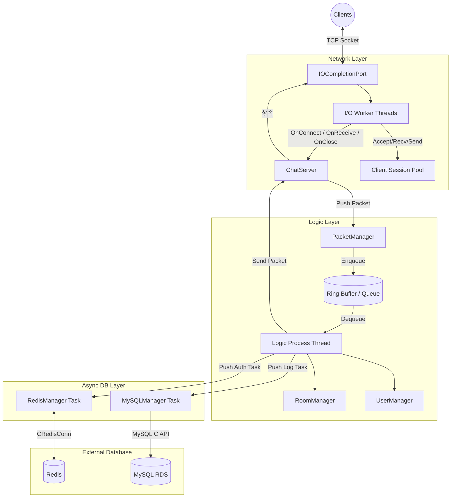
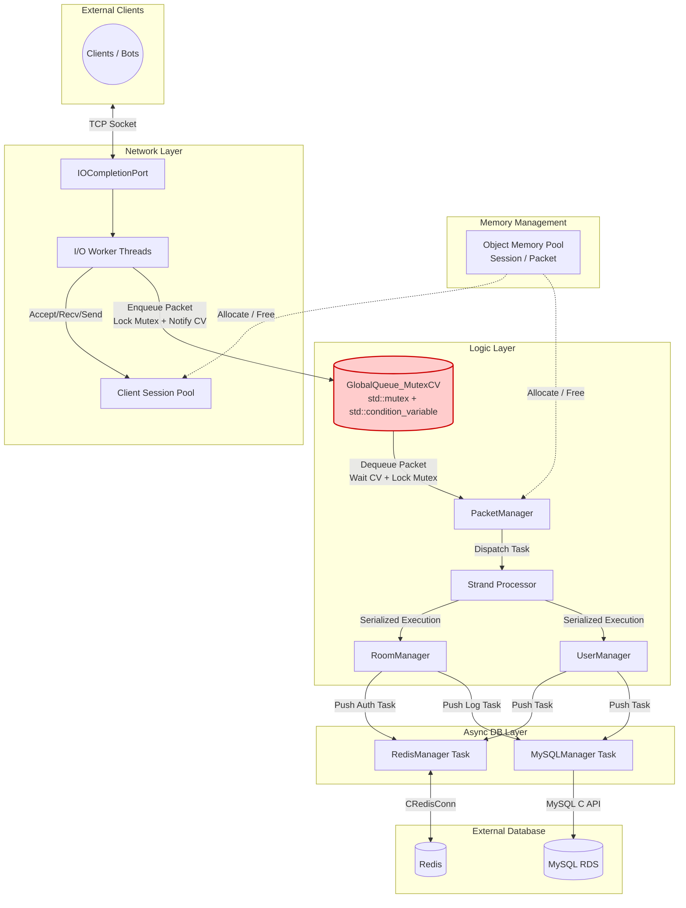

[← README로 돌아가기](../README.md)

# 서버 아키텍처 진화 및 성능 벤치마크

처리량(TPS)을 극대화하기 위해 총 3단계에 걸쳐 아키텍처를 리팩토링 및 최적화했습니다.

## 테스트 환경

| 구분 | 사양 |
| --- | --- |
| **Server** | AWS EC2 c6i.xlarge (4 vCPU, 8GB RAM) x 1대, Windows Server 2022 |
| **Client** | AWS EC2 c6i.xlarge (4 vCPU, 8GB RAM) x 4대, Windows Server 2022 (각 2,500봇) |
| **Network** | 동일 리전, 동일 클러스터 배치 그룹 (Cluster Placement Group) |
| **테스트 모드** | `TestMode=true` — Redis 인증/MySQL 로그 I/O 우회, 순수 네트워크/로직 엔진 처리 성능 측정 |

## 아키텍처 진화 요약

> `v0 → v1` : 단일 큐의 락 경합 → **더블 버퍼링**으로 해결 (TPS 83% 향상)
> 
> `v1 → v2` : 단일 코어 한계 → **멀티스레드** 도입 (Mutex 병목 발견)
> 
> `v2 → v3` : Mutex 병목 → **Lock-Free**로 해결 (142,400 TPS 달성)

---

## v0 → v1: Single-Thread (단일 큐 → 더블 버퍼링)

- **Problem:** IOCP 스레드와 패킷 처리 스레드가 단일 패킷 큐를 공유하며 `std::mutex`로 보호 → 패킷 삽입/처리마다 락 경합이 발생하여 처리 지연 누적, 1,000명 이상에서 처리 스타베이션(Starvation) 발생
- **Solution:** 더블 버퍼링(Double Buffering) 기법 도입. 수신용 큐와 처리용 큐를 분리하고, 로직 스레드가 처리를 시작할 때 두 큐를 O(1) swap하여 락 경합 제거. IOCP I/O 워커 스레드도 4개 → 8개로 최적화.
- **Result:** 초당 처리량(TPS) 83% 증가 및 평균 지연시간 76% 단축. 최대 1,500명 부하까지 안정적 처리.



### 단일 큐 vs 더블 버퍼링 성능 비교

| 부하 단계 | 핵심 지표 | 단일 큐 (Before) | 더블 버퍼링 (After) | 개선 |
| --- | --- | --- | --- | --- |
| **500명** | Chat RTT 평균 | 22.0 ms | **13.0 ms** | 41% 단축 |
|  | Chat RTT p50 | 16.8 ms | **11.0 ms** | 35% 단축 |
|  | Chat RTT p95 | 59.1 ms | **32.3 ms** | 45% 단축 |
| **1,000명** | Chat RTT 평균 | 349.7 ms | **83.7 ms** | 76% 단축 |
|  | Chat RTT p95 | 925.6 ms | **221.5 ms** | 76% 단축 |
|  | 초당 채팅 처리량 | 551 /sec | **1,010 /sec** | 83% 증가 |
| **1,500명** | Login 성공 | 1,000명 (한계) | **1,500명** | Starvation 해결 |
|  | Room Enter 성공 | 1,000명 (한계) | **1,500명** | 전원 성공 |
|  | Login RTT 평균 | 처리 불가 | **105.2 ms** | 정상 처리 |
| **2,000명** | 초당 채팅 처리량 | 350.9 /sec | **405.6 /sec** | 16% 증가 |
|  | 성공한 총 채팅 수 | 123,599건 | **168,851건** | 37% 증가 |
|  | Chat RTT 평균 | 222.9 ms | **185.6 ms** | 17% 단축 |

---

## v1 → v2: Multi-Thread (Mutex + CV)

- **목표:** 1,500명 이상에서 발생하는 단일 코어의 한계(CPU 100% 및 처리 스타베이션)를 극복하기 위해 스레드 풀(Thread Pool) 도입.
- **이슈:** 채팅 서버 특성상 브로드캐스트를 위한 공유 자원(Room, Session) 접근이 잦아 Mutex Lock/Unlock 과정에서 심각한 병목 발생. 2,000명 부하 시 p99 지연시간이 500ms까지 튀는 현상 확인.



---

## v2 → v3: Multi-Thread (Lock-Free) — 최종 아키텍처

- **구현:** Mutex를 제거하고 **CAS 연산 기반의 Lock-Free 큐와 Object Pool, Strand 패턴**을 직접 구현하여 적용. 패킷 전송 시마다 발생하던 동적 할당(new/delete)을 Lock-Free Object Pool로 대체하여 힙 메모리 단편화와 Lock 경합 병목을 동시에 해소.
- **결과:** 2,000명 스트레스 테스트에서 초당 142,400건의 패킷을 무응답 0건으로 처리.

### 핵심 코드: Lock-Free MPSC Queue

CAS(Compare-And-Swap) exchange 연산으로 Producer 간 경합 없이 Lock-Free Push를 구현합니다.

```cpp
// MPSCQueue.h — Lock-Free Multi-Producer Single-Consumer Queue
void Push(T* node)
{
    node->mpscNext.store(nullptr, std::memory_order_relaxed);
    T* prev = m_tail.exchange(node, std::memory_order_acq_rel);  // CAS: 원자적 교환
    prev->mpscNext.store(node, std::memory_order_release);       // Hole 구간
}
```

Pop에서는 sentinel(파수꾼) 노드와 hole(Push 중간 상태) 3가지 상황을 처리합니다.

[전체 구현 보기 → `MPSCQueue.h`](../IOCPChatServer/MPSCQueue.h)

### 핵심 코드: Lock-Free Object Pool

서버 시작 시 `malloc + placement new`로 N개 객체를 통째로 사전 할당하고, Lock-Free 스택으로 O(1) 할당/반납합니다. Hot-path에서 new/delete가 발생하지 않아 OS 힙 락 경합을 제거합니다.

```cpp
// ObjectPool.h — Alloc/Free (Lock-Free Stack 기반)
T* Alloc()
{
    T* p = mFreeStack.Pop();  // Lock-Free Pop
    if (p) mFreeCount.fetch_sub(1, std::memory_order_relaxed);
    return p;
}

void Free(T* obj)
{
    if (obj == nullptr) return;
    mFreeStack.Push(obj);     // Lock-Free Push
    mFreeCount.fetch_add(1, std::memory_order_relaxed);
}
```

[전체 구현 보기 → `ObjectPool.h`](../IOCPChatServer/ObjectPool.h)

---

## 아키텍처별 성능 비교 (2,000명 Stress Test)


**3가지 아키텍처 모델**

1. **v1. Single-Thread (Double Buffering):** 로직 처리를 단일 스레드가 전담하여 락 오버헤드가 없으나, 코어의 물리적 한계가 존재.
2. **v2. Multi-Thread (Mutex + CV):** 스레드 풀을 도입했으나, 브로드캐스트 시 공유 자원(방, 세션) 접근으로 인한 Lock 경합 발생.
3. **v3. Multi-Thread (Lock-Free) — 최종:** CAS 연산 기반의 Lock-Free 글로벌 큐와 Strand 패턴을 결합하여 경합 제거.

**분석**

- **Single-Thread의 붕괴:** 1,500명까지는 싱글 스레드가 효율적이었으나, 2,000명 부하에서 단일 코어(CPU 100%) 병목으로 초당 23만 건의 패킷이 Drop(무응답)되는 붕괴가 발생.
- **Mutex의 한계 (Lock Contention):** 멀티 스레드로 붕괴는 방지했으나, 동일 방(Room) 접근 시 락 획득/해제 과정에서 병목 발생. p99 지연시간 500ms.
- **Lock-Free:** 초당 142,400건의 패킷을 15.5ms 지연시간, 무응답 0건으로 처리. 대규모 트래픽에서 가장 안정적인 지연시간을 기록.
