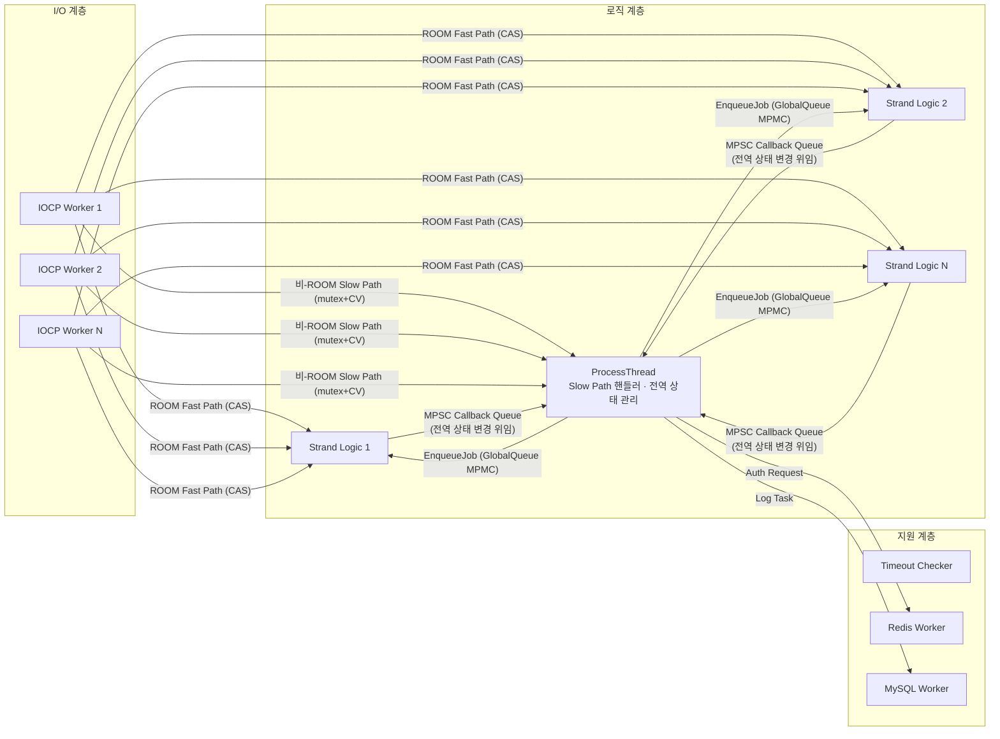
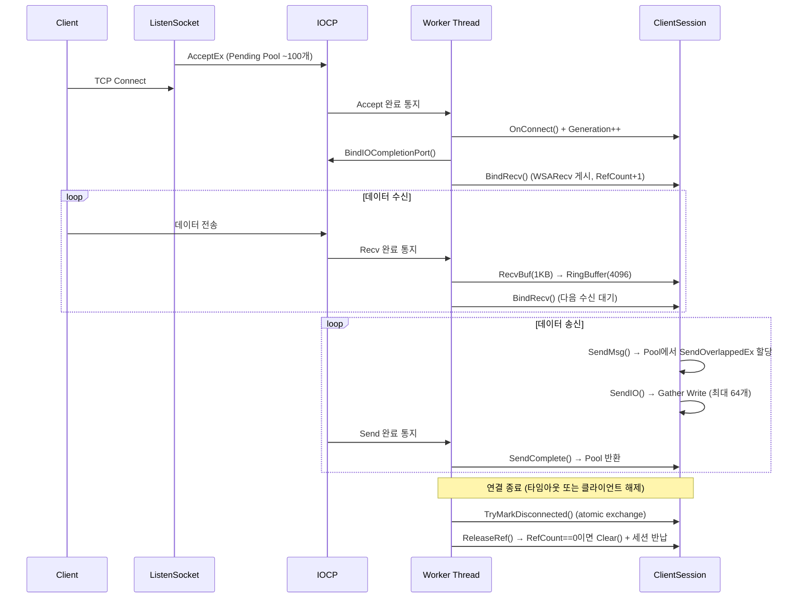
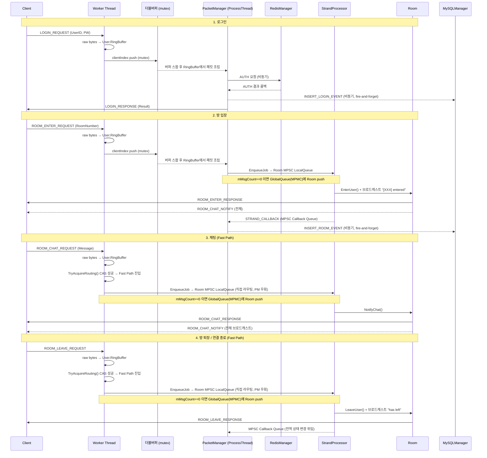

[← README로 돌아가기](../README.md)

# 구현 상세

스레드 모델, 메모리 관리, 동기화 전략, 네트워크 구조의 상세 내용을 정리한 문서입니다.

---

## 1. 스레드 모델

### 스레드 구성



| 스레드 그룹 | 기본 수량 | 역할 | 설정 |
|-------------|-----------|------|------|
| **IOCP Worker** | 8 | AcceptEx/WSARecv/WSASend 완료 처리, raw bytes → User.RingBuffer 저장, clientIndex를 더블버퍼에 push | `MaxIOWorkerThread` |
| **Packet Processing** | 1 (고정) | 더블버퍼 패킷 Dequeue, 핸들러 디스패치, 콜백 처리 | 고정 |
| **Strand/Logic** | 4 | Room별 MPSC 큐 드레인, 비즈니스 로직 직렬 처리, 완료 후 전역 상태 변경을 Callback으로 ProcessThread에 위임 | `MaxLogicThread` |
| **Timeout Checker** | 1 (고정) | 비활성 세션 탐지, Ping/Pong 스케줄링 (주기: 10초) | 고정 |
| **Redis Worker** | 1 | 로그인 인증 (GET key=password) | 코드 고정 |
| **MySQL Worker** | 1 | 활동 로그 INSERT (로그인/입장/채팅) | 코드 고정 |

> **튜닝 인사이트**: 채팅 빈도가 높은 고부하 환경에서는 **IO Worker를 늘리는 것(IO=16, Logic=8)** 이 효과적입니다. Logic Thread를 과도하게 늘리면(Logic=16, IO=8) IO 스레드가 CPU 자원을 빼앗겨 Room LocalQueue 적체 및 레이턴시 발산이 발생합니다. 16 vCPU 환경의 권장 구성은 IO=16, Logic=8이며, 상세 분석은 [부하 테스트 리포트](부하%20테스트.md)를 참조해 주십시오.

---

## 2. 메모리 관리 전략

### Object Pool 구조

| Pool | 타입 | 용량 | 자료구조 | 용도 |
|------|------|------|----------|------|
| **SendBuffer Pool** | `ObjectPool<SendOverlappedEx>` | config 설정 | `LockFreeStack` | WSASend용 I/O 버퍼 |
| **Job Pool** | `ObjectPool<PacketJob>` | 200,000 (`JobPoolSize`) | `LockFreeStack` | Strand 패킷 작업 |
| **Session Free-list** | `LockFreeStack<SessionNode>` | 10,000 (`MaxClient`) | `LockFreeStack` | 빈 세션 인덱스 O(1) 탐색 |

### LockFreeStack — ABA 방지 Index 기반 설계

포인터 대신 **인덱스 기반**으로 설계하여 8바이트 CAS 한 번으로 ABA 문제를 방지합니다.

```cpp
// LockFreeStack.h — {index, generation}을 uint64_t로 Pack하여 단일 CAS 수행
struct TaggedIndex
{
    uint32_t index;       // 풀 인덱스 (UINT32_MAX = 비어있음)
    uint32_t generation;  // ABA 방지 카운터
};

std::atomic<uint64_t> m_head;  // Pack(index, generation)

void Push(T* obj)
{
    uint32_t objIndex = static_cast<uint32_t>(obj - m_pool);
    uint64_t oldHead = m_head.load(std::memory_order_relaxed);
    while (true)
    {
        TaggedIndex old = Unpack(oldHead);
        obj->poolNext = old.index;
        uint64_t newHead = Pack(objIndex, old.generation + 1);
        if (m_head.compare_exchange_weak(oldHead, newHead,
            std::memory_order_release, std::memory_order_relaxed))
            break;
    }
}
```
[전체 구현 보기 → `LockFreeStack.h`](../IOCPChatServer/LockFreeStack.h)

### ObjectPool — malloc + placement new + LockFreeStack

```cpp
// ObjectPool.h — 연속 메모리 할당 + 인덱스 기반 Free-list
void Init(const uint32_t poolSize)
{
    m_poolBlock = static_cast<T*>(std::malloc(sizeof(T) * poolSize));
    for (uint32_t i = 0; i < poolSize; ++i)
    {
        new (&m_poolBlock[i]) T();      // placement new
        mFreeStack.Push(&m_poolBlock[i]);
    }
}

T* Alloc() { return mFreeStack.Pop(); }    // O(1) Lock-Free
void Free(T* obj) { mFreeStack.Push(obj); } // O(1) Lock-Free
```
[전체 구현 보기 → `ObjectPool.h`](../IOCPChatServer/ObjectPool.h)

### Zero-Allocation 설계

`PacketJob`은 **union 구조**로 JOB 단계(패킷 처리)와 CALLBACK 단계(후처리 알림)에서 동일 메모리를 재활용하여, 콜백용 별도 Pool 할당이 불필요합니다.

---

## 3. 동기화 전략

### Lock-Free 자료구조

#### MPSC Queue — Logic Thread → ProcessThread Callback 경로 (다중 Producer CAS)

```cpp
// MPSCQueue.h
void Push(T* node)
{
    node->mpscNext.store(nullptr, std::memory_order_relaxed);
    T* prev = m_tail.exchange(node, std::memory_order_acq_rel);  // 원자적 교환: Producer간 경합 없음
    prev->mpscNext.store(node, std::memory_order_release);       // Hole 구간 (Pop에서 3-state로 처리)
}
```
[전체 구현 보기 → `MPSCQueue.h`](../IOCPChatServer/MPSCQueue.h)

- **Producer (`Push`)**: `m_tail`을 `exchange`로 원자적 교환 — Producer 간 경합 없음
- **Consumer (`Pop`)**: `m_head`는 non-atomic — MPSC 설계상 단일 Consumer만 접근
- **Hole 처리**: Push의 `exchange`와 `store` 사이 preemption 발생 시, Pop이 nullptr을 만나면 adaptive backoff로 대기

#### MPSC Queue — Room LocalQueue (다중 IO Worker 직접 Push)

Fast Path 도입으로 여러 IO Worker가 동시에 Room LocalQueue에 직접 Push할 수 있게 되어, 기존 SPSC에서 **MPSC**로 전환했습니다. Consumer는 Strand 패턴에 의해 항상 단일 Logic Thread이므로 MPSC 구조가 정확히 부합합니다.

- **Producer(`Push`)**: 다중 IO Worker가 CAS 라우팅 독점 획득 후 직접 Push — `m_tail.exchange()`로 Producer 간 경합 없음
- **Consumer(`Pop`)**: 단일 Logic Thread만 접근 — Strand 패턴으로 보장
- **Hole 처리**: `exchange`와 `store` 사이 preemption 발생 시 `PopWithBackoff`로 adaptive 대기

[전체 구현 보기 → `MPSCQueue.h`](../IOCPChatServer/MPSCQueue.h)

#### GlobalQueue (Lock-Free) — Bounded MPMC Ring Buffer / SPMC 최적화

```cpp
// GlobalQueue_LockFree.h — alignas(64)로 False Sharing 방지
alignas(64) std::atomic<uint32_t> m_enqueuePos;  // Producer 위치
alignas(64) std::atomic<uint32_t> m_dequeuePos;  // Consumer 위치
```

Fast Path 도입으로 여러 IO Worker가 직접 Push하는 다중 Producer 구조가 되어 **MPMC 모드**로 동작합니다. (`USE_SPMC` 주석 처리) `m_enqueuePos`를 CAS 루프로 경합 없이 원자적으로 갱신합니다.

```cpp
// GlobalQueue_LockFree.cpp — Push 함수 분기
#ifdef USE_SPMC
    // SPMC: 단일 Producer → CAS 없음, relaxed load/store
    uint32_t pos = m_enqueuePos.load(std::memory_order_relaxed);
    Cell* cell = &m_buffer[pos & m_bufferMask];
    while (cell->sequence.load(std::memory_order_acquire) != pos)
        _mm_pause();                                    // 슬롯이 빌 때까지 대기
    cell->data = pRoom;
    cell->sequence.store(pos + 1, std::memory_order_release);
    m_enqueuePos.store(pos + 1, std::memory_order_relaxed);  // CAS 없음
#else
    // MPMC: CAS 루프 (ProcessThread 샤딩 등 다중 Producer 시)
    ...compare_exchange_weak(pos, pos + 1)...
#endif
```

| | MPMC (현재, `USE_SPMC` 주석 처리) | SPMC (`#define USE_SPMC`) |
|---|---|---|
| `m_enqueuePos` 갱신 | `compare_exchange_weak` CAS 루프 | `relaxed store` |
| Producer 경합 | CAS 루프로 해결 | 구조적으로 없음 |
| Consumer (`Pop`) | MPMC CAS 유지 | 변경 없음 |

### Strand 패턴 — Room 단위 Lock 없는 직렬화

```cpp
// Room::EnqueueJob() — mMsgCount로 첫 번째 여부 판별
Room::EnqueueResult Room::EnqueueJob(PacketJob* pJob)
{
    mLocalQueue.Push(pJob);  // MPSCQueue<PacketJob>
    if (mMsgCount.fetch_add(1, std::memory_order_acq_rel) == 0)
        return EnqueueResult::SUCCESS_FIRST;   // → GlobalQueue에 등록
    return EnqueueResult::SUCCESS_APPENDED;    // → 이미 처리 중, 추가만
}
```
[전체 구현 보기 → `StrandProcessor.cpp`](../IOCPChatServer/StrandProcessor.cpp) | [Room.cpp](../IOCPChatServer/Room.cpp)

### Lock 기반 동기화 (의도적 선택)

| 위치 | Lock 종류 | 이유 |
|------|-----------|------|
| `ClientSession::mSendLock` | `std::mutex` | WSASend Scatter-Gather가 버퍼 배열에 대한 배타적 접근을 요구 |
| `User::mPacketRingBuffMutex` | `std::mutex` | IOCP Worker(쓰기)와 Packet Processing(읽기)이 동시 접근 |
| `PacketManager` 더블버퍼 | `std::mutex` | 큐 스왑 시 짧은 구간만 Lock — 읽기/쓰기가 서로 다른 버퍼에서 동작 |

### Memory Ordering 선택

| 변수 | Ordering | 이유 |
|------|----------|------|
| `ClientSession::mIsConnected` | `acquire/release` | 연결 상태 변경이 다른 스레드에서 즉시 가시적이어야 함 |
| `ClientSession::mGeneration` | `acquire/acq_rel` | 세대 값 증가와 읽기의 순서 보장 |
| `Room::mMsgCount` | `acq_rel` | Strand 진입/퇴출 판정의 정확성 보장 |
| `mLastActivityTime` | `relaxed` | 빈번한 갱신, 정확한 순서보다 성능 우선 |
| `LockFreeStack::m_head` | `release/acquire` | Push 성공 시 쓰기 가시성, Pop 성공 시 읽기 안전성 |

---

## 4. 네트워크 구조

### 연결 수명주기



### 주요 설계

| 구성 요소 | 설계 | 구현 |
|-----------|------|------|
| **Accept** | AcceptEx Pending Pool | 서버 시작 시 100개 AcceptEx 게시, 완료 시 Worker가 1개씩 보충 (`TryPostAcceptEx`) |
| **세션 관리** | Generation + RefCount | `mGeneration` (atomic)으로 ABA 방지, `AddRef/ReleaseRef`로 비동기 I/O 수명 관리 |
| **수신** | 1KB 수신 버퍼 + RingBuffer | `WSARecv` → `RecvBuf[1024]` → `RingBuffer<4096>` TCP 스트림 재조립 |
| **송신** | Pool + Scatter-Gather | `ObjectPool<SendOverlappedEx>`에서 할당, `WSASend`로 최대 64개 버퍼 일괄 전송 |
| **완료 처리** | 배치 Dequeue | `GetQueuedCompletionStatusEx`로 최대 64개 완료를 한 번에 처리 |
| **연결 해제** | Race-Free Close | `TryMarkDisconnected()` (atomic exchange)로 단 하나의 스레드만 정리 담당 |

### 전체 사용 흐름 — Login → Chat → Leave


