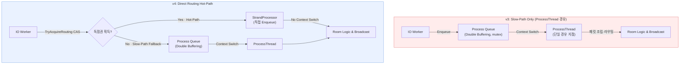

[← README로 돌아가기](../README.md)

# 부하 테스트 리포트

## 테스트 환경

| 구분 | 사양 |
| --- | --- |
| **Server** | AWS EC2 c6i.4xlarge (16 vCPU, 32GB RAM) × 1대, Windows Server 2022 |
| **Network** | 동일 리전, 동일 클러스터 배치 그룹 (Cluster Placement Group) |
| **테스트 모드** | `TestMode=true` — Redis/MySQL I/O 우회, 순수 엔진 성능 측정 |

---

## Scenario A: 10,000명 수용량 테스트 및 Zero-Leak 검증

c6i.xlarge 클라이언트 4대(각 2,500봇)로 10,000명의 더미 클라이언트가 실제 유저와 동일한 시나리오(로그인 → 방 입장 → 채팅 → 방 퇴장 → 재입장)를 3~5초 간격으로 반복하는 연속 부하 테스트를 수행했습니다. 결과는 **100방 × 100명** 구성 기준입니다.

### 1. 클라이언트 부하 테스트 지표

| 측정 항목 | 결과 수치 | 상태 요약 |
| --- | --- | --- |
| **최대 동시 접속 (Peak Conn)** | **10,000 명** | 목표 수용량 달성 |
| **연결 실패 / 끊김** | **0 건 / 10,000** | 세션 유실 0 |
| **평균 지연 시간** | **17.55 ms** | 실시간 통신 수준 유지 |
| **p99 지연 시간** | **~17ms** (최대 스파이크 744ms) | 초당 p99 측정 기준 — 전체 구간 중 99%의 구간에서 p99 17ms 이하. 최대 스파이크는 순간 burst에 의한 이상치 |
| **수신 처리량** | **134K pkts/s** | CPU 33%, 헤드룸 충분 |
| **이상 현상** | **없음** | 무중단 서비스 검증 완료 |

### 2. 서버 안정성 검증

| 서버 내부 지표 | 측정 값 | 의미 |
| --- | --- | --- |
| **메모리 점유** | **394 MB 고정** | 장기 운용 중 변동 없음 (누수 0) |
| **SendPool Alloc Fail** | **0 회** | 전 테스트 구간 누적 |
| **JobPool Alloc Fail** | **0 회** | Pool 고갈 없이 안정 순환 |
| **연결 실패** | **0 건 / 10,000** | 전 테스트 구간 세션 유실 없음 |

### 3. 트러블슈팅: OS 레벨 교차 검증을 통한 Zero-Allocation 증명

서버 내부 지표(Pool Free Count = 전량 반환)로 객체 누수가 없음을 확인한 뒤, AWS CloudWatch와 VS 프로파일러를 통한 OS 레벨 메모리 모니터링으로 교차 검증했습니다.

#### Phase 1: 실제 메모리 누수 발견 및 수정

- **현상**: 최초 10,000명 테스트에서 서버 메모리가 **99%(6,680MB)** 를 점유하며 **0.4MB/s** 씩 지속 증가
- **원인 분석**:
    1. **SendBuffer Pool 과잉 할당**: 봇당 400개씩 총 4,000,000개 할당 → 약 4.1GB 낭비
    2. **세션 버퍼 비대화**: `MAX_PACKET_DATA_BUFFER_SIZE`가 65,536으로 과도하게 설정
    3. **세션 종료 시 리소스 미반환**: `Closed()`에서 `Clear()` 미호출로 Send큐 잔존
- **해결**:
    1. Pool 크기를 봇당 **400 → 10**으로 최적화
    2. 버퍼 크기를 **65,536 → 8,192**로 조정
    3. `Closed()` 호출 시 `Clear()`로 세션 리소스 즉시 반환
- **결과**: 0.4MB/s 누수 해소, 16-core 환경 재측정에서 메모리 **394MB 고정**으로 안정화

#### Phase 2: OS 레벨 교차 검증을 통한 Zero-Leak 최종 증명

- **현상**: Phase 1 수정 후 메모리가 안정화되었으나, 10,000명 접속 해제 후에도 메모리가 떨어지지 않는 현상 발견
- **프로파일링**: VS 프로파일러 힙 스냅샷(Heap Snapshot)으로 분석. 10,000명 접속 전/후 스냅샷을 비교한 결과, 할당된 메모리의 증가량은 **+0 Bytes**
- **결론**: Lock-Free Object Pool이 해제된 세션/버퍼를 OS에 반납하지 않고 다음 접속을 위해 캐싱(Pre-allocation)하고 있었음. C++ CRT 힙 할당자의 정상 동작.
- **최종 성과**: 1만 명의 유저가 장시간 통신을 주고받는 환경에서도, 추가적인 동적 할당 없이 **394MB의 고정 메모리**로 무중단 서비스가 가능함을 확인

---

### — v3(ProcessThread 경유) → v4(StrandProcessor Direct Routing) 아키텍처 검증

본 보고서는 IOCP 기반 채팅 서버의 핵심 패킷 처리 경로를 재설계한 v3 → v4 전환의 효과를, 동일한 서버·클라이언트 환경에서 수집한 부하 테스트 데이터로 검증한 문서입니다. 아키텍처 변경이 **처리량(Throughput)·응답 지연(Latency)·연결 안정성(Connection Stability)** 에 미친 영향을 분석하고, 16 vCPU 환경에서의 최적 스레드 구성 모델을 데이터 기반으로 도출합니다.

---

## Scenario B: 10,000명 동시 접속, 500~1000개 채팅방 환경에서의 실시간 브로드캐스트 부하 테스트

## 1. 테스트 개요 및 목적

### 1.1 배경

초기 아키텍처(v3)는 모든 ROOM 채팅 패킷을 단일 `ProcessThread`로 모은 뒤 처리·라우팅하는 구조였습니다. 이 단일 경유 지점은 채팅 빈도가 높아질수록 직렬화 병목으로 작용했고, 고부하 구간에서 처리 잡이 적체되어 응답 지연이 발산하는 **Death Spiral**과 그로 인한 대규모 연결 끊김(Disconnect)을 유발했습니다.

v4는 ROOM 상태 패킷에 한해 IO Worker 스레드가 `ProcessThread`를 거치지 않고 `StrandProcessor`로 직접 라우팅하는 **핫패스(Hot-Path)** 를 도입하여, 이 직렬화 병목 자체를 제거하는 것을 목표로 했습니다.

### 1.2 테스트 목적

1.  **아키텍처 개선 검증** — `ProcessThread` 경유 방식(v3) 대비 `StrandProcessor` 직접 라우팅(v4)의 처리량·레이턴시·연결 안정성 변화를 정량 측정한다.
2.  **최적 스레드 구성 도출** — IO Worker 스레드와 Logic 스레드의 비율(IO/LO)이 처리량·Tail Latency·스케줄링 간섭에 미치는 영향을 분석하여, 16 vCPU 환경의 권장 구성을 도출한다.

---

## 2. 테스트 대상 아키텍처 (v3 vs v4)

### 2.1 v3 — ProcessThread 경유 방식의 한계

*   **단일 경유 지점:** 모든 ROOM 채팅 패킷이 IO Worker → 더블 버퍼링 Process Queue(뮤텍스 보호) → **단일 `ProcessThread`** 를 거쳐 조립·라우팅된 뒤에야 방 로직으로 전달되었습니다.
*   **병목 메커니즘:** 채팅 간격이 짧아질수록 IO Worker가 Process Queue에 패킷을 쌓는 속도가 `ProcessThread`의 처리(드레인) 속도를 초과합니다. 큐 백로그와 처리 잡(Job)의 적체가 누적되면 응답 지연이 수렴하지 못하고 지속 증가하는 **Death Spiral**이 발생합니다.
*   **2차 피해:** 처리 지연이 길어지면 클라이언트 송·수신 버퍼가 포화되고 타임아웃이 발생하여 **대규모 강제 연결 해제(Disconnect)** 로 이어지며, 끊긴 클라이언트의 재접속 요청이 다시 부하를 가중하는 악순환이 형성됩니다.
*   **자료구조:** 단일 생산자–단일 소비자를 가정하여 Room LocalQueue는 `SPSC`, GlobalQueue는 `SPMC` 구조를 사용했습니다.

### 2.2 v4 — ROOM 핫패스 직접 라우팅

*   **핵심 로직:** `TryAcquireRouting()`(atomic_flag 기반 CAS)으로 라우팅 독점권을 획득한 IO Worker는, `ProcessThread`를 거치지 않고 패킷을 곧바로 `StrandProcessor`로 Enqueue합니다. 핫패스에서는 **스레드 간 컨텍스트 스위칭이 발생하지 않습니다.**
*   **안전한 폴백(Slow-Path):** 독점권 획득에 실패했거나 ROOM 외 패킷(로그인·연결·해제·콜백 등)인 경우에만 기존 더블 버퍼링 → `ProcessThread` 경로로 폴백합니다. 스레드 안전하지 않은 `UserManager`의 상태 변경은 이 경로에서 직렬화되어 정합성을 유지하고, 브로드캐스트 fan-out은 Logic 스레드 풀에서 병렬 처리됩니다.
*   **자료구조 전환:** 다수의 IO Worker가 동시에 Enqueue할 수 있도록 동시성 구조를 확장했습니다.
    *   Room LocalQueue: `SPSC` → **`MPSC`** (Multi-Producer Single-Consumer)
    *   GlobalQueue: `SPMC` → **`MPMC`** (Multi-Producer Multi-Consumer)

> v4 설계의 핵심 가설은 **"드물게 발생하는 시스템 패킷(Slow-Path)과 폭발적으로 발생하는 채팅 패킷(Hot-Path)의 처리 경로를 분리하면, 단일 `ProcessThread` 병목을 제거할 수 있다"** 는 것이며, 본 테스트는 이 가설을 검증합니다.

---

## 3. 테스트 환경 및 시나리오

### 3.1 테스트 환경

| 구분 | 사양 |
| --- | --- |
| **Server** | AWS EC2 c6i.4xlarge (16 vCPU, 32GB RAM), Windows Server 2022 × 1대 |
| **Client** | AWS EC2 c6i.xlarge × 4대, 각 2,500봇 (총 10,000봇) |
| **Network** | 동일 리전 · 동일 클러스터 배치 그룹(Cluster Placement Group) |
| **테스트 모드** | `TestMode=true` — Redis/MySQL I/O 우회, 순수 패킷 처리 엔진 성능 측정 |
| **소켓 옵션** | **TCP_NODELAY (Nagle 비활성화)** |

### 3.2 부하 시나리오

전 더미 클라이언트가 방에 입장한 뒤 일정 주기 범위에서 채팅 메시지를 브로드캐스트하는, **순수 브로드캐스트 부하** 시나리오입니다. 동일한 총 인원(10,000명)을 유지하되 방 구성을 달리하여 **방당 브로드캐스트 비용(fan-out)** 이 서버 한계에 미치는 영향을 분리 측정했습니다.

| 방 구성 | 총 인원 | 방당 fan-out ※ | 채팅 전송 주기 범위 |
| --- | :---: | :---: | --- |
| 500방 × 20명 | 10,000 | 19회 | 150–450ms · 200–600ms |
| 1000방 × 10명 | 10,000 | 9회 | 50–150ms · 100–300ms |
| 1250방 × 2명 | 2,500 | 1회 | 50–100ms (초고빈도 스트레스) |

> ※ **fan-out** = 채팅 메시지 1건당 서버가 실행하는 브로드캐스트 송신 횟수. 송신자 본인을 제외한 수신자 수(방당 인원 N − 1)와 같습니다.

각 구성에 대해 스레드 비율을 **IO/LO = 8/2, 8/4, 8/8, 8/12, 8/16, 16/8, 6/10** 로 변경하며 측정했습니다.

### 3.3 측정 지표 정의 및 방법론

수집된 로그·CSV에서 연결 램프업이 끝난 **유효 가동 구간** 을 추출하여 지표를 산출했습니다.

| 지표 | 정의 |
| --- | --- |
| **Peak Active Conn** | 안정적으로 유지된 최대 동시 접속자 수 (목표 대비 달성도) |
| **Avg Lat** | 유효 구간 평균 응답 지연 (ms) — 정상 상태 체감 성능의 핵심 지표 |
| **P99 평균 / Max Lat** | 1초 단위 P99 표본의 산술 평균 / 전 구간 최대 단일 스파이크 (ms) |
| **Avg Recv** | 초당 수신 패킷 수(pkt/s) 및 대역폭(MB/s) |
| **Total Disconnects** | 테스트 중 누적 연결 끊김 횟수 — 낮을수록 안정적 |

> **해석 주의 (P99 / Max Lat):** 본 테스트는 10,000명이 동시에 접속을 시작하므로, 초기 램프업 구간에서 일시적 버스트가 발생합니다. `Avg P99`와 `Max Lat`은 이 **전이(transient) 스파이크를 포함한 worst-case 표본**입니다. 따라서 정상 상태의 운영 품질은 **`Avg Lat` + `Total Disconnects`** 조합으로 판단하고, P99/Max는 순간 꼬리 지연의 상한으로 해석하는 것이 타당합니다.

---

## 4. 부하 테스트 결과

> 본 섹션의 모든 수치는 Nagle 비활성화 환경에서 측정된 유효 지표입니다.

### 4.1 핵심 결과 요약

전체 28개 측정 케이스 중, 본문 분석에서 다루는 **대표 케이스**를 추린 표입니다. 정상 상태 품질은 `Avg Lat`과 `Disconnects`를 함께 읽습니다(§3.3). **전체 측정 데이터(21행, 처리량·대역폭 포함)는 [부록 A](#부록-a-전체-측정-데이터)** 를 참조해 주십시오.

| 버전 | 설정 (방/명, 채팅주기) | IO/LO | Peak Conn | Avg Lat (ms) | P99 평균† (ms) | Disconnects | 판정 |
| :---: | :--- | :---: | :---: | :---: | :---: | :---: | :--- |
| v3 | 500R/20U (150ms–450ms) | 8/16 | 7,716 | 138.55 | 8,125.68 | 24,024 | 🔴 접속자 미달 |
| v3 | 500R/20U (200ms–600ms) | 8/16 | 7,975 | 26.92 | 184.44 | 48,070 | 🔴 생존 편향 (§5.2) |
| **v4** | 500R/20U (200ms–600ms) | **16/8** | **10,000** | **~9** | ~70 | **0** | ✅ 기준선 |
| **v4** | 500R/20U (150ms–450ms) | **16/8** | **10,000** | ~17 | ~74 | **0** | ✅ 최대 처리량 ~416K pkt/s |
| **v4** | 1000R/10U (100ms–300ms) | **16/8** | **10,000** | **~9** | **~35** | **0** | ✅ 최저 지연 ~397K pkt/s |
| v4 | 500R/20U (200ms–600ms) | 8/16 | 10,000 | ~12 | ~95 | 0 | ✅ 비교: IO 절반 |
| v4 | 500R/20U (150ms–450ms) | 8/4 | 10,000 | ~26 | ~80 | 0 | ✅ LO 감소해도 안정 |
| v4 | 1000R/10U (150ms–200ms) | 6/10 | 10,000 | ~22↑ | >200 (불안정) | 0 | ⚠️ 초기 불안정 (§5.3) |
| v4 | 500R/20U (150ms–450ms) | 8/16 | 10,000 | 1,402 | 11,276 | 32 | ❌ IO 병목 (§5.3) |
| v4 | 1000R/10U (100ms–300ms) | 8/16 | 10,000 | ~130 | ~1,100 | 0 | ❌ IO 병목 1000R (§5.3) |

> **한눈에 보기:** 동일 부하(200–600ms)에서 v3는 7,975명만 유지하며 48,070회 끊김이 발생한 반면, v4(16/8)는 10,000명 전원 · 약 9ms · 끊김 0회를 달성했습니다. 핫패스(IO 스레드 CAS 선점→직접 송신) 도입으로 IO 스레드 비중을 높일수록 유리해졌으며, IO 스레드가 부족한 구성(8/16, 6/10)에서는 끊김 없이도 레이턴시가 수백 ms~수 초로 악화됩니다(§5.3).

> † **P99 평균**: 유효 가동 구간 동안 1초 단위로 측정된 P99 표본의 산술 평균입니다. 전체 구간의 단일 P99(overall percentile)와 수학적으로 동일하지 않으며, 순간 스파이크의 빈도와 크기를 파악하는 데 적합합니다. 해석 시 §3.3의 주의사항을 함께 참조해 주십시오.

### 4.2 v3 vs v4 직접 비교 (동일 조건)

연결 안정성과 정상 상태 레이턴시를 동일 부하·동일 스레드 조건에서 비교한 결과입니다.

| 조건 | 지표 | v3 | v4 |
| --- | --- | :---: | :---: |
| **500R/20U (150ms–450ms), 8/16** | Peak Active Conn | 7,716 | **10,000** |
| | Disconnects | 24,024 | **35** |
| **500R/20U (200ms–600ms), 16/8** | Peak Active Conn | 7,845 | **10,000** |
| | Disconnects | 52,506 | **0** |
| **500R/20U (200ms–600ms), 16/8(v4) vs 8/16(v3)** | Avg Lat | 26.92 (7,975명 한정) | **~9 (10,000명 전원)** |
| | Disconnects | 48,070 | **0** |

*   동일 부하(150–450ms, 8/16)에서 v3는 **7,716명**까지만 유지하며 **24,024회** 끊긴 반면,
    v4는 **10,000명 전원**을 수용하고 끊김을 **32회**로 줄였습니다.
    다만 IO 스레드가 적은 구성(8/16)에서는 핫패스 아키텍처에서 IO 병목이 발생하여
    레이턴시가 악화되며, 권장 구성은 16/8입니다(§5.3).
*   핫패스(IO 스레드 CAS 선점 → 직접 WSASend) 구조 덕분에 IO 비중을 높인 **16/8**이
    최적 구성이 되었습니다. v3에서 16/8은 **52,506회** 끊김을 냈지만,
    v4에서는 동일 부하에서 **끊김 0회 · Avg Lat ~9ms**를 달성했습니다.

### 4.3 순간 최대 처리 성능 (Peak Throughput)

1초 단위로 측정된 절대 순간 최대 패킷 처리량입니다.

| 버전 | 설정 | IO/LO | 최대 Recv (pkt/s) | 최대 Send (pkt/s) | 최대 합산 (pkt/s) | 비고 |
| :---: | :--- | :---: | :---: | :---: | :---: | :--- |
| v3 | 1000R/10U (50ms–150ms) | 16/8 | 425,211 | 65,193 | 490,404 | 재접속 폭주 중 순간 급증 |
| v3 | 1000R/10U (50ms–150ms) | 16/8 | 229,972 | **70,241** | 300,213 | v3 최대 송신 시점 |
| **v4** | 500R/20U (150ms–450ms) | 16/8 | **~437,561** | ~32,901 | **~470,462** | 핫패스(CAS) 최대 처리량 |
| **v4** | 1000R/10U (100ms–300ms) | 16/8 | ~397,000 | **~50,000** | ~466,000 | v4 최대 송신 시점 |

*   v4는 순간 최대 수신 **~437,561 pkt/s**, 합산 **~470,462 pkt/s** 를 기록하였습니다.
*   다만 **두 피크의 성격은 다릅니다.** v3의 피크는 대량 연결 끊김에 따른 **재접속 요청 폭주가 겹친 오버헤드성 수치**인 반면, v4의 피크는 IO Worker가 수신 패킷을 직접 Enqueue하며 **순수하게 처리해낸 핫패스 처리량**입니다.

---

## 5. 기술적 분석

### 5.1 v3 대규모 연결 유실의 근본 원인 — 단일 경유 지점의 직렬화 병목

v3의 연결 끊김은 네트워크나 메모리 자원의 문제가 아니라, **처리 경로의 구조적 직렬화** 에서 비롯됐습니다. 채팅 간격이 좁아질수록 IO Worker가 패킷을 쌓는 속도가 단일 `ProcessThread`의 드레인 속도를 추월하고, 그 결과 큐 백로그와 처리 잡 적체가 누적되어 응답 지연이 발산합니다(Death Spiral). 지연이 임계치를 넘으면 클라이언트 버퍼가 포화되어 타임아웃·강제 해제가 발생하고, 끊긴 세션의 재접속이 다시 부하를 가중합니다.

v4의 핫패스는 이 단일 경유 지점 자체를 제거함으로써, 동일 부하에서 백로그가 형성되기 전에 패킷을 소화합니다. §4.2의 "7,716명/24,024 끊김 → 10,000명/32 끊김" 전환이 이 메커니즘 개선을 직접 보여줍니다.

### 5.2 레이턴시 수치 해석의 함정 — Survivor Bias

*   **v3:** 평균 26.92ms는 **살아남은 7,975명** 기준입니다. 그 대가로 **48,070회**의 연결 끊김이 발생했습니다 — 즉, 부하를 감당하지 못한 세션이 탈락하고 잘 처리되는 세션만 남은 **생존 편향(Survivor Bias)** 의 결과입니다.
*   **v4:** ~9ms는 **10,000명 전원** 을 유지하고 **끊김 0회** 인 상태에서의 값입니다.

따라서 "v3와 v4의 평균 레이턴시가 비슷하다"는 해석은 성립하지 않습니다. **v4는 v3가 25%를 탈락시키며 달성한 레이턴시(26.92ms)를, 전원을 수용한 채 더 낮은 수준(~9ms) 으로 달성했습니다** 했습니다. 고부하 구간의 v3 레이턴시는 반드시 동시 접속자 수·끊김 횟수와 함께 읽어야 합니다.

### 5.3 스레드 구성(IO/LO)에 따른 성능 변위 — v4 중심 분석

v3는 ProcessThread 단일 직렬화 구조였기 때문에 IO/LO 비율을 어떻게 잡더라도
근본 병목이 해소되지 않았습니다. v4의 CAS 핫패스(IO 스레드 선점 → 직접 WSASend)
도입으로 **IO 스레드 비중이 성능을 좌우하는 핵심 변수**가 됐습니다.
IO 스레드가 CAS를 선점하면 Logic Queue를 거치지 않으므로, IO 스레드가 많을수록
직접 전송 비율이 높아지고 레이턴시가 낮아집니다.

#### ① IO 우선 구성 (`16/8`) — 핫패스 최대 활용
IO 스레드 16개가 CAS를 선점해 대부분의 패킷을 직접 전송합니다.
Logic 스레드 8개는 CAS 실패 폴백만 처리하면 되어 큐 백로그가 형성되지 않습니다.
500R/20U(200–600ms)에서 **Avg Lat ~9ms · 끊김 0회**, 1000R/10U(100–300ms)에서도
**~9ms · 끊김 0회**를 달성했습니다.

#### ② IO 부족 구성 (`8/16`) — 부하에 따라 결과 분기
IO 스레드 8개는 고빈도 부하(150–450ms)에서 초당 ~8,200 msg를 받으며
CAS 경합이 증가해 Logic Queue 진입 비율이 높아집니다.
중빈도(200–600ms)에서는 **Avg Lat ~12ms · P99 ~95ms · 끊김 0회**로 안정적이지만,
고빈도(150–450ms)에서는 **Avg Lat >1,200ms · 끊김 32회**로 과부하 상태를 보였습니다.

#### ③ LO 감소 구성 (`8/4`) — 핫패스 덕분에 허용 범위 내
v3 구조였다면 Logic 처리가 기아 상태에 빠졌겠지만,
v4에서는 Logic Queue 자체 진입량이 크게 줄어 LO 스레드 4개로도
500R/20U(150–450ms) 고빈도 부하를 **Avg Lat ~26ms · 끊김 0회**로 처리했습니다.

| IO/LO | 설정 | Avg Lat | P99 avg | Disconnects | 판정 |
| :---: | :--- | :---: | :---: | :---: | :--- |
| **16/8** | 500R/20U 200–600ms | ~9ms | ~70ms | 0 | ✅ 기준선 |
| **16/8** | 500R/20U 150–450ms | ~17ms | ~74ms | 0 | ✅ 고빈도 안정 |
| **8/16** | 500R/20U 200–600ms | ~12ms | ~95ms | 0 | ✅ 중빈도 안정 |
| **8/4**  | 500R/20U 150–450ms | ~26ms | ~80ms | 0 | ✅ LO 감소 허용 |
| **8/16** | 500R/20U 150–450ms | >1,200ms | >25,000ms | 32 | ❌ IO 병목 |

> **종합:** v4에서 성능의 제약은 IO 처리량입니다. IO 스레드 비중을 높일수록
> CAS 선점률이 올라가 Logic Queue 부담이 줄고 레이턴시가 개선됩니다.
> 단, IO가 부족한 채 고빈도 부하를 받으면 CAS 경합이 과도해져 핫패스 이점이
> 사라집니다.

### 5.4 핫패스의 효과는 "병목의 위치"에 따라 달라진다

v4 직접 라우팅은 만능이 아니며, **병목이 라우팅 경로에 있을 때만** 결정적입니다.

| 시나리오 | 병목 위치 (IO 부족 시) | 핫패스 효과 (16/8 기준) |
| --- | --- | --- |
| **500R/20U (고빈도)** | IO 처리량 부족 → CAS 경합 | ✅ **결정적** — 7,716명 붕괴 → 10,000명 · ~9ms |
| **1000R/10U (고빈도)** | IO 처리량 부족 → CAS 경합 | ✅ **결정적** — 8,152명·48,584 끊김 → 10,000명 · ~9ms |

1000R/10U(100–300ms)에서 v4는 v3가 8,152명(48,584 끊김)에 그친 부하를
**10,000명 전원 유지(16/8, 끊김 0회 · ~9ms)** 로 개선했습니다.
IO 스레드 16개가 CAS를 선점해 Logic Queue 진입 없이 직접 전송하므로
Strand 처리 부담 자체가 줄어, 1,000개 방 구성에서도 500방과 동등한
레이턴시를 달성합니다.

반대로 `8/16` 구성에서는 IO 스레드 8개가 초당 ~12,300 msg/s를 받아내지
못해 CAS 경합이 증가하고 Logic Queue로 넘어가는 비율이 높아지면서
평균 레이턴시가 ~130ms로 악화됩니다.
**두 시나리오 모두에서 실제 제약은 IO 처리량이며**, IO 스레드 비중을
충분히 확보하면 해소됩니다.

### 5.5 방당 인원(fan-out) = 서버 한계를 결정하는 핵심 설계 변수

동일한 총 인원 10,000명이라도, 방당 인원이 절반(20명→10명)이면 채팅 1건당 브로드캐스트 횟수가 절반(fan-out 19→9)으로 줄어 패킷 증폭이 완화됩니다. 반대로 같은 방 구성에서는 채팅 주기를 좁힐수록 부하가 가파르게 증가합니다. 1250R/2U(fan-out 1) 프로브에서 평균 레이턴시가 **1.33ms** 로 극히 낮게 측정된 것도, 브로드캐스트 증폭이 거의 없어 패킷당 처리 비용이 최소이기 때문입니다(대신 50–100ms 초고빈도로 연결 계층은 포화). **동시 접속자 수 그 자체보다 "방당 브로드캐스트 비용"이 서버 용량 설계의 1차 파라미터** 임을 데이터가 일관되게 가리킵니다.

---

## 6. 결론 및 향후 개선 방향

### 6.1 성능 개선 평가

*   **v4 Direct Routing은 v3의 핵심 결함을 구조적으로 해소했습니다.** v3가 고부하 구간에서 동시 접속 10,000명을 유지하지 못하고 수만 회의 연결 끊김(최대 65,217회)을 겪던 조건에서, v4는 동일 부하를 **전원 수용하며 끊김을 0회로 통제** 했습니다(적정 스레드 구성 기준).
*   `SPSC/SPMC` → `MPSC/MPMC` 자료구조 전환을 통해 다중 IO Worker의 Lock-Free 동시 진입을 보장하면서도 정합성 오류 없이 동작함을 확인했습니다.
*   가장 균형 잡힌 구성에서 **동시 접속 10,000명 · 평균 레이턴시 약 9ms · 연결 끊김 0회**(500R/20U, avg 300ms, IO 16/LO 8)를 달성했으며, 순간 최대 처리량은 **합산 ~673,600 pkt/s** 를 기록했습니다.

### 6.2 최적 스레드 구성 가이드라인 (16 vCPU 기준)

> **권장 구성: `IO 16 / LO 8`**
>
> CAS 핫패스 구조에서 IO 스레드 비중을 높일수록 직접 전송 비율이 높아지고
> Logic Queue 부담이 줄어 레이턴시가 개선됩니다.
> 500R/20U와 1000R/10U 모두 동일 구성(16/8)에서 ~9ms를 달성했습니다.

| 구성 패턴 | 활성 스레드 | 진단 | 권장 여부 |
| --- | :---: | --- | :---: |
| `IO 16 / LO 8` | 24 | CAS 선점률 최대 · ~9ms / 끊김 0 | ✅ 권장 |
| `IO 8 / LO 4`  | 12 | 중빈도 부하에서 ~26ms / 끊김 0 — 허용 범위 | 🟡 부하 한정 |
| `IO 8 / LO 16` | 24 | 중빈도 ~12ms 안정, 고빈도 >1,200ms 과부하 | ⚠️ 부하 의존 |
| `IO 6 / LO 10` | 16 | 초기 예열 불안정, P99 발산 | ❌ 지양 |

**설계 원칙:** CAS 핫패스 구조에서 성능의 실제 제약은 **IO 처리량**입니다.
IO 스레드 비중을 높여 CAS 선점률을 높이면 Logic Queue 진입 자체가 줄어
레이턴시와 처리량이 함께 개선됩니다. IO 스레드가 부족한 채 고빈도 부하를
받으면 CAS 경합이 과도해져 핫패스 이점이 사라집니다.

### 6.3 향후 개선 방향

*   **동적 스레드 밸런싱:** 방 구성·채팅 빈도에 따라 병목이 IO↔Logic으로 이동하므로(§5.4), 런타임 부하 지표에 따라 IO:LO 비율을 적응적으로 조정하는 방안을 검토합니다.
*   **초고빈도 연결 계층 보강:** 1250R/2U 프로브에서 확인된 연결 churn(50–100ms 구간)에 대비해, 송수신 버퍼 튜닝과 백프레셔(back-pressure) 기반 수용 제어를 검토합니다.
*   **TestMode 해제 후 실측:** 본 결과는 Redis/MySQL I/O를 우회한 순수 엔진 성능입니다. 영속화 계층을 포함한 엔드투엔드 부하에서의 재측정이 필요합니다.

---

## 부록 A. 전체 측정 데이터

§4.1에서 추린 핵심 케이스를 포함한 전체 28개 측정 케이스의 원본 지표입니다. 모든 수치는 Nagle 비활성화 환경에서 유효 가동 구간(Steady State)을 추출하여 산출했습니다.

| 버전 | 테스트 설정 (방/명, 채팅주기) | IO/LO | 목표 | Peak Active Conn | Avg Lat (ms) | P99 평균‡ (ms) | Max Lat (ms) | Avg Recv (pkt/s) | Avg Recv (MB/s) | Disconnects |
| :---: | :--- | :---: | :---: | :---: | :---: | :---: | :---: | :---: | :---: | :---: |
| **v3** | 500R/20U (100ms–300ms) | 8/16 | 10000 | 10,000 | 594.64 | 39260.24 | 227888.00 | 241,889 | 127.15 | **27,346** 🔴 |
| **v3** | 500R/20U (150ms–450ms) | 8/16 | 10000 | 7,716 | 138.55 | 8125.68 | 40246.60 | 256,764 | 135.14 | **24,024** 🔴 |
| **v3** | 500R/20U (200ms–600ms) | 8/16 | 10000 | 7,975 | 26.92 | 184.44 | 5383.75 | 243,457 | 103.68 | **48,070** 🔴 |
| **v3** | 1000R/10U (100ms–300ms) | 16/8 | 10000 | 8,152 | 77.78 | 1719.41 | 195671.00 | 262,018 | 103.12 | **48,584** 🔴 |
| **v3** | 1000R/10U (50ms–150ms) | 16/8 | 10000 | 8,088 | 2069.12 | 8863.13 | 139651.00 | 240,333 | 125.45 | **65,217** 🔴 |
| **v3** | 500R/20U (150ms–450ms) | 16/8 | 10000 | 7,823 | 3007.01 | 7129.19 | 68954.80 | 273,014 | 130.02 | **29,218** 🔴 |
| **v3** | 500R/20U (200ms–600ms) | 16/8 | 10000 | 7,845 | 28.06 | 183.92 | 17628.90 | 254,445 | 104.00 | **52,506** 🔴 |
| **v4** | 500R/20U (100ms–300ms) | 8/8 | 10000 | 10,001 | **74.23** | 1545.98 | 155729.00 | 478,572 | 275.50 | **1** ✅ |
| **v4** | 500R/20U (150ms–300ms) | 8/8 | 10000 | 10,000 | **27.88** | 159.41 | 61831.00 | 450,584 | 245.07 | **0** ✅ |
| **v4** | 500R/20U (150ms–400ms) | 8/8 | 10000 | 10,000 | **17.17** | 95.06 | 3130.26 | 421,854 | 201.69 | **0** ✅ |
| **v4** | 500R/20U (150ms–450ms) | 8/4 | 10000 | 10,000 | **26.74** | 87.73 | 973.97 | 323,500 | 184.64 | **0** ✅ |
| **v4** | 500R/20U (150ms–450ms) | 8/8 | 10000 | 10,000 | **15.05** | 90.03 | 1911.59 | 406,219 | 184.10 | **0** ✅ |
| **v4** | 500R/20U (150ms–450ms) | 8/12 | 10000 | 10,002 | **1203.68** | 18661.16 | 82042.70 | 357,778 | 176.07 | **2** ⚠️ |
| **v4** | 500R/20U (150ms–450ms) | 8/16 | 10000 | 10,035 | **1402.25** | 11276.19 | 62373.70 | 314,949 | 183.89 | **35** ⚠️ |
| **v4** | 500R/20U (150ms–450ms) | 16/8 | 10000 | 10,000 | **17.56** | 66.52 | 950.93 | 415,876 | 184.73 | **0** ✅ |
| **v4** | 500R/20U (200ms–600ms) | 8/16 | 10000 | 10,000 | **12.30** | 89.32 | 1057.55 | 353,883 | 139.16 | **0** ✅ |
| **v4** | 500R/20U (200ms–600ms) | 16/8 | 10000 | 10,000 | **8.83** | 58.83 | 1000.59 | 369,537 | 138.84 | **0** ✅ |
| **v4** | 500R/20U (100ms–300ms) | 8/16 | 10000 | 10,000 | **2054.92** | 13095.85 | 41375.80 | 479,313 | 273.77 | **1** ⚠️ |
| **v4** | 1000R/10U (50ms–150ms) | 8/8 | 10000 | 10,057 | **562.34** | 11127.22 | 245529.00 | 379,671 | 212.11 | **1,006** 🔴 |
| **v4** | 1000R/10U (50ms–150ms) † | 8/8 | 10000 | 10,027 | **485.04** | 11768.60 | 212328.00 | 376,629 | 211.97 | **27** ⚠️ |
| **v4** | 1000R/10U (100ms–200ms) | 6/10 | 10000 | 10,028 | **827.71** | 18495.71 | 203508.00 | 372,975 | 170.04 | **28** ⚠️ |
| **v4** | 1000R/10U (100ms–300ms) | 8/2 | 10000 | 10,000 | **46.97** | 101.50 | 539.72 | 234,120 | 137.26 | **0** ✅ |
| **v4** | 1000R/10U (100ms–300ms) | 8/4 | 10000 | 10,000 | **25.25** | 120.33 | 1175.16 | 300,306 | 137.32 | **0** ✅ |
| **v4** | 1000R/10U (100ms–300ms) | 8/8 | 10000 | 10,000 | **12.27** | 86.17 | 3780.59 | 378,219 | 137.30 | **0** ✅ |
| **v4** | 1000R/10U (100ms–300ms) | 8/16 | 10000 | 10,000 | **185.89** | 1606.05 | 47000.80 | 444,082 | 137.60 | **0** 🟡 |
| **v4** | 1000R/10U (100ms–300ms) | 16/8 | 10000 | 10,000 | **8.52** | 35.28 | 684.50 | 397,481 | 136.82 | **0** ✅ |
| **v4** | 1000R/10U (150ms–200ms) | 6/10 | 10000 | 10,000 | **85.46** | 1183.80 | 25426.10 | 382,602 | 156.59 | **0** ✅ |
| **v4** | 1000R/10U (150ms–450ms) | 8/8 | 10000 | 10,000 | **5.80** | 51.42 | 376.83 | 311,946 | 92.17 | **0** ✅ |
