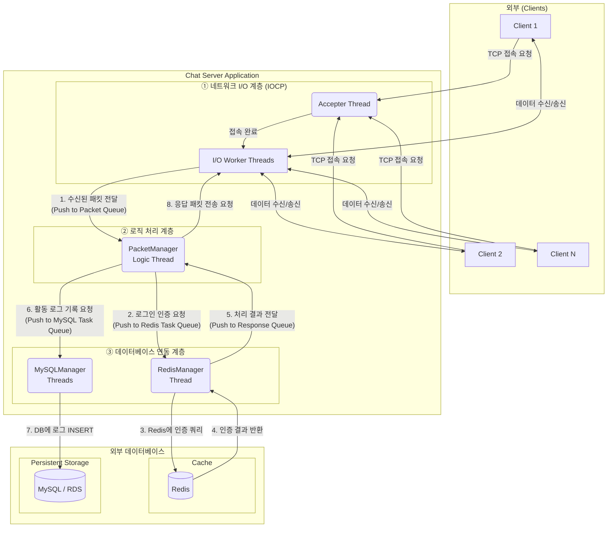
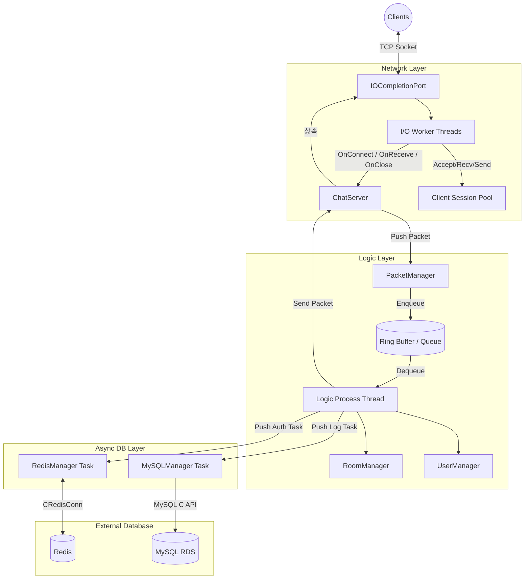
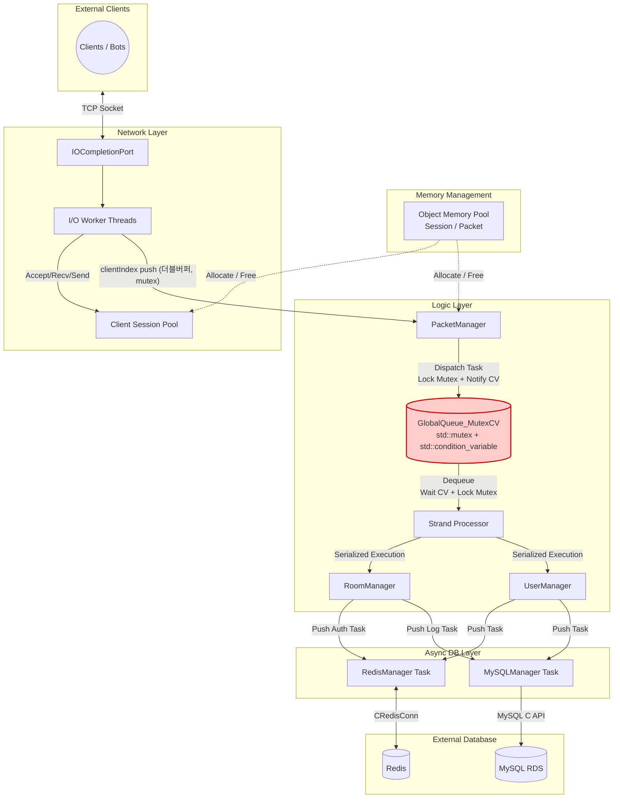
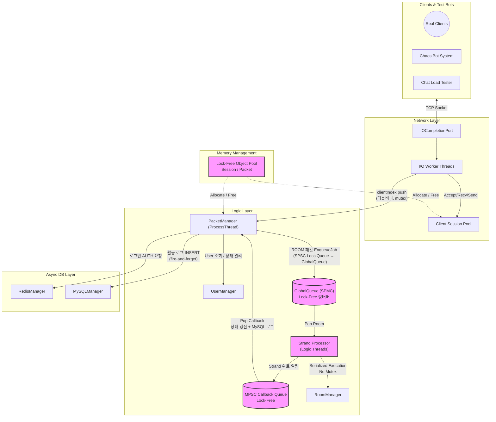
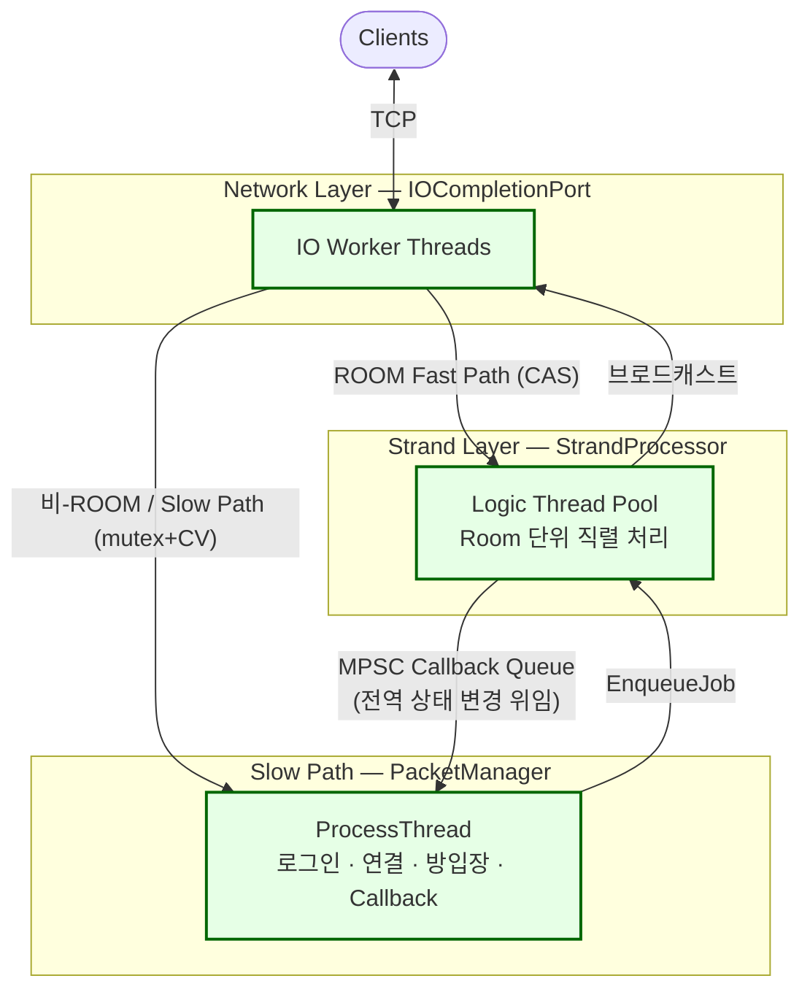

[← README로 돌아가기](../README.md)

# 서버 아키텍처 진화 및 성능 벤치마크

처리량(TPS)을 극대화하기 위해 총 4단계에 걸쳐 아키텍처를 리팩토링 및 최적화했습니다.

## 테스트 환경

| 구분 | 사양 |
| --- | --- |
| **Server** | AWS EC2 c6i.xlarge (4 vCPU, 8GB RAM) x 1대, Windows Server 2022 |
| **Client** | AWS EC2 c6i.xlarge (4 vCPU, 8GB RAM) x 4대, Windows Server 2022 (각 2,500봇) |
| **Network** | 동일 리전, 동일 클러스터 배치 그룹 (Cluster Placement Group) |
| **테스트 모드** | `TestMode=true` — Redis 인증/MySQL 로그 I/O 우회, 순수 네트워크/로직 엔진 처리 성능 측정 |

## 아키텍처 진화 요약

> `v0 → v1` : 단일 큐의 락 경합 → **더블 버퍼링**으로 해결 (TPS 83% 향상)
> 
> `v1 → v2` : 단일 코어 한계 → **로직 계층 멀티스레드 도입** (Strand + Mutex, 병목 발견)
> 
> `v2 → v3` : 로직 계층 Mutex 병목 → **Lock-Free 전환** (TPS 유지, p99 97%↓ · 무응답 1,075건→0건)
> 
> `v3 → v4` : 전체 패킷 경로의 ProcessThread 의존 → **ROOM 핫패스 직접 라우팅** (IO Worker → StrandProcessor CAS, context switch 제거)

---
## v0: Single-Thread(단일 큐)


## v0 → v1: Single-Thread (단일 큐 → 더블 버퍼링)

- **Problem:** IOCP 스레드와 패킷 처리 스레드가 단일 패킷 큐를 공유하며 `std::mutex`로 보호 → 패킷 삽입/처리마다 락 경합이 발생하여 처리 지연 누적, 1,000명 이상에서 처리 스타베이션(Starvation) 발생
- **Solution:** 더블 버퍼링(Double Buffering) 기법 도입. 수신용 큐와 처리용 큐를 분리하고, 로직 스레드가 처리를 시작 때 두 큐를 O(1) swap하여 락 경합 제거. IOCP I/O 워커 스레드도 4개 → 8개로 최적화
- **Result:** 초당 처리량(TPS) 83% 증가 및 평균 지연시간 76% 단축. 최대 1,500명 부하까지 안정적 처리.



### 단일 큐 vs 더블 버퍼링 성능 비교

| 부하 단계 | 핵심 지표 | 단일 큐 (Before) | 더블 버퍼링 (After) | 개선 |
| --- | --- | --- | --- | --- |
| **500명** | Chat RTT 평균 | 22.0 ms | **13.0 ms** | 41% 단축 |
|  | Chat RTT p50 | 16.8 ms | **11.0 ms** | 35% 단축 |
|  | Chat RTT p95 | 59.1 ms | **32.3 ms** | 45% 단축 |
| **1,000명** | Chat RTT 평균 | 349.7 ms | **83.7 ms** | 76% 단축 |
|  | Chat RTT p95 | 925.6 ms | **221.5 ms** | 76% 단축 |
|  | 초당 채팅 처리량 | 551 /sec | **1,010 /sec** | 83% 증가 |
| **1,500명** | Login 성공 | 1,000명 (한계) | **1,500명** | Starvation 해결 |
|  | Room Enter 성공 | 1,000명 (한계) | **1,500명** | 전원 성공 |
|  | Login RTT 평균 | 처리 불가 | **105.2 ms** | 정상 처리 |
| **2,000명** | 초당 채팅 처리량 | 350.9 /sec | **405.6 /sec** | 16% 증가 |
|  | 성공한 총 채팅 수 | 123,599건 | **168,851건** | 37% 증가 |
|  | Chat RTT 평균 | 222.9 ms | **185.6 ms** | 17% 단축 |

---

## v1 → v2: 로직 계층 멀티스레드 도입 (Strand + Mutex)

- **목표:** 1,500명 이상에서 발생하는 단일 코어의 한계(CPU 100% 및 처리 스타베이션)를 극복하기 위해 **로직 처리 계층에 스레드 풀(Strand Processor) 도입**. 수신 경로(IOCP Worker → ProcessThread)의 더블버퍼 구조는 v1에서 그대로 유지.
- **이슈:** 채팅 서버 특성상 브로드캐스트를 위한 공유 자원(Room, Session) 접근이 잦아 Mutex Lock/Unlock 과정에서 심각한 병목 발생. 2,000명 부하 시 p99 지연시간이 500ms까지 튀는 현상 확인



---

## v2 → v3: 로직 계층 Lock-Free 전환 — 최종 아키텍처

- **구현:** v2의 스레드 구조(Strand Processor + Logic Thread Pool)는 그대로 유지하고, **로직 계층의 Mutex만 Lock-Free 자료구조로 교체**. ProcessThread → Room SPSC LocalQueue → GlobalQueue(SPMC) → Logic Thread 경로와 Logic Thread → MPSC Callback Queue → ProcessThread 경로를 Lock-Free로 구현. 패킷 전송 시마다 발생하던 동적 할당(new/delete)을 Lock-Free Object Pool로 대체하여 힙 메모리 단편화와 Lock 경합 병목을 동시에 해소. 수신 경로(IOCP Worker → ProcessThread)의 더블버퍼 구조는 v1부터 유지.

### v2 vs v3 성능 비교 (2,000명 Stress Test)

| 지표 | v2 (Mutex) | v3 (Lock-Free) | 개선 |
|------|-----------|----------------|------|
| **처리량** | 140,100 TPS | 142,400 TPS | +1.6% (동일 수준) |
| **평균 지연** | 36.5ms | 15.5ms | **57%↓** |
| **p99 지연** | ≤500ms | ≤16.1ms | **97%↓** |
| **무응답** | 1,075건 | 0건 | **완전 제거** |

> **핵심 인사이트**: Lock-Free 전환은 처리량을 크게 늘린 것이 아니라, **Mutex Spike를 제거하여 동일 처리량에서 응답 안정성을 확보**한 것이 본질입니다. Mutex 환경에서는 Lock 경합이 간헐적으로 500ms 지연을 유발하고 1,075건의 무응답을 만들었지만, Lock-Free 전환 후 p99가 16.1ms로 수렴하며 무응답이 완전히 사라졌습니다.

### 핵심 코드: Lock-Free MPSC Queue (Logic Thread → ProcessThread Callback 경로)

Logic Thread가 브로드캐스트 완료 후 상태 변경을 ProcessThread에 통보하는 Callback Queue로 사용됩니다. CAS(Compare-And-Swap) exchange 연산을 활용하여 다수의 Logic Thread(Producer) 간 경합 없이 Lock-Free Push를 구현했습니다.

```cpp
// MPSCQueue.h — Lock-Free Multi-Producer Single-Consumer Queue
void Push(T* node)
{
    node->mpscNext.store(nullptr, std::memory_order_relaxed);
    T* prev = m_tail.exchange(node, std::memory_order_acq_rel);  // CAS: 원자적 교환
    prev->mpscNext.store(node, std::memory_order_release);       // Hole 구간
}
```

Pop 연산에서는 sentinel(파수꾼) 노드와 hole(Push 중간 상태)을 포함한 3가지 상태를 처리하도록 구성했습니다

[전체 구현 보기 → `MPSCQueue.h`](../IOCPChatServer/MPSCQueue.h)

### 핵심 코드: Lock-Free Object Pool

서버 시작 시 `malloc + placement new`를 통해 N개의 객체를 사전에 할당하고, Lock-Free 스택을 이용하여 O(1) 속도로 할당 및 반납을 수행합니다. Hot-path에서 new/delete 호출이 발생하지 않아 OS 힙 락 경합을 원천적으로 제거했습니다

```cpp
// ObjectPool.h — Alloc/Free (Lock-Free Stack 기반)
T* Alloc()
{
    T* p = mFreeStack.Pop();  // Lock-Free Pop
    if (p) mFreeCount.fetch_sub(1, std::memory_order_relaxed);
    return p;
}

void Free(T* obj)
{
    if (obj == nullptr) return;
    mFreeStack.Push(obj);     // Lock-Free Push
    mFreeCount.fetch_add(1, std::memory_order_relaxed);
}
```

[전체 구현 보기 → `ObjectPool.h`](../IOCPChatServer/ObjectPool.h)

---

## 아키텍처별 성능 비교 (2,000명 Stress Test)


**4가지 아키텍처 모델**

1. **v1. Single-Thread (Double Buffering):** 로직 처리를 단일 스레드가 전담하여 락 오버헤드가 없으나, 코어의 물리적 한계가 존재
2. **v2. Multi-Thread (Mutex + CV):** 스레드 풀을 도입했으나, 브로드캐스트 시 공유 자원(방, 세션) 접근으로 인한 Lock 경합 발생
3. **v3. 로직 계층 Lock-Free 전환:** v2의 Strand 구조를 유지하면서 Mutex를 제거. 로직 계층(SPSC LocalQueue, GlobalQueue SPMC, MPSC Callback Queue)을 Lock-Free 자료구조로 전면 교체하여 경합 제거
4. **v4. ROOM 핫패스 직접 라우팅 — 최종:** ROOM 채팅 패킷의 ProcessThread 경유를 제거. IO Worker가 `atomic_flag` CAS로 라우팅 독점 획득 후 StrandProcessor로 직접 전달. Room LocalQueue SPSC → MPSC, GlobalQueue SPMC → MPMC 전환

**분석**

- **Single-Thread의 붕괴:** 1,500명까지는 싱글 스레드가 효율적이었으나, 2,000명 부하에서 단일 코어(CPU 100%) 병목으로 초당 23만 건의 패킷이 Drop(무응답)되는 붕괴가 발생
- **Mutex의 한계 (Lock Contention):** 멀티 스레드로 붕괴는 방지했으나, 동일 방(Room) 접근 시 락 획득/해제 과정에서 병목 발생. p99 지연시간 500ms
- **Lock-Free:** 처리량은 v2와 유사(140,100 → 142,400 TPS)하지만, **평균 지연 36.5ms → 15.5ms(57%↓), p99 500ms → 16.1ms(97%↓), 무응답 1,075건 → 0건**. Mutex Spike가 완전히 제거됨

---

> v3 아키텍처의 채팅 빈도별 한계 탐색 및 스레드 튜닝 데이터는 [부하 테스트 리포트](부하%20테스트.md)의 Scenario A를 참조해 주십시오.

---

## v3 → v4: ROOM 핫패스 직접 라우팅

- **문제:** ROOM 채팅 패킷(핫패스)도 ProcessThread를 경유 → 불필요한 context switch와 mutex+CV 오버헤드 발생
- **구현:** `TryAcquireRouting()` (`atomic_flag` CAS)으로 라우팅 독점권 획득 후 IO Worker가 StrandProcessor로 직접 EnqueueJob. 독점 획득 실패 또는 비-ROOM 패킷은 기존 Slow Path(double buffering → ProcessThread)로 폴백
- **자료구조 전환:** Room LocalQueue SPSC → MPSC (다중 IO Worker가 Producer), GlobalQueue SPMC → MPMC



### 병목 분석 — VS Concurrency Visualizer 프로파일링

v4 전환의 근거는 추측이 아닌 **실측 프로파일링 데이터**입니다. v3 상태에서 chatMin=20~50 극한 부하를 주며 VS Concurrency Visualizer로 스레드 동작을 분석했습니다.

#### 확인된 ProcessThread 콜스택 (동기화 대기 구간)

```
PacketManager::Run::'2'::<lambda_1>
  └─ PacketManager::ProcessPacket        ← PacketManager.cpp:189
       └─ _Cnd_wait
            └─ SleepConditionVariableSRW  ← 배치 처리 후 CV 대기 반복
                 └─ [커널 컨텍스트 스위치]
```

- `PacketManager::ProcessPacket`이 단일 스레드로 모든 ROOM 패킷을 처리하며 조건변수(SleepConditionVariableSRW) 대기 사이클을 반복함을 확인
- Death Spiral 진입 후 ProcessThread의 CV 대기 시간: **2,776ms** (Job Pool 소진으로 신규 PacketJob 할당 불가)

#### 확인된 StrandProcessor 실행 경로

```
StrandProcessor::ProcessRoom             ← StrandProcessor.cpp:116
  └─ Room::NotifyChat                    ← Room.cpp:40
       └─ ClientSession::SendMsg         ← ClientSession.cpp:83
            └─ ClientSession::SendIO     ← ClientSession.cpp:188
                 └─ WSASend
```

CPU Usage 프로파일러의 **실행 부하 과다 경로**에서 `StrandProcessor::Start` 스레드가 전체 CPU의 **70.63%** 를 소모함을 확인:


#### 스레드 전체 동기화 비율

| 상태 | 비율 | 해석 |
|------|:---:|------|
| 실행 (Running) | 30% | 실제 CPU 작업 |
| **동기화 대기** | **48%** | Lock / CV / IOCP 대기 |
| I/O 대기 | 11% | IOCP 완료 대기 |
| 대기 (Sleep) | 11% | 유휴 |

전체 스레드 시간의 **48%가 동기화 대기**였으며, Concurrency Visualizer 스레드 탭에서 Worker Thread(ProcessThread) 행의 대부분이 빨간색(동기화)으로 가득 찬 것을 확인:


Death Spiral 직후 IOCPChatServer CPU 사용률이 **0으로 붕괴**하는 패턴이 확인됨:


---

### v3 vs v4 성능 비교 (AWS EC2 c6i.4xlarge, 10,000명)

#### 500방 × 20명 — 스레드 구성별 안정성

| 조건 | 스레드 | v3 LockFree | v4 Hot-Path |
|------|--------|:-----------:|:-----------:|
| chatMin=150~450 | **L8/IO16** | 🔴 lat_avg 3,007ms · 29,218 disconnects | ✅ **lat_avg ~17ms · 0 disconnects · ~415K pkt/s** |
| chatMin=200~600 | **L8/IO16** | 🔴 lat_avg 28ms · 52,506 disconnects | ✅ **lat_avg ~9ms · 0 disconnects · ~369K pkt/s** |
| chatMin=150~450 | L16/IO8 | 🔴 lat_avg 138ms · 접속자 미달(7,716명) | ❌ **lat_avg 1,402ms · 35 disconnects (IO 병목)** |
| chatMin=200~600 | L16/IO8 | 🔴 lat_avg 27ms · 접속자 미달(7,975명) | ✅ lat_avg ~12ms · 0 disconnects |

> **핵심**: v4는 **L8/IO16(IO=16, Logic=8)** 구성에서 레이턴시와 연결 안정성 모두 결정적으로 개선됩니다. Logic Thread를 과도하게 늘리면(L16/IO8) IO 스레드 CPU 기아로 Room LocalQueue가 적체되고 레이턴시가 발산합니다(§5.3 참조).

#### 1000방 × 10명 — 스레드 구성별 성능

| 조건 | 스레드 | v3 | v4 |
|------|--------|:--:|:--:|
| chatMin=100~300 | **L8/IO16** | 🔴 lat_avg 77ms · 48,584 disconnects | ✅ **lat_avg ~8ms · 0 disconnects · ~397K pkt/s** |
| chatMin=50~150 | **L8/IO16** | 🔴 lat_avg 2,069ms · 65,217 disconnects | 🔴 lat_avg ~562ms · ~1,006 disconnects (고빈도 한계) |
| chatMin=100~300 | L16/IO8 | 미측정 | ❌ lat_avg ~186ms · IO 병목 |

#### 아키텍처 의사결정 요약

| 지표 | v3 LockFree | v4 Hot-Path | 채택 근거 |
|------|:-----------:|:-----------:|---------|
| 레이턴시 (L8/IO16, 150–450ms) | 🔴 3,007ms · 29,218 disconnects | ✅ **~17ms · 0 disconnects** | **v4 결정적 우위** |
| 레이턴시 (L8/IO16, 200–600ms) | 🔴 28ms · 52,506 disconnects | ✅ **~9ms · 0 disconnects** | **v4 결정적 우위** |
| 연결 안정성 (10,000명) | 🔴 최대 7,975명 (접속자 미달) | ✅ **10,000명 전원 수용** | v4 완전 해소 |
| IO 병목 구성 (L16/IO8) | 🔴 ProcessThread 적체 | 🟡 IO 스레드 기아로 대체 | **구성 선택 중요 (§5.3)** |

> v3의 ProcessThread 직렬화 병목이 v4에서 IO 스레드 CAS 라우팅으로 제거됨. 권장 구성(**L8/IO16, IO=16, Logic=8**)에서 레이턴시와 연결 안정성 모두 결정적으로 개선됩니다.