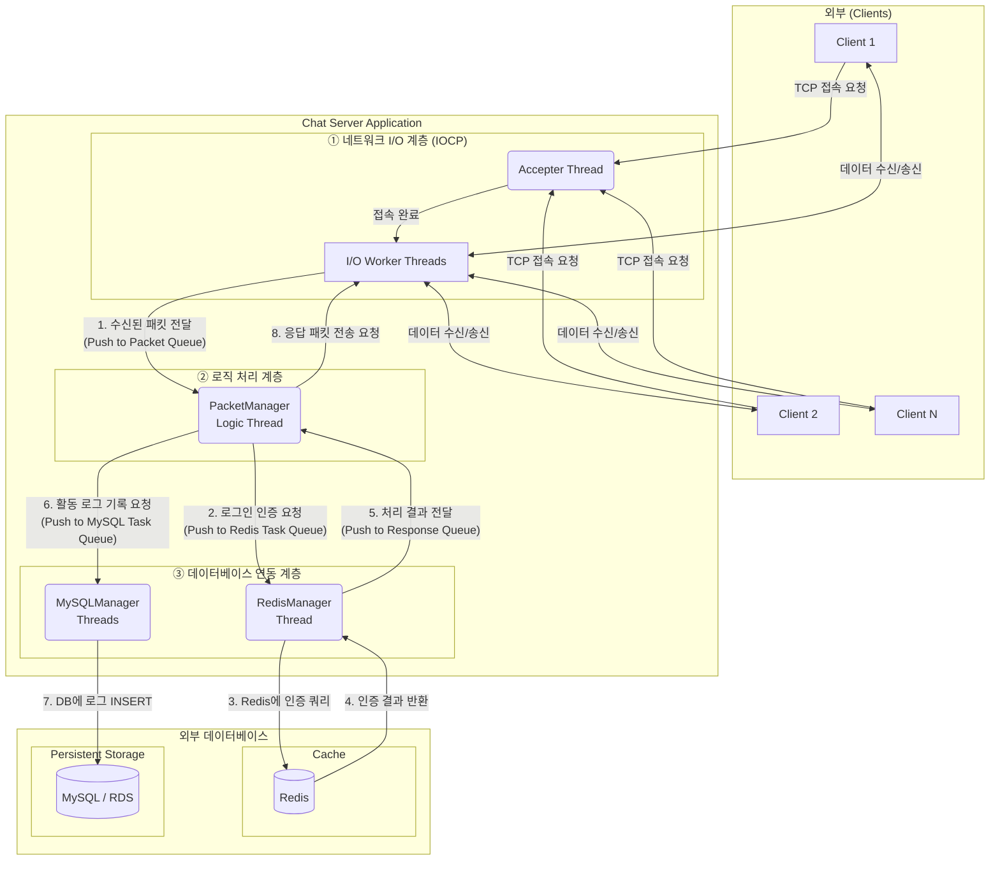

# IOCP 기반 고성능 채팅 서버

## 📋 프로젝트 개요
Windows IOCP(I/O Completion Port)를 활용한 고성능 멀티스레드 채팅 서버입니다. 비동기 I/O와 패킷 처리의 분리로 높은 동시 접속자 수를 지원하며, 방 기반 실시간 채팅 시스템을 구현했습니다.

## 🚀 주요 특징
- **IOCP 기반 네트워크 처리**
  - AcceptEx, WSARecv, WSASend 비동기 처리
  - Overlapped 구조체 확장을 통한 세션 관리
- **클라이언트 관리**
  - `UserManager`를 통한 유저 객체 풀 관리
  - 중복 로그인 방지
- **Room 시스템**
  - `RoomManager`를 통한 다중 채팅방 관리
  - 방 입장, 퇴장, 사용자 그룹 채팅 지원
- **데이터베이스 연동**
  - Redis: 빠른 In-Memory 캐시로 활용하여 사용자의 로그인 인증을 담당
  - MySQL(AWS RDS): 사용자의 모든 주요 활동(로그인, 채팅, 방 입/퇴장)을 영구적으로 기록
- **패킷 시스템**
  - `PACKET_HEADER` 기반 구조화된 패킷 처리
  - 패킷 ID별 Dispatcher (`PacketManager`)
  - 링버퍼 기반 패킷 조립
  - ~~함수 포인터 기반 패킷 핸들러~~
  - std::function 기반 패킷 핸들러
- **멀티스레드 처리**
  - 네트워크 I/O와 어플리케이션 로직 분리
  - IOCP 워커 스레드 풀
  - 패킷 처리 전용 스레드
  - Redis Task 처리 스레드
  - MySQL Task 처리 스레드
## 🏗️ 아키텍처

### 전체 구조
```
┌─────────────────┐
│     Client      │
│  (채팅 프로그램) │
└─────────────────┘
          │
          ▼
┌──────────────────────────────────────────────┐
│                  IOCP Server                 │
│  ┌────────────────────┐                      │
│  │  IOCP(NetWork I/O) │◄─ AcceptEx / WSARecv / WSASend
│  └────────────────────┘                      │
│           │                                  │
│           ▼                                  │
│  ┌────────────────────────────┐              │
│  │   PacketManager            │◄─ 패킷 큐 처리, Dispatcher
│  └────────────────────────────┘              │
│     │          │         │                   │
│     │          │         │                   │
│     ▼          ▼         ▼                   │
│ ┌─────────┐ ┌─────────┐ ┌──────────┐         │
│ │ UserMgr │ │ RoomMgr │ │ MySQLMgr │◄─ 활동 로그 기록
│ └─────────┘ └─────────┘ └──────────┘         │
│                              │               │
│  ┌────────────────────┐      │               │
│  │    RedisManager    │◄─────┴─ 로그인 요청 처리
│  └────────────────────┘      │               │
└───────────┬──────────────────┬───────────────┘
            │                  │
            ▼                  ▼
┌─────────────────┐    ┌─────────────────┐
│     Redis DB    │    │    MySQL DB     │
│   (ID/PASSWORD) │    │ (Activity Log)  │
└─────────────────┘    └─────────────────┘

  ```


### 핵심 컴포넌트
- **IOCompletionPort**: IOCP 초기화 및 워커 스레드 관리
- **ClientSession**: 클라이언트별 소켓 및 버퍼 관리
- **PacketManager**: 패킷 수신, 송신, 조립
- **UserManager**: 사용자 세션 및 상태 관리
- **RoomManager**: 채팅방 생성 및 관리
- **RedisManager**: 전용 스레드를 통해 빠른 사용자 인증을 수행
- **MySQLManager**: 전용 스레드를 통해 서버의 주요 활동을 기록

## 📦 기술 스택
- **언어**: C++17
- **플랫폼**: Windows
- **네트워크**: Windows Sockets (Winsock2), IOCP
- **데이터베이스**: 
  - Redis (로그인 검증용)
  - MySQL: 활동 로그 영구 저장 (AWS RDS 연동)
- **빌드 도구**: Visual Studio 2019+

## 🔧 빌드 및 실행

### 요구사항
- Windows 10/11
- Visual Studio 2019 이상
- Redis Server
- MySQL Server
### 빌드 방법
```bash
# Visual Studio에서 솔루션 파일 열기
IOCPChatServer.sln

# 빌드 구성: x64 Debug/Release
# 빌드 실행 (Ctrl+Shift+B)
```

### 실행 방법
1. Redis 서버 시작 (포트 6379)
2. Redis 클라이언트에 이용자 아이디, 비밀번호 세팅
3. IOCPChatServer.sln 실행
4. 클라이언트 연결 (포트 11021)

## 📊 성능 특징
- **동시 접속자**: 최대 1000명 (설정 가능)
- **방 생성**: 최대 10개 (설정 가능)
- **방당 사용자**: 최대 4명
- **패킷 처리**: 비동기 큐 기반 처리
- **메모리 사용**: 링버퍼로 효율적인 메모리 관리

## 📁 프로젝트 구조
```
IOCPChatServer/
├── IOCP.h                  # IOCP 핵심 클래스
├── ClientSession.h         # 클라이언트 세션 관리
├── Packet.h                # 패킷 구조체 정의
├── PacketManager.h/cpp     # 패킷 처리
├── User.h                  # 사용자 정보 및 상태
├── UserManager.h           # 사용자 관리
├── Room.h                  # 채팅방 구현
├── RoomManager.h           # 채팅방 관리
├── RedisManager.h          # Redis 연동
├── RingBuffer.h            # 링버퍼 직접 구현
├── Define.h                # 상수 및 타입 정의
├── ErrorCode.h             # 에러 코드 정의
└── main.cpp                # 메인 함수
```

## 🔍 핵심 구현 내용

### 1. IOCP 기반 비동기 I/O
- `CreateIoCompletionPort`로 I/O 완료 이벤트 큐 생성
- `GetQueuedCompletionStatusEx`로 배치 I/O 완료 처리
- `WSARecv`, `WSASend`, `AcceptEx` 비동기 호출

### 2. 패킷 처리 시스템
- 링버퍼 기반 패킷 조립
- 헤더 peek → 길이 확인 → 전체 데이터 read
- ~~함수 포인터 기반 패킷 핸들러 디스패치~~
- std::function 기반 패킷 핸들러 디스패치

### 3. 멀티스레드 아키텍처
- IOCP 워커 스레드: 네트워크 I/O 처리
- Accepter 스레드: 연결 수락
- 패킷 처리 스레드: 비즈니스 로직

### 4. 방 기반 채팅
- 사용자 입장/퇴장 관리
- 방별 브로드캐스트 메시지 전송
- 동시 접속자 수 제한

## 🛠️ Technical Challenges

### Challenge 1: TCP Stream Packet 경계
- **Problem**: TCP는 스트림 기반 프로토콜로 패킷 경계가 없어서, 여러 패킷이 합쳐지거나 하나의 패킷이 분할되어 수신될 수 있음. 이로 인해 패킷 조립 시 데이터 손실이나 잘못된 파싱이 발생할 위험
- **Approach**: 고정 길이 헤더 구조체를 설계하고, 링버퍼를 도입하여 스트림 데이터를 안전하게 버퍼링
- **Solution**: `User::GetPacket()`에서 헤더 peek → 전체 길이 확인 → 정확한 바이트 수만큼 read

### Challenge 2: 다중쓰레드에서 Ring Buffer 접근
- **Problem**: 네트워크 쓰레드(IOCP Worker)에서 `User::SetPacketData()`로 데이터 쓰기와 패킷 처리 쓰레드에서 `User::GetPacket()`으로 데이터 읽기가 동시에 발생하여 데이터 race condition 발생.
- **Approach**: Mutex추가로 쓰레드 안전성 확보
- **Solution**: `User` 클래스에 `mPacketRingBuffMutex` 추가, `SetPacketData()`, `GetPacket()`, `Clear()` 메서드를 동일한 뮤텍스로 보호

### Challenge 3: 연결 종료 중 잔여 인덱스 처리
- **Problem**: `DequePacketData()`에서 `userIndex`가져와 처리하는 과정 직전에, 패킷 처리 쓰레드에서 시스템 패킷으로 `ClearConnectionInfo()`가 먼저 실행되어 `User::Clear()`가 호출이 되면 이미 초기화된 사용자 객체에 대해 패킷 처리를 시도하여 빈 패킷 반환 하게 되고, 불필요한 처용

## 🔮 향후 개선 방향
- [x] ~~std::function 기반 패킷 핸들러로 리팩토링~~
- [x] ~~MySQL 연동하여 사용자 활동 로그 기록~~
- [ ] 더미 클라이언트 테스트
- [ ] 멀티서버 구조 확장

## 👨‍💻 개발자
- **이름**: 강형우
- **연락처**: rkdguddn21@gmail.com
- **GitHub**: [https://github.com/kanghyoungwoo]
