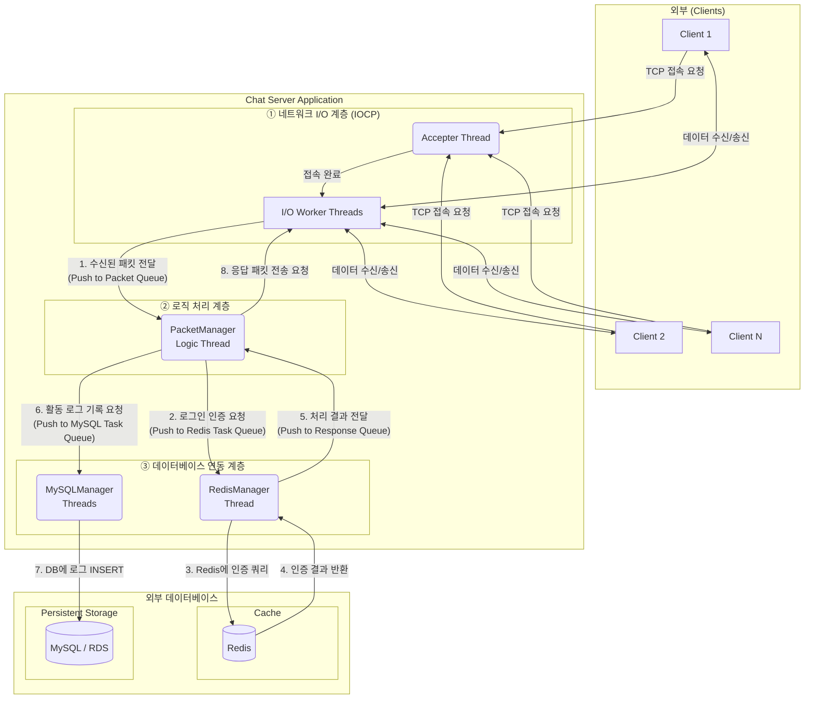

# IOCP 기반 고성능 채팅 서버

## 📋 프로젝트 개요
Windows IOCP(I/O Completion Port)를 활용한 고성능 멀티스레드 채팅 서버입니다. 비동기 I/O와 패킷 처리의 분리로 높은 동시 접속자 수를 지원하며, 방 기반 실시간 채팅 시스템을 구현했습니다.

## 🚀 주요 특징
- **IOCP 기반 네트워크 처리**
  - AcceptEx, WSARecv, WSASend 비동기 처리
  - Overlapped 구조체 확장을 통한 세션 관리
- **클라이언트 관리**
  - `UserManager`를 통한 유저 객체 풀 관리
  - 중복 로그인 방지
- **Room 시스템**
  - `RoomManager`를 통한 다중 채팅방 관리
  - 방 입장, 퇴장, 사용자 그룹 채팅 지원
- **데이터베이스 연동**
  - Redis: 빠른 In-Memory 캐시로 활용하여 사용자의 로그인 인증을 담당
  - MySQL(AWS RDS): 사용자의 모든 주요 활동(로그인, 채팅, 방 입/퇴장)을 영구적으로 기록
- **패킷 시스템**
  - `PACKET_HEADER` 기반 구조화된 패킷 처리
  - 패킷 ID별 Dispatcher (`PacketManager`)
  - 링버퍼 기반 패킷 조립
  - ~~함수 포인터 기반 패킷 핸들러~~
  - std::function 기반 패킷 핸들러
- **멀티스레드 처리**
  - 네트워크 I/O와 어플리케이션 로직 분리
  - IOCP 워커 스레드 풀
  - 패킷 처리 전용 스레드
  - Redis Task 처리 스레드
  - MySQL Task 처리 스레드
## 🏗️ 아키텍처

### 전체 구조
```
┌─────────────────┐
│     Client      │
│  (채팅 프로그램) │
└─────────────────┘
          │
          ▼
┌──────────────────────────────────────────────┐
│                  IOCP Server                 │
│  ┌────────────────────┐                      │
│  │  IOCP(NetWork I/O) │◄─ AcceptEx / WSARecv / WSASend
│  └────────────────────┘                      │
│           │                                  │
│           ▼                                  │
│  ┌────────────────────────────┐              │
│  │   PacketManager            │◄─ 패킷 큐 처리, Dispatcher
│  └────────────────────────────┘              │
│     │          │         │                   │
│     │          │         │                   │
│     ▼          ▼         ▼                   │
│ ┌─────────┐ ┌─────────┐ ┌──────────┐         │
│ │ UserMgr │ │ RoomMgr │ │ MySQLMgr │◄─ 활동 로그 기록
│ └─────────┘ └─────────┘ └──────────┘         │
│                              │               │
│  ┌────────────────────┐      │               │
│  │    RedisManager    │◄─────┴─ 로그인 요청 처리
│  └────────────────────┘      │               │
└───────────┬──────────────────┬───────────────┘
            │                  │
            ▼                  ▼
┌─────────────────┐    ┌─────────────────┐
│     Redis DB    │    │    MySQL DB     │
│   (ID/PASSWORD) │    │ (Activity Log)  │
└─────────────────┘    └─────────────────┘

  ```


### 핵심 컴포넌트
- **IOCompletionPort**: IOCP 초기화 및 워커 스레드 관리
- **ClientSession**: 클라이언트별 소켓 및 버퍼 관리
- **PacketManager**: 패킷 수신, 송신, 조립
- **UserManager**: 사용자 세션 및 상태 관리
- **RoomManager**: 채팅방 생성 및 관리
- **RedisManager**: 전용 스레드를 통해 빠른 사용자 인증을 수행
- **MySQLManager**: 전용 스레드를 통해 서버의 주요 활동을 기록

## 📦 기술 스택
- **언어**: C++17
- **플랫폼**: Windows
- **네트워크**: Windows Sockets (Winsock2), IOCP
- **데이터베이스**: 
  - Redis (로그인 검증용)
  - MySQL: 활동 로그 영구 저장 (AWS RDS 연동)
- **빌드 도구**: Visual Studio 2019+

## 🔧 빌드 및 실행

### 요구사항
- Windows 10/11
- Visual Studio 2019 이상
- Redis Server
- MySQL Server
### 빌드 방법
```bash
# Visual Studio에서 솔루션 파일 열기
IOCPChatServer.sln

# 빌드 구성: x64 Debug/Release
# 빌드 실행 (Ctrl+Shift+B)
```

### 실행 방법
1. Redis 서버 시작 (포트 6379)
2. Redis 클라이언트에 이용자 아이디, 비밀번호 세팅
3. IOCPChatServer.sln 실행
4. 클라이언트 연결 (포트 11021)

### ▶️ 시연 영상


### ▶️ 더미 클라이언트 테스트 영상


## 📊 성능 특징
- **동시 접속자**: 최대 2000명 (설정 가능)
- **방 생성**: 최대 250개 (설정 가능)
- **방당 사용자**: 최대 8명(설정 가능)
- **패킷 처리**: 비동기 큐 기반 처리
- **메모리 사용**: 링버퍼로 효율적인 메모리 관리

## 📁 프로젝트 구조
```
IOCPChatServer/
├── IOCP.h                  # IOCP 핵심 클래스
├── ClientSession.h         # 클라이언트 세션 관리
├── Packet.h                # 패킷 구조체 정의
├── PacketManager.h/cpp     # 패킷 처리
├── User.h                  # 사용자 정보 및 상태
├── UserManager.h           # 사용자 관리
├── Room.h                  # 채팅방 구현
├── RoomManager.h           # 채팅방 관리
├── RedisManager.h          # Redis 연동
├── RingBuffer.h            # 링버퍼 직접 구현
├── Define.h                # 상수 및 타입 정의
├── ErrorCode.h             # 에러 코드 정의
└── main.cpp                # 메인 함수
```

## 🔍 핵심 구현 내용

### 1. IOCP 기반 비동기 I/O
- `CreateIoCompletionPort`로 I/O 완료 이벤트 큐 생성
- `GetQueuedCompletionStatusEx`로 배치 I/O 완료 처리
- `WSARecv`, `WSASend`, `AcceptEx` 비동기 호출

### 2. 패킷 처리 시스템
- 링버퍼 기반 패킷 조립
- 헤더 peek → 길이 확인 → 전체 데이터 read
- ~~함수 포인터 기반 패킷 핸들러 디스패치~~
- std::function 기반 패킷 핸들러 디스패치

### 3. 멀티스레드 아키텍처
- IOCP 워커 스레드: 네트워크 I/O 처리
- ~~Accepter 스레드: 연결 수락~~
- 패킷 처리 스레드: 비즈니스 로직

### 4. 방 기반 채팅
- 사용자 입장/퇴장 관리
- 방별 브로드캐스트 메시지 전송
- 동시 접속자 수 제한

## 🛠️ Technical Challenges

### Challenge 1: TCP Stream Packet 경계
- **Problem**: TCP는 스트림 기반 프로토콜로 패킷 경계가 없어서, 여러 패킷이 합쳐지거나 하나의 패킷이 분할되어 수신될 수 있음. 이로 인해 패킷 조립 시 데이터 손실이나 잘못된 파싱이 발생할 위험
- **Approach**: 고정 길이 헤더 구조체를 설계하고, 링버퍼를 도입하여 스트림 데이터를 안전하게 버퍼링
- **Solution**: `User::GetPacket()`에서 헤더 peek → 전체 길이 확인 → 정확한 바이트 수만큼 read

### Challenge 2: 다중쓰레드에서 Ring Buffer 접근
- **Problem**: 네트워크 쓰레드(IOCP Worker)에서 `User::SetPacketData()`로 데이터 쓰기와 패킷 처리 쓰레드에서 `User::GetPacket()`으로 데이터 읽기가 동시에 발생하여 데이터 race condition 발생.
- **Approach**: Mutex추가로 쓰레드 안전성 확보
- **Solution**: `User` 클래스에 `mPacketRingBuffMutex` 추가, `SetPacketData()`, `GetPacket()`, `Clear()` 메서드를 동일한 뮤텍스로 보호

### Challenge 3: 비동기 이벤트 처리 중 발생하는 상태 불일치 문제
- **Problem**: I/O 쓰레드가 작업을 생성한 후 큐에 넣기 전 사이에 다른 쓰레드가 사용자의 상태를 변경하면 ProcessPacket쓰레드엔 무효화된 작업이 들어가게됨
- **Approach**: Client 객체의 생명 주기를 추적할 수 있도록 Generation token 도입으로 상태 검증
- **Solution**: User클래스에 generation token을 도입하여 패킷 처리 작업을 생성할 때 당시의 generation token 값을 함께 기록하여 queue에서 꺼내어 작업을 할 때 generation token 값을 비교 하여 값이 다를 경우 해당 패킷을 무효화 된 패킷처리

### Challenge 4: 기존 Send 로직의 잦은 동적 할당(new/delete)으로 인한 힙 메모리 단편화 및 다중 스레드 환경에서의 Lock 경합 병목 발생
- **Problem**: 패킷 전송 시마다 발생하는 잦은 동적 할당(new/delete)으로 인해 힙 메모리 단편화가 유발되고, 다중 스레드 환경에서 Lock 경합이 발생
- **Approach**: 동적할당을 없애고 메모리 풀 도입
- **Solution**: 메모리 풀을 구현하여 런타임 동적 할당 오버헤드를 제거하였고, 메모리 연속성을 통해 송신 처리 속도 개선

### Challenge 5: Graceful Shutdown 구현
- **Problem**: 서버 강제 종료 시 진행 중인 I/O와 DB 작업이 유실되고, 리소스가 정리되지 않아 데이터 손실과 메모리 누수가 발생
- **Approach**: 5단계 순차 종료(Accept 차단 → 클라이언트 킥 + CancelIoEx → I/O Draining → PQCS 워커 종료 → 리소스 정리)하고, DB/Redis 쓰레드는 queue draining 후 종료
- **Solution**: DestroyThread()를 5단계로 구성, MySQL/Redis의 TaskProcessThread()를 빈 큐 확인 패턴으로 변경하여 잔여 작업을 모두 처리한 뒤 종료하도록 구현. 추가로 SetConsoleCtrlHandler로 Ctrl+C 및 콘솔 종료도 Graceful Shutdown으로 구현

### Challenge 6: AcceptEx 빈 세션 탐색 방식의 비효율
- **Problem**: AccepterThread가 빈 세션을 찾기 위해 매번 전체 10,000개를 O(N) 선형 탐색하며, 이미 AcceptEx가 걸린 세션에 중복 호출하여 소켓 누수가 발생 가능성 존재
- **Approach**: FreeList를 도입하여 O(1) Pop/Push로 빈 세션을 관리하고, 서버 시작 시 100개만 미리 AcceptEx를 걸어둔 뒤 워커 스레드가 완료 시 1개씩 보충하는 방식으로 변경
- **Solution**: AccepterThread를 제거하고 PopFreeSessionIndex()/PushFreeSessionIndex()로 세션을 관리하며 ACCEPT 완료 시 워커 스레드가 자동으로 AcceptEx를 보충하도록 구현. 커널에는 항상 ~100개의 대기 소켓만 유지

### Challenge 7: 단일 패킷 큐의 락 경합으로 인한 로직 처리 지연
- **Problem**: 단일 패킷 큐의 락 경합(Lock Contention) 및 로직 처리 지연 IOCP 스레드와 패킷 처리 스레드가 패킷 큐(mInComingPacketUserIndex)를 주고받을 때 std::mutex를 사용하여 빈번하게 락이 발생
- **Approach**: 더블 버퍼링 기법을 도입함. 수신용 큐와 처리용 큐를 분리하여, 로직 스레드가 패킷을 처리하는 동안에도 네트워크 쓰레드들이 방해받지 않고 패킷을 삽입할 수 있도록 만듦
- **Solution**: 일반 패킷과 시스템 패킷을 분리하여 각각 수신 큐와 로직 처리 큐를 두 쌍으로 구성함.
- **Result**:
### 🚀 성능 최적화 결과 (단일 큐 vs 더블 버퍼링)

수신 큐와 로직 큐를 분리하는 **더블 버퍼링(Swap)** 기법을 도입하고, IOCP I/O 워커 스레드를 4개에서 **8개로 최적화**하여 락(Lock) 경합 병목을 O(1)로 단축한 결과

#### ⚡ Phase 1: 로직 처리 지연 시간(Latency) 비교 (500명 기준)
부하가 상대적으로 적은 구간으로, 순수 로직 처리 속도의 개선을 보여줌

| 지표 (Phase 1) | 단일 큐 (Before) | 더블 버퍼링 (After) | 개선율 |
| :--- | :---: | :---: | :---: |
| **Chat RTT (평균)** | 22.0 ms | **13.0 ms** | 📉 **41% 단축** |
| **Chat RTT (p50)** | 16.8 ms | **11.0 ms** | 📉 **35% 단축** |
| **Chat RTT (p95)** | 59.1 ms | **32.3 ms** | 📉 **45% 단축** |

<br>

#### 📊 Phase 2: 처리량 및 안정성 비교 (1,000명 기준)
서버에 본격적인 부하가 걸리는 구간으로, 처리량과 응답 안정성의 차이가 극명하게 드러남

| 지표 (Phase 2) | 단일 큐 (Before) | 더블 버퍼링 (After) | 개선율 |
| :--- | :---: | :---: | :---: |
| **Chat RTT (평균)** | 349.7 ms | **83.7 ms** | 📉 **76% 단축** |
| **Chat RTT (p95)** | 925.6 ms | **221.5 ms** | 📉 **76% 단축** |
| **초당 채팅 처리량** | 551 /sec | **1,010 /sec** | 📈 **83% 증가** |

<br>

#### 🛡️ Phase 3: 처리 스타베이션(Starvation) 해결 및 확장성 (1,500명 접속 기준)
기존 병목으로 인해 1,000명에서 발생하던 처리 스타베이션 현상이 완벽하게 해결

| 지표 (Phase 3) | 단일 큐 (Before) | 더블 버퍼링 (After) | 결과 |
| :--- | :---: | :---: | :---: |
| **Login 성공** | 1,000 명 (한계) | **1,500 명** | ✅ **전원 성공** |
| **Room Enter 성공** | 1,000 명 (한계) | **1,500 명** | ✅ **전원 성공** |
| **Login RTT (평균)** | 처리 불가 (Starvation) | **105.2 ms** | ✅ **정상 처리** |

<br>

#### 🔥 Phase 4: 극한 부하에서의 절대 처리량 (2,000명 기준)
서버가 한계에 달하는 상황에서도 더 높은 처리량(Throughput)과 안정적인 응답 속도를 유지

| 지표 (Phase 4) | 단일 큐 (Before) | 더블 버퍼링 (After) | 개선율 |
| :--- | :---: | :---: | :---: |
| **초당 채팅 처리량** | 350.9 /sec | **405.6 /sec** | 📈 **16% 증가** |
| **성공한 총 채팅 수** | 123,599 건 | **168,851 건** | 📈 **37% 증가** |
| **Chat RTT (평균)** | 222.9 ms | **185.6 ms** | 📉 **17% 단축** |

## 🔮 향후 개선 방향
- [x] ~~std::function 기반 패킷 핸들러로 리팩토링~~
- [x] ~~MySQL 연동하여 사용자 활동 로그 기록~~
- [ ] 더미 클라이언트 테스트
- [ ] Lock-Free-Queue 구현하고 적용하기
- [ ] Process 처리 쓰레드를 단일 -> 멀티 쓰레드로 확장
- [ ] 멀티서버 구조 확장

## 👨‍💻 개발자
- **이름**: 강형우
- **연락처**: rkdguddn21@gmail.com
- **GitHub**: [https://github.com/kanghyoungwoo]
