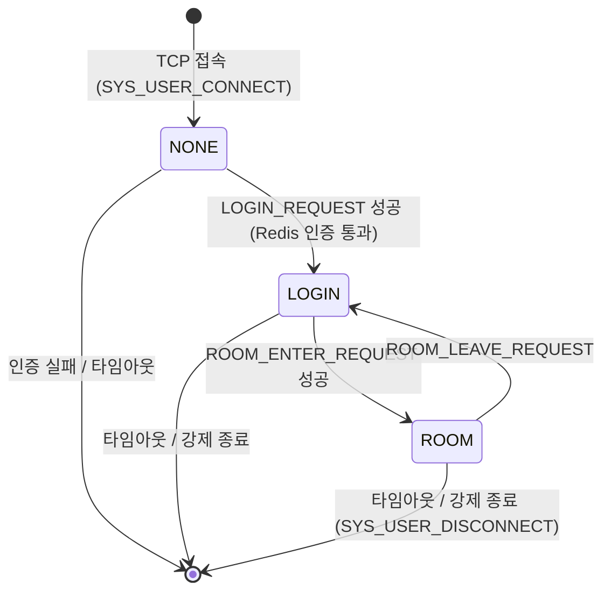
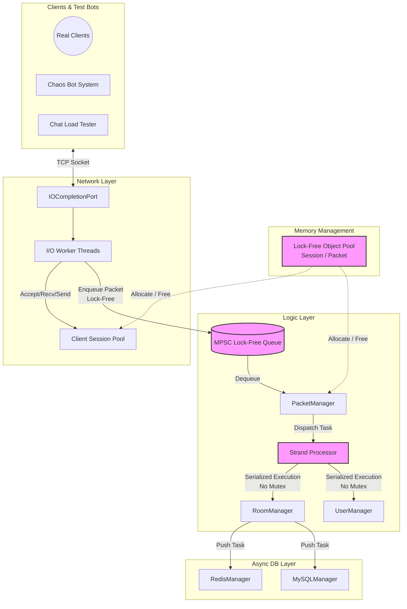
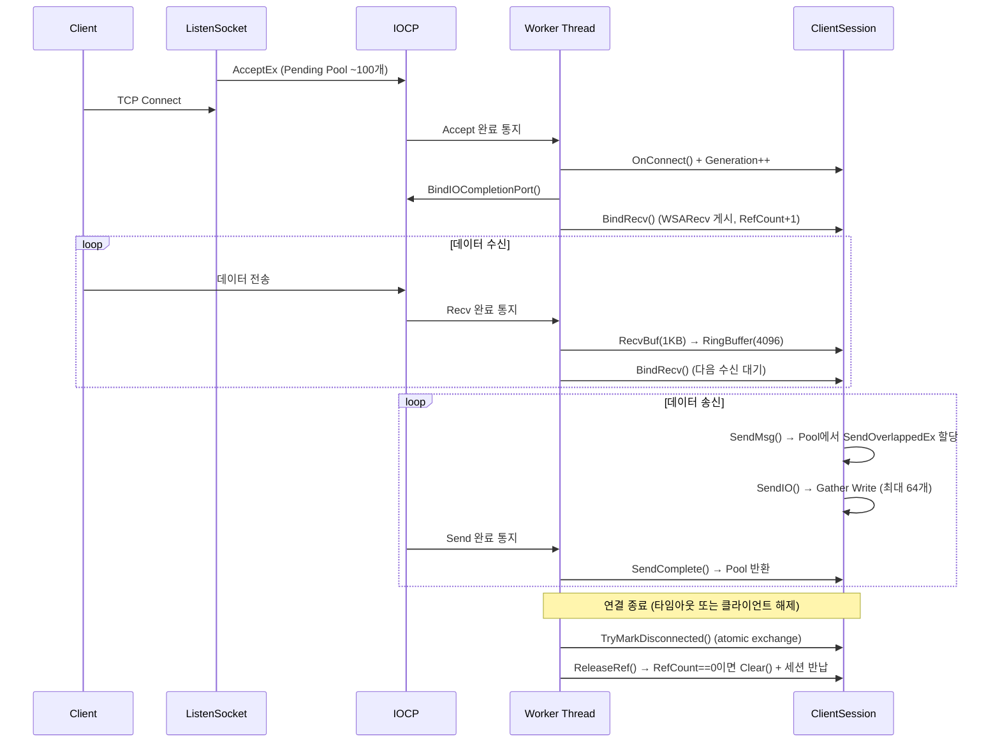
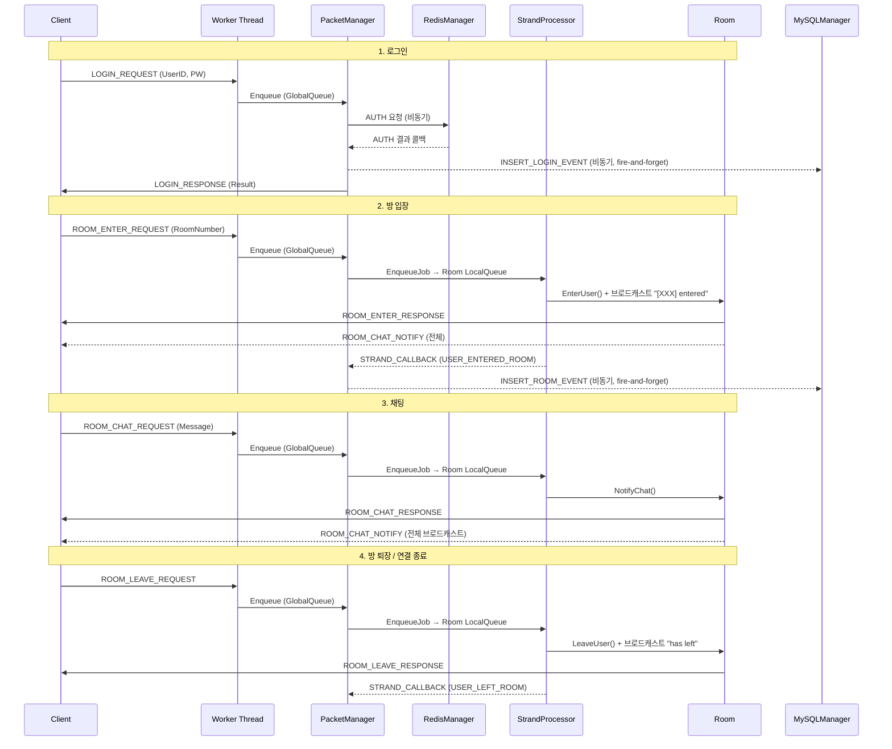
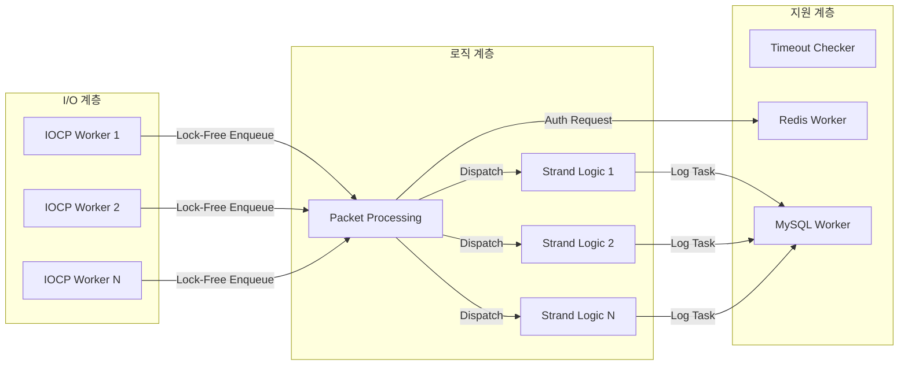

# IOCP 기반 Lock-Free 채팅서버

> C++17 | 10,000명 동시접속 | 288K~884K broadcast ops/s

Windows IOCP 기반 네트워크 엔진과 채팅 서비스를 **직접 설계·구현**한 프로젝트입니다.
Lock-Free 자료구조(MPSC Queue), Strand 패턴, Object Pool을 라이브러리 없이 직접 구현하여 엔진 레이어를 구성하고, Contents 레이어(채팅방, 인증, DB 연동)를 분리 설계하여 다른 실시간 서비스(게임, 알림 등)에도 적용 가능한 구조입니다.

         

---

## 목차

1. [프로젝트 소개](#1-프로젝트-소개)
2. [개발 환경](#2-개발-환경)
3. [핵심 기능](#3-핵심-기능)
4. [서버 아키텍처](#4-서버-아키텍처)
5. [네트워크 구조](#5-네트워크-구조)
6. [스레드 모델](#6-스레드-모델)
7. [패킷 구조](#7-패킷-구조)
8. [메모리 관리 전략](#8-메모리-관리-전략)
9. [동기화 전략](#9-동기화-전략)
10. [성능 테스트](#10-성능-테스트)
11. [트러블 슈팅](#11-트러블-슈팅)
12. [실행 방법](#12-실행-방법)
13. [시연 영상](#13-시연-영상)
14. [향후 개선 사항](#14-향후-개선-사항)

---

## 1. 프로젝트 소개

IOCP 기반의 고성능 채팅서버로, `std::mutex` 기반에서 시작하여 측정 기반 병목 분석을 통해 **Lock-Free 아키텍처**로 진화시킨 프로젝트입니다.

| 지표 | 수치 | 조건 |
|------|------|------|
| 측정 처리량 (CPU 50%) | **288K ops/s** | 200방 × 50명, Avg 20.7ms (W8/IO8/L4) |
| 측정 처리량 (CPU 90%) | **884K ops/s** | 500방 × 20명, Avg 49.2ms (W8/IO8/L4) |
| 동시접속 | **10,000명** | 연결실패 < 2건, 메모리 394MB 고정 |
| p99 지연시간 개선 | **500ms → 15.5ms** | 97% 개선 (Lock-Free 전환 후) |
| 메모리 누수 | **0 bytes** | VS 힙 스냅샷 +0 Bytes 교차 검증 |
| Zero-Allocation | **Alloc Fail 0건** | Lock-Free Object Pool, 핫패스 할당 없음 |

---

## 2. 개발 환경

| 분류 | 내용 |
|------|------|
| **Language** | C++17 |
| **OS / API** | Windows IOCP (`AcceptEx`, `GetQueuedCompletionStatusEx`) |
| **IDE** | Visual Studio 2022 |
| **Platform** | Windows |
| **Database** | Redis (hiredis), MySQL |
| **Infra** | AWS EC2 c6i.4xlarge (Server), c6i.xlarge × 4 (Client) |
| **Test** | Google Test (100 cases), Chaos Bot System, Chat Load Tester |

---

## 3. 핵심 기능

| 기능 | 설명 |
|------|------|
| **Lock-Free MPSC Queue** | CAS 기반 Multi-Producer Single-Consumer 큐로 I/O 워커 간 패킷 큐 경합 제거 |
| **Strand 패턴** | Room 단위 브로드캐스트를 Lock 없이 직렬화하여 동시성 보장 |
| **Lock-Free Object Pool** | `LockFreeStack` 기반 O(1) Alloc/Free, ABA 방지 Generation Counter 적용 |
| **10,000 동시접속** | AcceptEx Pending Pool + 세션 Free-list로 대규모 연결 수용 |
| **Zero-Allocation Hot Path** | 핫패스의 모든 할당을 사전 초기화된 Object Pool에서 처리 |
| **Generation Token** | 비동기 이벤트의 상태 불일치를 세대 카운터로 방어 |
| **TCP 패킷 경계 처리** | RingBuffer 기반 스트림 재조립으로 패킷 분할/병합 안전 처리 |
| **Graceful Shutdown** | 5단계 순차 종료 (Accept 차단 → 킥 → I/O Draining → 워커 종료 → 리소스 정리) |
| **좀비 세션 감지** | Ping/Pong + 타임아웃 기반 비활성 세션 자동 연결 해제 |
| **비동기 DB 레이어** | Redis (로그인 인증) + MySQL (활동 로그 기록) 별도 스레드에서 비동기 처리 |
| **로그 시스템** | `LOG_DEBUG` (Debug 빌드만 출력) / `LOG_ERROR` (항상 출력) / `LOG_ERROR_ONCE` (최초 1회만 출력) 매크로로 핫패스 오버헤드 최소화 |
| **크래시 대응** | `SetUnhandledExceptionFilter` + `MiniDumpWriteDump`로 미처리 예외 발생 시 타임스탬프 기반 `.dmp` 파일 자동 생성 (`CrashDump_%Y%m%d_%H%M%S.dmp`) |

### 유저 상태 머신 (State Machine)



| 상태 | 의미 | 허용 패킷 |
|------|------|-----------|
| `NONE` | TCP 연결됨, 미인증 | `LOGIN_REQUEST` |
| `LOGIN` | 인증 완료, 방 미입장 | `ROOM_ENTER_REQUEST` |
| `ROOM` | 방 입장 완료 | `ROOM_CHAT_REQUEST`, `ROOM_LEAVE_REQUEST` |

> 상태 외 패킷 수신 시 즉시 폐기 — `User::GetDomainState()` 검증 후 처리

---

## 4. 서버 아키텍처

### 아키텍처 다이어그램



> **패킷 흐름**: Client → WSARecv(IOCP) → RingBuffer → PacketJob 생성 + Generation Token → **Lock-Free GlobalQueue** → PacketManager → **Strand**(Room별 직렬화) → Room::BroadcastChat → **Object Pool**에서 SendBuffer 할당 → WSASend → I/O 완료 후 Pool 반환

### 핵심 기술 도전: 측정 기반의 병목 추적과 Lock-Free 전환

```
mutex 기반 (v2)              →    Lock-Free 아키텍처 (v3)
p99 500ms, 2,000명 동접       →    p99 15.5ms, 10,000명 동접
```

처음부터 Lock-Free를 도입하지 않았습니다. `std::mutex` 기반의 멀티스레딩 모델로 먼저 구현한 뒤, 부하 한계점을 측정하고 프로파일링하여 병목 지점만을 타겟팅해 최적화했습니다.

**[Issue]** 2,000명 동시 접속 부하 테스트 중 p99 지연시간이 **500ms**로 폭등하며, 처리 지연으로 인해 초당 23만 건의 패킷 유실(Drop)이 발생했습니다.

**[Analyze]** VS Profiler 진단 결과, 아키텍처의 양 끝단에서 `std::mutex` 경합 병목을 교차로 확인했습니다.
- **생산자 경합**: I/O 워커들이 패킷을 중앙 큐에 밀어 넣는 과정에서 병목이 발생했습니다.
- **동기화 병목**: 로직 스레드들이 방(Room) 객체에 접근할 때 병목이 발생했습니다.

**[Action]** 두 가지 병목을 각각 다른 전략으로 락(Lock) 없이 해소했습니다.
- **수신부**: CAS 연산 기반의 MPSC(Multi-Producer Single-Consumer) Lock-Free Queue를 구현하여 워커 스레드 간의 Lock 경합을 제거했습니다.
- **로직부**: Strand 패턴을 적용하여, 방(Room) 단위의 브로드캐스트 연산을 락 없이 안전하게 직렬화하도록 보장했습니다.

**[Result]** p99 지연시간을 **500ms에서 15.5ms로 97% 개선**했습니다. 이후 10,000명 동시 접속 환경에서 브로드캐스트 연산량을 최대 **884,000 ops/s**까지 무응답 및 크래시 없이 안정적으로 소화했습니다.

> 아키텍처 리팩토링 전 과정(v0 싱글스레드 → v1 더블버퍼링 → v2 Mutex → v3 Lock-Free)의 상세 지표는 [아키텍처 진화 문서](Docs/architecture-evolution.md)에서 확인할 수 있습니다.

---

## 5. 네트워크 구조

### 연결 수명주기



### 주요 설계

| 구성 요소 | 설계 | 구현 |
|-----------|------|------|
| **Accept** | AcceptEx Pending Pool | 서버 시작 시 100개 AcceptEx 게시, 완료 시 Worker가 1개씩 보충 (`TryPostAcceptEx`) |
| **세션 관리** | Generation + RefCount | `mGeneration` (atomic)으로 ABA 방지, `AddRef/ReleaseRef`로 비동기 I/O 수명 관리 |
| **수신** | 1KB 수신 버퍼 + RingBuffer | `WSARecv` → `RecvBuf[1024]` → `RingBuffer<4096>` TCP 스트림 재조립 |
| **송신** | Pool + Scatter-Gather | `ObjectPool<SendOverlappedEx>`에서 할당, `WSASend`로 최대 64개 버퍼 일괄 전송 |
| **완료 처리** | 배치 Dequeue | `GetQueuedCompletionStatusEx`로 최대 64개 완료를 한 번에 처리 |
| **연결 해제** | Race-Free Close | `TryMarkDisconnected()` (atomic exchange)로 단 하나의 스레드만 정리 담당 |

### 수신 코드 — RingBuffer 기반 TCP 스트림 재조립

```cpp
// User::GetPacket() — 헤더 peek → 길이 확인 → 완전한 패킷만 추출
if (mPacketDataBuffer.Size() < PACKET_HEADER_LENGTH)
    return PacketInfo();

char headerBuffer[PACKET_HEADER_LENGTH];
for (size_t i = 0; i < PACKET_HEADER_LENGTH; i++)
{
    if (!mPacketDataBuffer.Peek(headerBuffer[i], i))
        return PacketInfo();  // 불완전한 헤더
}
auto pHeader = (PACKET_HEADER*)headerBuffer;
```
[전체 구현 보기 → `User.h`](IOCPChatServer/User.h)

### 전체 사용 흐름 — Login → Chat → Leave



> **패킷 프로토콜 전체 스펙** → [Docs/packet-protocol.md](Docs/packet-protocol.md)

---

## 6. 스레드 모델

### 스레드 구성



| 스레드 그룹 | 기본 수량 | 역할 | 설정 |
|-------------|-----------|------|------|
| **IOCP Worker** | 8 | AcceptEx/WSARecv/WSASend 완료 처리, 패킷 Enqueue | `MaxIOWorkerThread` |
| **Packet Processing** | 1 (고정) | 더블버퍼 패킷 Dequeue, 핸들러 디스패치, 콜백 처리 | 고정 |
| **Strand/Logic** | 4 | Room별 MPSC 큐 드레인, 비즈니스 로직 직렬 처리 | `MaxLogicThread` |
| **Timeout Checker** | 1 (고정) | 비활성 세션 탐지, Ping/Pong 스케줄링 (주기: 10초) | 고정 |
| **Redis Worker** | 1 | 로그인 인증 (GET key=password) | 코드 고정 |
| **MySQL Worker** | 1 | 활동 로그 INSERT (로그인/입장/채팅) | 코드 고정 |

> **튜닝 인사이트**: 4-core에서 `IO4/W2/L4` (p99 17ms)를 도출했으며, 16-core에서는 시나리오별로 스레드 비율을 조정해야 한다는 결론을 단계별 부하 시험으로 확인했습니다. **방 인원이 많으면 IOCP Worker에, 방 수가 많으면 Logic Thread에 코어를 집중합니다.** 상세 권장값은 [부하 테스트 리포트](Docs/load-test-results.md)를 참조해 주십시오.

---

## 7. 패킷 구조

### 바이너리 헤더 (5바이트, `#pragma pack(push,1)`)

```
┌────────────────────┬──────────────────┬──────────────┐
│ PacketLength (2B)  │ PacketId (2B)    │ Type (1B)    │
│ UINT16             │ UINT16           │ UINT8        │
└────────────────────┴──────────────────┴──────────────┘
 전체 패킷 크기         패킷 종류 식별     압축/인코딩 플래그
```

```cpp
// Packet.h
#pragma pack(push,1)
struct PACKET_HEADER
{
    UINT16 PacketLength;
    UINT16 PacketId;
    UINT8  PacketType;
};
const UINT32 PACKET_HEADER_LENGTH = sizeof(PACKET_HEADER);  // 5 bytes
```

### Packet ID

| 카테고리 | Packet ID | 값 | 방향 |
|----------|-----------|-----|------|
| System | `SYS_USER_CONNECT` | 11 | Internal |
| System | `SYS_USER_DISCONNECT` | 12 | Internal |
| System | `SYS_PING` / `SYS_PONG` | 21 / 22 | S→C / C→S |
| Auth | `LOGIN_REQUEST` / `LOGIN_RESPONSE` | 201 / 202 | C→S / S→C |
| Room | `ROOM_ENTER_REQUEST` / `RESPONSE` | 206 / 207 | C→S / S→C |
| Room | `ROOM_LEAVE_REQUEST` / `RESPONSE` | 215 / 216 | C→S / S→C |
| Chat | `ROOM_CHAT_REQUEST` / `RESPONSE` | 221 / 222 | C→S / S→C |
| Chat | `ROOM_CHAT_NOTIFY` | 223 | S→C (broadcast) |

### 패킷 바디 예시

```cpp
// 로그인 요청
struct LOGIN_REQUEST_PACKET : PACKET_HEADER
{
    char UserID[MAX_USER_ID_LENGTH + 1];   // 33 bytes
    char UserPW[MAX_USER_PW_LENGTH + 1];   // 33 bytes
};

// 채팅 브로드캐스트 알림
struct ROOM_CHAT_NOTIFY_PACKET : PACKET_HEADER
{
    char UserID[MAX_USER_ID_LENGTH + 1];   // 33 bytes
    char Message[MAX_CHAT_MSG + 1];        // 257 bytes
};
```

### 주요 상수

| 상수 | 값 | 용도 |
|------|-----|------|
| `RING_BUFFER_SIZE` | 4,096 | User별 수신 버퍼 크기 (power-of-2) |
| `MAX_SOCKBUF` | 1,024 | WSARecv 1회 수신 버퍼 |
| `MAX_CHAT_MSG` | 256 | 채팅 메시지 최대 길이 |
| `MAX_USER_ID_LENGTH` | 32 | 유저 ID 최대 길이 |
| `MAX_PACKET_BODY_SIZE` | 512 | 단일 패킷 바디 최대 크기 |

---

## 8. 메모리 관리 전략

### Object Pool 구조

| Pool | 타입 | 용량 | 자료구조 | 용도 |
|------|------|------|----------|------|
| **SendBuffer Pool** | `ObjectPool<SendOverlappedEx>` | config 설정 | `LockFreeStack` | WSASend용 I/O 버퍼 |
| **Job Pool** | `ObjectPool<PacketJob>` | 200,000 (`JobPoolSize`) | `LockFreeStack` | Strand 패킷 작업 |
| **Session Free-list** | `LockFreeStack<SessionNode>` | 10,000 (`MaxClient`) | `LockFreeStack` | 빈 세션 인덱스 O(1) 탐색 |

### LockFreeStack — ABA 방지 Index 기반 설계

포인터 대신 **인덱스 기반**으로 설계하여 8바이트 CAS 한 번으로 ABA 문제를 방지합니다.

```cpp
// LockFreeStack.h — {index, generation}을 uint64_t로 Pack하여 단일 CAS 수행
struct TaggedIndex
{
    uint32_t index;       // 풀 인덱스 (UINT32_MAX = 비어있음)
    uint32_t generation;  // ABA 방지 카운터
};

std::atomic<uint64_t> m_head;  // Pack(index, generation)

static uint64_t Pack(uint32_t index, uint32_t gen)
{
    return static_cast<uint64_t>(index) | (static_cast<uint64_t>(gen) << 32);
}
```

```cpp
// LockFreeStack::Push — 포인터 → 인덱스 변환 후 CAS
void Push(T* obj)
{
    uint32_t objIndex = static_cast<uint32_t>(obj - m_pool);
    uint64_t oldHead = m_head.load(std::memory_order_relaxed);

    while (true)
    {
        TaggedIndex old = Unpack(oldHead);
        obj->poolNext = old.index;
        uint64_t newHead = Pack(objIndex, old.generation + 1);

        if (m_head.compare_exchange_weak(oldHead, newHead,
            std::memory_order_release,
            std::memory_order_relaxed))
            break;
    }
}
```
[전체 구현 보기 → `LockFreeStack.h`](IOCPChatServer/LockFreeStack.h)

### ObjectPool — malloc + placement new + LockFreeStack

```cpp
// ObjectPool.h — 연속 메모리 할당 + 인덱스 기반 Free-list
void Init(const uint32_t poolSize)
{
    m_poolBlock = static_cast<T*>(std::malloc(sizeof(T) * poolSize));
    mFreeStack.Init(m_poolBlock);
    for (uint32_t i = 0; i < poolSize; ++i)
    {
        new (&m_poolBlock[i]) T();      // placement new
        mFreeStack.Push(&m_poolBlock[i]);
    }
}

T* Alloc() { return mFreeStack.Pop(); }   // O(1) Lock-Free
void Free(T* obj) { mFreeStack.Push(obj); } // O(1) Lock-Free
```
[전체 구현 보기 → `ObjectPool.h`](IOCPChatServer/ObjectPool.h)

### RingBuffer — Power-of-2 Bitmask 인덱싱

```cpp
// RingBuffer.h — 컴파일 타임 2의 거듭제곱 검증 + 비트마스크 Wrap-around
template<size_t BufferSize>
class RingBuffer
{
    static_assert((BufferSize & (BufferSize - 1)) == 0,
        "BufferSize must be a power of 2");

    size_t Write(const char* data, size_t length)
    {
        // head = (head + toWrite) & (BufferSize - 1);  ← 모듈러 대신 비트마스크
    }
};
```

### Zero-Allocation 설계

`PacketJob`은 **union 구조**로 JOB 단계(패킷 처리)와 CALLBACK 단계(후처리 알림)에서 동일 메모리를 재활용하여, 콜백용 별도 Pool 할당이 불필요합니다.

---

## 9. 동기화 전략

### Lock-Free 자료구조

#### MPSC Queue — I/O 워커 간 패킷 큐 경합을 CAS로 제거

```cpp
// MPSCQueue.h
void Push(T* node)
{
    node->mpscNext.store(nullptr, std::memory_order_relaxed);
    T* prev = m_tail.exchange(node, std::memory_order_acq_rel);  // 원자적 교환: Producer간 경합 없음
    prev->mpscNext.store(node, std::memory_order_release);       // Hole 구간 (Pop에서 3-state로 처리)
}
```
[전체 구현 보기 → `MPSCQueue.h`](IOCPChatServer/MPSCQueue.h) | Pop에서 sentinel/hole/정상 3가지 상태를 처리하는 로직 포함

- **Producer (`Push`)**: `m_tail`을 `exchange`로 원자적 교환 — Producer 간 경합 없음
- **Consumer (`Pop`)**: `m_head`는 non-atomic — MPSC 설계상 단일 Consumer만 접근 (Debug 빌드에서 `assert` 검증)
- **Hole 처리**: Push의 `exchange`와 `store` 사이 preemption 발생 시, Pop이 nullptr을 만나면 adaptive backoff로 대기

#### GlobalQueue (Lock-Free) — Bounded MPSC Ring Buffer

```cpp
// GlobalQueue_LockFree.h — alignas(64)로 False Sharing 방지
alignas(64) std::atomic<uint32_t> m_enqueuePos;  // Producer 위치
alignas(64) std::atomic<uint32_t> m_dequeuePos;  // Consumer 위치
```

### Strand 패턴 — Room 단위 Lock 없는 직렬화

```cpp
// Room::EnqueueJob() — mMsgCount로 첫 번째 여부 판별
Room::EnqueueResult Room::EnqueueJob(PacketJob* pJob)
{
    if (mIsBroken.load(std::memory_order_acquire))
        return EnqueueResult::FAILED_DROPPED;

    mLocalQueue.Push(pJob);

    if (mMsgCount.fetch_add(1, std::memory_order_acq_rel) == 0)
        return EnqueueResult::SUCCESS_FIRST;   // → GlobalQueue에 등록

    return EnqueueResult::SUCCESS_APPENDED;    // → 이미 처리 중, 추가만
}
```

```cpp
// StrandProcessor.cpp — EnqueueResult에 따른 분기
auto result = pRoom->EnqueueJob(pJob);
switch (result)
{
case Room::EnqueueResult::SUCCESS_FIRST:
    mGlobalQueue.Push(pRoom);       // 첫 작업만 GlobalQueue에 등록 → Worker가 처리
    break;
case Room::EnqueueResult::SUCCESS_APPENDED:
    break;                          // 이미 처리 중인 Room → 추가만 하고 끝
case Room::EnqueueResult::FAILED_DROPPED:
    mJobPool.Free(pJob);            // Room이 파손 상태 → Job 반납
    break;
}
```
[전체 구현 보기 → `StrandProcessor.cpp`](IOCPChatServer/StrandProcessor.cpp) | [Room.cpp](IOCPChatServer/Room.cpp)

### Lock 기반 동기화 (의도적 선택)

| 위치 | Lock 종류 | 이유 |
|------|-----------|------|
| `ClientSession::mSendLock` | `std::mutex` | WSASend Scatter-Gather가 버퍼 배열에 대한 배타적 접근을 요구 |
| `User::mPacketRingBuffMutex` | `std::mutex` | IOCP Worker(쓰기)와 Packet Processing(읽기)이 동시 접근 |
| `PacketManager` 더블버퍼 | `std::mutex` | 큐 스왑 시 짧은 구간만 Lock — 읽기/쓰기가 서로 다른 버퍼에서 동작 |

### Memory Ordering 선택

| 변수 | Ordering | 이유 |
|------|----------|------|
| `ClientSession::mIsConnected` | `acquire/release` | 연결 상태 변경이 다른 스레드에서 즉시 가시적이어야 함 |
| `ClientSession::mGeneration` | `acquire/acq_rel` | 세대 값 증가와 읽기의 순서 보장 |
| `Room::mMsgCount` | `acq_rel` | Strand 진입/퇴출 판정의 정확성 보장 |
| `mLastActivityTime` | `relaxed` | 빈번한 갱신, 정확한 순서보다 성능 우선 |
| `LockFreeStack::m_head` | `release/acquire` | Push 성공 시 쓰기 가시성, Pop 성공 시 읽기 안전성 |

---

## 10. 성능 테스트

### 테스트 환경

| 구분 | 사양 |
| --- | --- |
| **Server** | AWS EC2 c6i.4xlarge (16 vCPU, 32GB RAM), Windows Server 2022 |
| **Client** | AWS EC2 c6i.xlarge (4 vCPU, 8GB RAM) × 4대 (각 2,500봇 = 총 10,000봇) |
| **Network** | 동일 리전, 동일 클러스터 배치 그룹 (Cluster Placement Group) |
| **테스트 모드** | `TestMode=true` — Redis/MySQL I/O 우회, 순수 엔진 성능 측정 |

### 10,000명 수용량 테스트

| 측정 항목 | 결과 수치 | 비고 |
|-----------|-----------|------|
| **최대 동시 접속** | **10,000명** | 목표 수용량 달성 |
| **연결 실패** | **< 2건 / 10,000** | 사실상 세션 유실 0 |
| **평균 지연 시간** | **17.55ms** | 실시간 통신 수준 유지 |
| **p99 지연 시간** | **~17ms** | 100방 × 100명, 99%에서 17ms 이하 |
| **메모리 점유** | **394MB 고정** | 장기 운용 중 변동 없음 (누수 0) |
| **SendPool Alloc Fail** | **0회** | 전 테스트 구간 누적 |
| **JobPool Alloc Fail** | **0회** | Pool 고갈 없이 안정 순환 |

### CPU 포화 한계 테스트

| 시나리오 | 구성 | 처리량 | CPU | 평균 지연 |
|----------|------|--------|-----|-----------|
| 소수 대형방 | 200방 × 50명 | **288K ops/s** | 50% | 20.7ms |
| 다수 소형방 | 500방 × 20명 | **884K ops/s** | 90% | 49.2ms |

> 상세 분석 (스레드 최적화, CPU 포화 한계)은 [부하 테스트 리포트](Docs/load-test-results.md)를 참조해 주십시오.

---

## 11. 트러블 슈팅

### Challenge 1: TCP Stream 패킷 경계

- **Problem**: TCP는 스트림 기반 프로토콜로 패킷 경계가 없어서, 여러 패킷이 합쳐지거나 분할되어 수신될 수 있음
- **Solution**: 고정 길이 헤더(`PACKET_HEADER`) + `RingBuffer`를 도입하여 `User::GetPacket()`에서 헤더 peek → 전체 길이 확인 → 정확한 바이트 수만큼 read

### Challenge 2: 비동기 이벤트 상태 불일치 (Generation Token)

- **Problem**: I/O 스레드가 작업을 생성한 후 큐에 넣기 전 사이에 다른 스레드가 사용자 상태를 변경하면, 무효화된 작업이 처리됨
- **Solution**: `User`에 Generation Token을 도입하여 패킷 작업 생성 시 토큰 값을 기록, 처리 시 비교하여 불일치 시 폐기

### Challenge 3: Graceful Shutdown

- **Problem**: 서버 강제 종료 시 진행 중인 I/O와 DB 작업이 유실되고 메모리 누수 발생
- **Solution**: 5단계 순차 종료 (Accept 차단 → 클라이언트 킥 + `CancelIoEx` → I/O Draining → PQCS 워커 종료 → 리소스 정리), DB 스레드는 queue draining 후 종료

### Challenge 4: Partial Send 처리

- **Problem**: `WSASend`는 비동기 I/O이므로 요청한 바이트보다 적게 전송이 완료되는 Partial Send가 발생. 이를 처리하지 않으면 메시지 일부가 유실.
- **Cause**: TCP 스택이 커널 송신 버퍼 부족, 네트워크 혼잡 등의 이유로 한 번의 WSASend 완료에서 요청 크기보다 작은 `dwIoSize`를 반환할 수 있음.
- **Solution**: `SendComplete()`에서 `dwIoSize < totalRequested`를 감지하면 완전히 전송된 버퍼는 Pool에 반납하고, 부분 전송된 버퍼는 포인터를 전진시켜 남은 데이터만 재전송. 재시도는 최대 5회(`MAX_PARTIAL_RETRY`)로 제한하며 초과 시 해당 세션을 강제 종료.

```cpp
// ClientSession.cpp — SendComplete()
if (dwIoSize < totalRequested)   // Partial Send 감지
{
    ++mPartialSendRetryCount;
    if (mPartialSendRetryCount > MAX_PARTIAL_RETRY)
    {
        DisconnectAsync(GetGeneration());  // 재시도 한계 초과 → 강제 종료
        return;
    }
    // 완전 전송된 패킷은 Pool 반납, 부분 전송된 패킷은 포인터 전진 후 재전송
    ...
}
mPartialSendRetryCount = 0;  // 정상 완료 시 카운터 리셋
```

### Challenge 5: AcceptEx 빈 세션 탐색 O(N) → O(1)

- **Problem**: 10,000개 세션을 매번 선형 탐색하며 중복 AcceptEx 호출로 소켓 누수 발생
- **Solution**: `LockFreeStack` 기반 FreeList로 O(1) Pop/Push, 서버 시작 시 100개만 AcceptEx를 게시하고 완료 시 Worker가 자동 보충

### Edge Case 방어

| 공격 시나리오 | 방어 로직 |
|---------------|-----------|
| **비정상 패킷 크기** (헤더 조작) | `GetPacket()`에서 PacketLength 상한/하한 검증 후 오염된 링버퍼 `Clear()` |
| **링버퍼 오버플로우** (대량 전송) | `SetPacketData()` 반환값으로 오버플로우 감지 → `DisconnectAsync()` |
| **Slowloris 변형** (1바이트씩 전송) | 활동 시간 갱신 시점을 WSARecv 완료 → 완전한 패킷 조립 성공 시로 이동 |

> 상세 사례는 [기술적 도전과 해결](Docs/technical-challenges.md), [카오스 엔지니어링](Docs/chaos-engineering.md) 문서를 참조해 주십시오.

---

## 12. 실행 방법

### Quick Start (DB 불필요)

```bash
git clone https://github.com/kanghyoungwoo/IOCPChatServer.git
```

1. Visual Studio 2022에서 `IOCP/IOCPChatServer/IOCPChatServer.sln` 파일을 열기
2. `Release | x64` 빌드
3. `F5` 실행 — `config.json`의 `TestMode=true`(기본값)로 Redis/MySQL 없이 순수 엔진 모드로 동작

> 필수 환경: Visual Studio 2022 + Windows SDK 10.0+ 만 있으면 됩니다.
> DB 연동/AWS 배포는 [빌드 상세 가이드](Docs/build-guide.md)를 참조하세요.

---

## 13. 시연 영상


> 추가 시연: [더미 클라이언트 부하 테스트](https://github.com/user-attachments/assets/9ffc338d-c45d-4952-bdbe-462b06e3f24b)

---

## 14. 향후 개선 사항

- [x] ~~std::function 기반 패킷 핸들러로 리팩토링~~
- [x] ~~MySQL 연동하여 사용자 활동 로그 기록~~
- [x] ~~더미 클라이언트 테스트~~
- [x] ~~디버깅을 위한 Dump추가~~
- [x] ~~Process 처리 쓰레드를 단일 -> 멀티 쓰레드로 확장~~
- [x] ~~좀비 세션 감지 로직 추가~~
- [x] ~~단위테스트 도입~~
- [x] ~~Lock-Free 구현하고 적용하기~~
- [ ] 클라이언트 재접속 로직 추가
- [ ] 테스트 파이프라인을 기반으로, 검증 자동화

**단기 개선**

- [ ] **ProcessThread(Dispatcher) 제거** — IO Worker가 Room 패킷을 StrandProcessor로 직접 라우팅
  ```
  현재: IO Worker → mutex+CV → ProcessThread → StrandProcessor
  개선: IO Worker → StrandProcessor (lock-free CAS, 컨텍스트 스위치 0회)
  로그인 등 비-Room 패킷은 경량 MPSCQueue + 전용 LoginThread로 분리
  ```
  모든 패킷 경로에서 mutex/condition_variable 제거, Dispatch 레이턴시 감소

- [ ] **Room Sharding (대형 방 분할)** — 500명 방 1개 → 100명 서브그룹 5개로 분할
  ```
  채팅 1건 → 5개 서브그룹에 병렬 브로드캐스트
  각 서브그룹은 별도 스레드에서 독립 WSASend
  ```
  Strand 직렬화 병목을 해소하면서 대형 방 지원이 가능해짐

**장기 개선 (아키텍처 수준)**

- [ ] **LMAX Disruptor 패턴 도입** — Dispatch 큐를 lock-free 링버퍼 기반 Disruptor로 교체
  ```
  Producer: fetch_add 1회로 슬롯 예약 (CAS 재시도 없음)
  Consumer: sequence 번호로 준비된 슬롯만 폴링 (커널 진입 없음)
  슬롯 미리 할당 → 동적 메모리 할당 0회, False Sharing 완전 제거
  ```
  금융 거래 시스템 수준의 큐 처리량 달성

- [ ] **수평 확장 (Multi-Process Sharding)** — 방 번호 기반으로 여러 서버 프로세스에 분산
  ```
  Server A: Room 0~9
  Server B: Room 10~19
  Load Balancer: 방 번호 → 서버 라우팅
  ```

---

## 상세 문서

| 문서 | 내용 |
|------|------|
| [패킷 프로토콜 스펙](Docs/packet-protocol.md) | 전체 패킷 ID, 요청/응답 쌍, 바디 필드 상세, 주요 상수를 정리했습니다 |
| [아키텍처 진화 과정](Docs/architecture-evolution.md) | Single-Thread에서 Lock-Free까지의 3단계 리팩토링 및 벤치마크 결과를 정리했습니다 |
| [부하 테스트 리포트](Docs/load-test-results.md) | 10,000명 수용량 테스트, 스레드 최적화, CPU 포화 한계 분석을 담았습니다 |
| [단위 테스트](Docs/unit-testing.md) | Google Test 100개 항목을 통한 자료구조, 패킷, User/Room/RoomManager 도메인 로직 검증 결과를 포함했습니다 |
| [카오스 엔지니어링](Docs/chaos-engineering.md) | ABA 방어, Strand Race, 악성 네트워크 공격 테스트 결과를 기록했습니다 |
| [기술적 도전과 해결](Docs/technical-challenges.md) | TCP 경계 파싱, Graceful Shutdown, Edge Case 방어 사례를 정리했습니다 |
| [빌드 상세 가이드](Docs/build-guide.md) | 환경 설정, DB 연동, DLL 의존성, 테스터 실행법을 안내합니다 |
| [AI 활용 최적화 회고](Docs/ai-assisted-optimization-review.md) | SharedSendBuffer 도입 및 실패 분석, AI 교차 검증의 한계와 교훈을 작성했습니다 |

## 개발자

- **이름**: 강형우
- **연락처**: [rkdguddn21@gmail.com](mailto:rkdguddn21@gmail.com)
- **GitHub**: [https://github.com/kanghyoungwoo](https://github.com/kanghyoungwoo)
