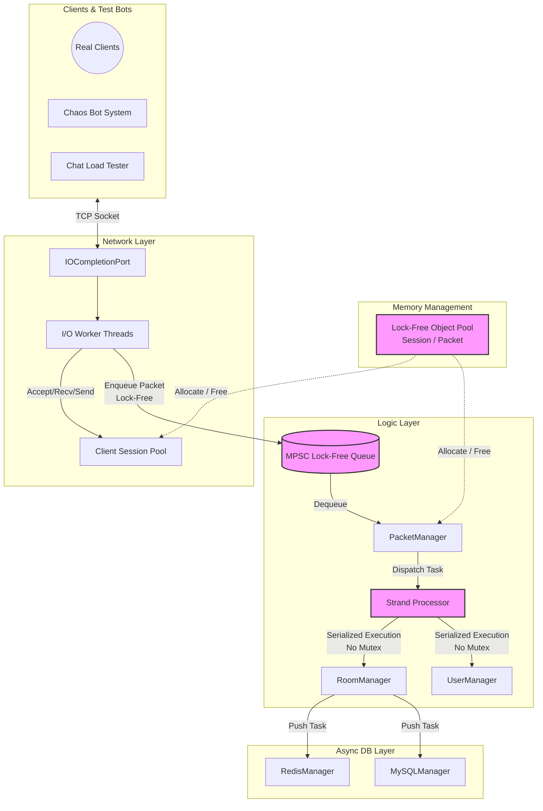

# IOCP-Core: C++17 Lock-Free 네트워크 엔진 (142,400 TPS)

Windows IOCP 기반 네트워크 엔진을 직접 설계하고, 채팅 서비스를 데모 애플리케이션으로 구현한 프로젝트입니다.
엔진 레이어(Lock-Free 자료구조, Strand 패턴, Object Pool)와 서비스 레이어(채팅방, 인증, 로그)를 분리 설계하여, Contents/ 레이어를 교체하면 다른 실시간 서비스(게임, 알림 등)에 적용 가능한 구조입니다.

## Key Results

- **142,400 TPS** — Lock-Free 아키텍처로 Mutex 대비 p99 지연시간 97% 개선 (500ms → 16.1ms), 무응답 0건
- **10,000명 동시접속** — AWS EC2 4대에서 82분간 연속 부하 테스트, 연결 유실 0건
- **Zero-Allocation Hot-path** — Lock-Free Object Pool로 740만 회 작업 처리 후 반환 누락 0건. VS 프로파일러 힙 스냅샷으로 교차 검증
- **스레드 최적 비율 도출** — 4코어 환경에서 IO/Worker/Logic 4가지 조합 실측 비교, `IO4/W2/L4`가 CPU 87% 헤드룸 + p99 17ms로 최적 확인
- **엔진 물리 한계 측정** — 방당 1,000명 브로드캐스트 환경에서 수신 TPS 118,000 pkts/s가 4코어 IOCP의 포화 한계임을 교차 검증

---

## 기술 스택

**Language & Network** <br>


**Core Architecture** <br>


**Database & Cache** <br>


**Infrastructure & Profiling** <br>


---

## 아키텍처 (v3 — Lock-Free 최종)



> 패킷 흐름: Client → WSARecv(IOCP) → RingBuffer → PacketJob 생성 + Generation Token → **Lock-Free GlobalQueue** → PacketManager → **Strand**(Room별 직렬화) → Room::BroadcastChat → **Object Pool**에서 SendBuffer 할당 → WSASend → I/O 완료 후 Pool 반환

> 아키텍처 진화 과정(v0→v3)은 [아키텍처 진화 문서](Docs/architecture-evolution.md)를 참조하세요.

---

## 핵심 코드

### Lock-Free MPSC Queue — CAS exchange로 Producer 경합 해결

```cpp
// MPSCQueue.h
void Push(T* node)
{
    node->mpscNext.store(nullptr, std::memory_order_relaxed);
    T* prev = m_tail.exchange(node, std::memory_order_acq_rel);  // 원자적 교환: Producer간 경합 없음
    prev->mpscNext.store(node, std::memory_order_release);       // Hole 구간 (Pop에서 3-state로 처리)
}
```
[전체 구현 보기 → `MPSCQueue.h`](IOCPChatServer/MPSCQueue.h) | Pop에서 sentinel/hole/정상 3가지 상태를 처리하는 로직 포함

### Strand 패턴 — 첫 번째 enqueue만 GlobalQueue에 Push

```cpp
// StrandProcessor.cpp — Boost.Asio strand 개념의 직접 구현
auto result = pRoom->EnqueueJob(pJob);
switch (result)
{
case Room::EnqueueResult::SUCCESS_FIRST:
    mGlobalQueue.Push(pRoom);       // 첫 작업만 GlobalQueue에 등록 → Worker가 처리
    break;
case Room::EnqueueResult::SUCCESS_APPENDED:
    break;                          // 이미 처리 중인 Room → 추가만 하고 끝
case Room::EnqueueResult::FAILED_DROPPED:
    mJobPool.Free(pJob);            // Room이 파손 상태 → Job 반납
    break;
}
```
[전체 구현 보기 → `StrandProcessor.cpp`](IOCPChatServer/StrandProcessor.cpp)

---

## 시연 영상


> 추가 시연: [더미 클라이언트 테스트](https://github.com/user-attachments/assets/9ffc338d-c45d-4952-bdbe-462b06e3f24b)

---

## 빌드 & 실행

### Quick Start (DB 불필요)

```bash
git clone https://github.com/kanghyoungwoo/IOCPChatServer.git
```

1. Visual Studio 2022에서 `IOCP/IOCPChatServer/IOCPChatServer.sln` 열기
2. `Release | x64` 빌드
3. `F5` 실행 — `config.json`의 `TestMode=true`(기본값)로 Redis/MySQL 없이 순수 엔진 모드로 동작

> 필수 환경: Visual Studio 2022 + Windows SDK 10.0+ 만 있으면 됩니다.
> DB 연동/AWS 배포는 [빌드 상세 가이드](Docs/build-guide.md)를 참조하세요.

---

## 상세 문서

| 문서 | 내용 |
|------|------|
| [아키텍처 진화 과정](Docs/architecture-evolution.md) | Single-Thread → Lock-Free까지 3단계 리팩토링 + 벤치마크 |
| [부하 테스트 리포트](Docs/load-test-results.md) | 10,000명 수용량 테스트, 스레드 최적화, CPU 포화 한계 |
| [카오스 엔지니어링](Docs/chaos-engineering.md) | ABA 방어, Strand Race, 악성 네트워크 공격 테스트 |
| [기술적 도전과 해결](Docs/technical-challenges.md) | TCP 경계 파싱, Graceful Shutdown, Edge Case 방어 |
| [빌드 상세 가이드](Docs/build-guide.md) | 환경 설정, DB 연동, DLL 의존성, 테스터 실행법 |

---

## 향후 개선 방향

- [ ] 브로드캐스트 구조 개선 (SendToAllUser Strand 외부 비동기화)
- [ ] 멀티서버 구조 확장

## 개발자

- **이름**: 강형우
- **연락처**: [rkdguddn21@gmail.com](mailto:rkdguddn21@gmail.com)
- **GitHub**: [https://github.com/kanghyoungwoo](https://github.com/kanghyoungwoo)
