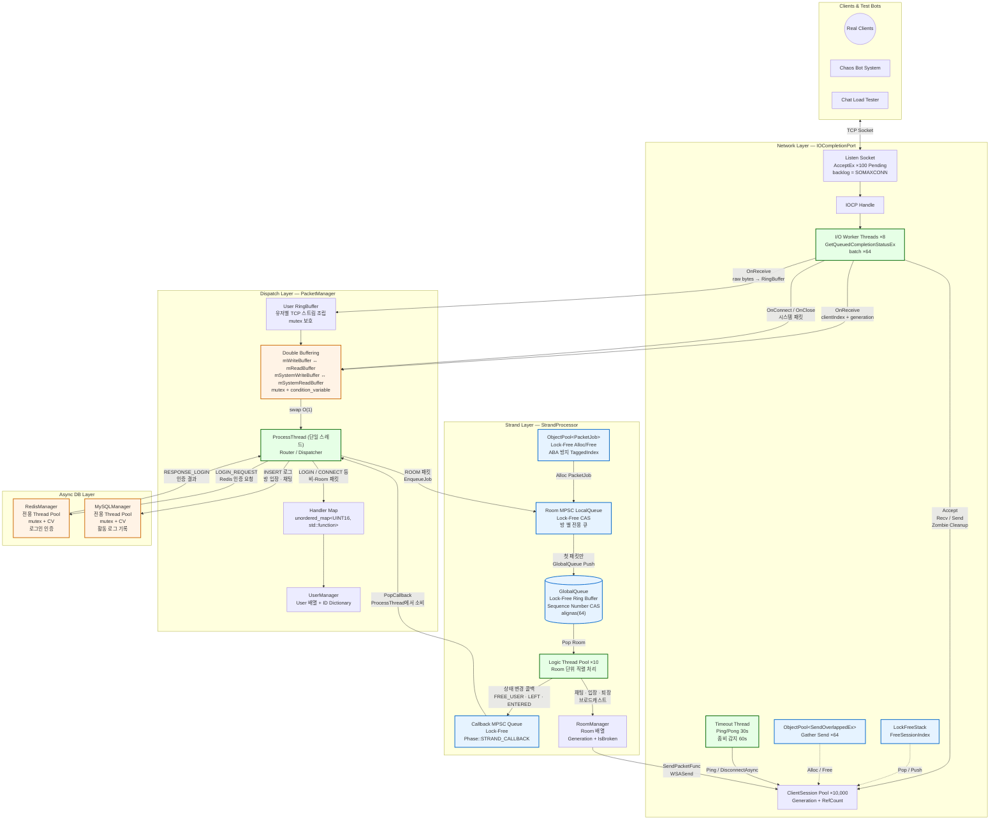
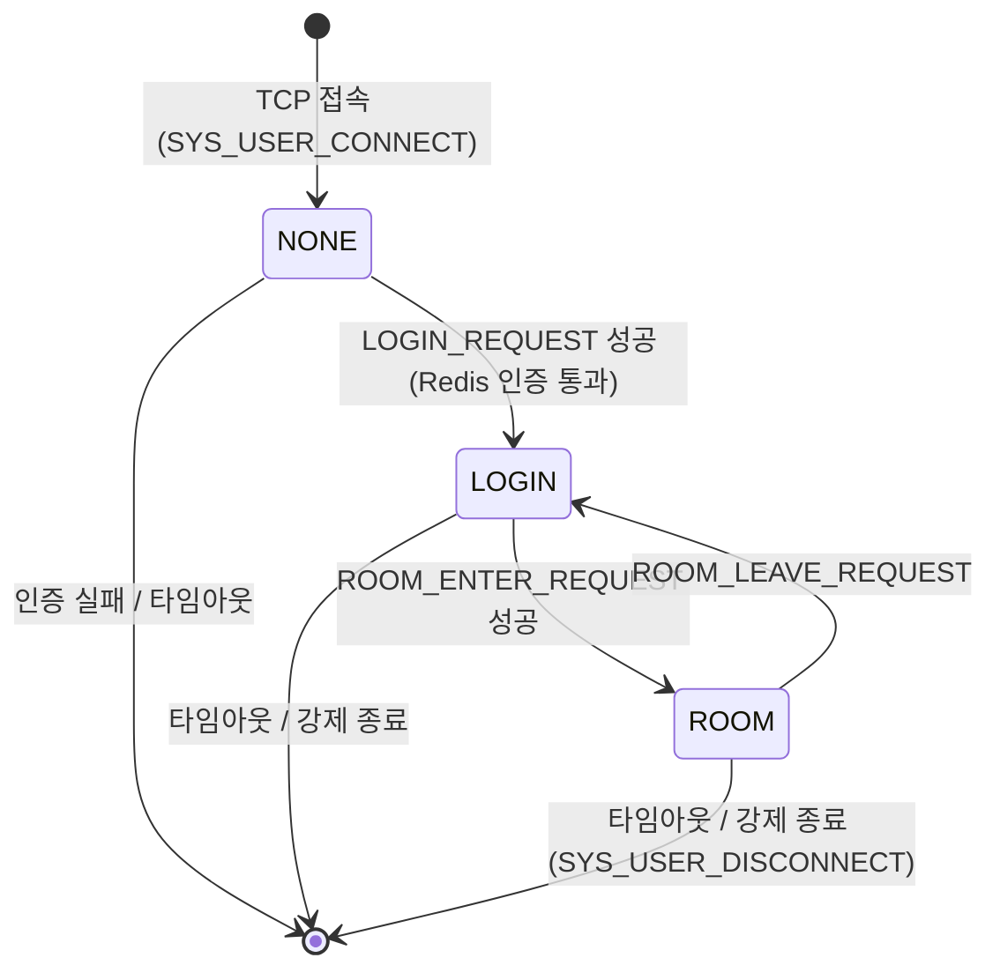
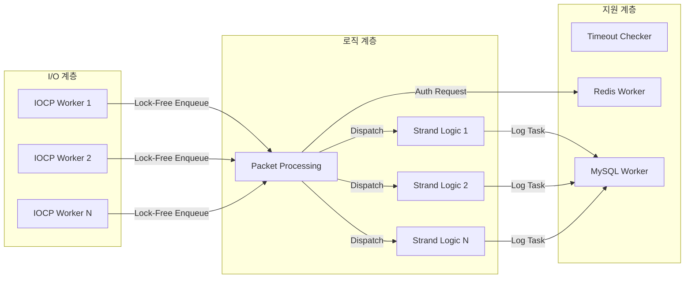
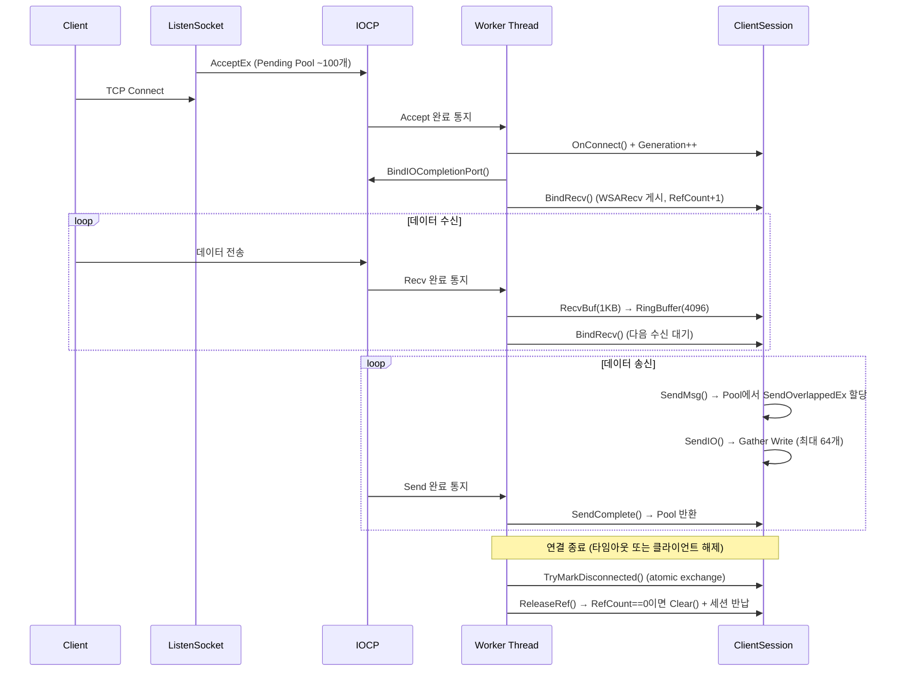
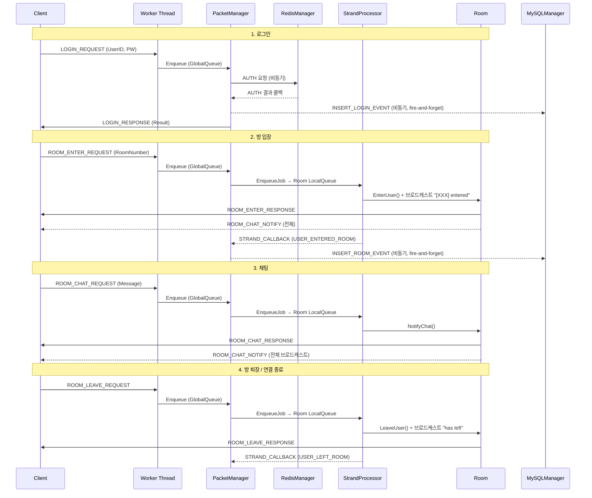

# IOCP 기반 Lock-Free 채팅서버

> C++17 | 10,000명 동시접속 | 최대 539K recv_pkt/s (LockFree)

Windows IOCP 기반 네트워크 엔진과 채팅 서비스를 구현한 프로젝트입니다.
Lock-Free 자료구조(MPSC Queue), Strand 패턴, Object Pool을 이용하여 엔진 레이어를 구성하고, Contents 레이어(채팅방, 인증, DB 연동)를 분리 설계하여 다른 실시간 서비스(게임, 알림 등)에도 적용 가능한 구조입니다.

         

---

## 목차

1. [프로젝트 소개](#1-프로젝트-소개)
2. [개발 환경](#2-개발-환경)
3. [핵심 기술 도전](#3-핵심-기술-도전)
4. [서버 아키텍처](#4-서버-아키텍처)
5. [성능 테스트](#5-성능-테스트)
6. [스레드 모델](#6-스레드-모델)
7. [메모리 관리 전략](#7-메모리-관리-전략)
8. [동기화 전략](#8-동기화-전략)
9. [네트워크 구조](#9-네트워크-구조)
10. [실행 방법](#10-실행-방법)
11. [시연 영상](#11-시연-영상)
12. [향후 개선 사항](#12-향후-개선-사항)

---

## 1. 프로젝트 소개

`std::mutex` 기반으로 먼저 구현한 뒤, 실제 부하 테스트와 프로파일링으로 병목을 특정하여 **Lock-Free 아키텍처**로 진화시킨 프로젝트입니다.

| 지표 | 수치 | 조건 |
|------|------|------|
| 동시접속 | **10,000명** | 연결실패 0건, 메모리 394MB 고정 |
| p99 지연시간 개선 | **500ms → 15.5ms** | 97% 개선 (Lock-Free 전환 후) |
| 안정 처리량 (CPU 75%) | **379K recv_pkt/s** | 500방×20명, 방당 19회 브로드캐스트, lat_avg 28ms |
| 최대 안정 처리량 (CPU 95%) | **539K recv_pkt/s** | 10,000명이 avg 200ms 간격으로 쉬지 않고 채팅하는 극한 부하에서도 lat_avg 32ms로 안정 |
| 메모리 누수 | **0 bytes** | VS 힙 스냅샷 +0 Bytes 교차 검증 |
| Zero-Allocation | **Alloc Fail 0건** | Lock-Free Object Pool, 핫패스 할당 없음 |

---

## 2. 개발 환경

| 분류 | 내용 |
|------|------|
| **Language** | C++17 |
| **OS / API** | Windows IOCP (`AcceptEx`, `GetQueuedCompletionStatusEx`) |
| **IDE** | Visual Studio 2022 |
| **Platform** | Windows |
| **Database** | Redis (hiredis), MySQL |
| **Infra** | AWS EC2 c6i.4xlarge (Server), c6i.large × 4 (Client) |
| **Test** | Google Test (100 cases), Chaos Bot System, Chat Load Tester |

---

## 3. 핵심 기술 도전

### 3-1. 측정 기반 병목 추적과 Lock-Free 전환 (p99 500ms → 15.5ms)

```
mutex 기반 (v2)              →    Lock-Free 아키텍처 (v3)
p99 500ms, 2,000명 동접       →    p99 15.5ms, 10,000명 동접
```

처음부터 Lock-Free를 도입하지 않았습니다. `std::mutex` 기반의 멀티스레딩 모델로 먼저 구현한 뒤, 부하 한계점을 측정하고 프로파일링하여 병목 지점만을 타겟팅해 최적화했습니다.

**[Issue]** 2,000명 동시 접속 부하 테스트 중 p99 지연시간이 **500ms**로 폭등하며, 처리 지연으로 인해 초당 23만 건의 패킷 유실(Drop)이 발생했습니다.

**[Analyze]** VS Profiler 진단 결과, 아키텍처의 양 끝단에서 `std::mutex` 경합 병목을 교차로 확인했습니다.
- **생산자 경합**: I/O 워커들이 패킷을 중앙 큐에 밀어 넣는 과정에서 병목이 발생했습니다.
- **동기화 병목**: 로직 스레드들이 방(Room) 객체에 접근할 때 병목이 발생했습니다.

**[Action]** 두 가지 병목을 각각 다른 전략으로 락(Lock) 없이 해소했습니다.
- **수신부**: CAS 연산 기반의 MPSC(Multi-Producer Single-Consumer) Lock-Free Queue를 구현하여 워커 스레드 간의 Lock 경합을 제거했습니다.
- **로직부**: Strand 패턴을 적용하여, 방(Room) 단위의 브로드캐스트 연산을 락 없이 안전하게 직렬화하도록 보장했습니다.

**[Result]** p99 지연시간을 **500ms에서 15.5ms로 97% 개선**했습니다. 이후 10,000명이 평균 200ms 간격으로 쉬지 않고 채팅하는 극한 부하 시나리오에서도, 방당 19회의 브로드캐스트를 포함한 최대 **539K recv_pkt/s**를 lat_avg 32ms로 안정적으로 소화했습니다.

> 아키텍처 리팩토링 전 과정(v0 싱글스레드 → v1 더블버퍼링 → v2 Mutex → v3 Lock-Free)의 상세 지표는 [아키텍처 진화 문서](Docs/서버%20아키텍처%20진화%20및%20성능%20벤치마크.md)에서 확인할 수 있습니다.

---

### 3-2. 좀비 세션 처리 경로의 힙 할당 제거

**[Issue]** 비활성 세션 감지(좀비 세션 정리) 시마다, Overlapped I/O 구조체를 `new`로 heap에서 동적 할당하고 있었습니다.

**[Analyze]** 타임아웃 체크 주기마다 반복 실행되는 경로에서의 heap 할당은 OS 힙 락 경합과 메모리 단편화를 유발합니다. 10,000개 세션 환경에서 동시다발적으로 발생할 경우 누적 오버헤드가 커집니다.

**[Action]** `new stOverlappedEx`를 제거하고, `ClientSession` 내부에 `stOverlappedEx mZombieContext` 멤버 변수를 내장화하여 서버 시작 시 세션 객체와 함께 사전 할당하도록 설계를 변경했습니다.

**[Result]** 좀비 세션 처리 경로에서 동적 할당을 완전히 제거했습니다. 세션 Pool을 통해 사전 할당된 메모리만 사용하는 Zero-Allocation 핫패스를 달성했습니다.

---

### 3-3. Partial Send Zero-Copy 이어쏘기

**[Issue]** `WSASend` 완료 통지에서 `dwIoSize < 요청 크기`인 Partial Send 발생 시, 잔여 데이터를 처리하는 로직이 없어 메시지 일부가 유실되는 문제가 있었습니다.

**[Analyze]** TCP 커널 송신 버퍼 부족이나 네트워크 혼잡으로 인해 `WSASend`가 요청보다 적은 바이트만 완료를 통보하는 케이스가 존재합니다. 재전송 시 새 버퍼를 할당하거나 큐를 복사하면 핫패스에 불필요한 메모리 오버헤드가 발생합니다.

**[Action]** 이미 완전히 전송된 버퍼는 Pool에 즉시 반납하고, 부분 전송된 버퍼는 `WSABUF`의 `buf` 포인터를 전송 완료분만큼 전진시키고 `len`을 축소한 뒤 즉시 재전송하는 Zero-Copy 방식으로 구현했습니다. 재시도 횟수(`MAX_PARTIAL_RETRY`) 초과 시 해당 세션을 강제 종료합니다.

```cpp
// ClientSession.cpp — SendComplete()
if (dwIoSize < totalRequested)
{
    ++mPartialSendRetryCount;
    if (mPartialSendRetryCount > MAX_PARTIAL_RETRY)
    {
        DisconnectAsync(GetGeneration());  // 재시도 한계 초과 → 강제 종료
        return;
    }
    // 완전 전송된 패킷은 Pool 반납, 부분 전송된 패킷은 포인터 전진 후 재전송
    ...
}
mPartialSendRetryCount = 0;
```

**[Result]** 메모리 재할당 없이 Partial Send를 방어합니다. 잔여 전송 데이터는 기존 버퍼 포인터만 조작하여 즉시 재전송하므로, 핫패스의 Zero-Allocation 원칙을 유지합니다.

---

### 3-4. TCP Stream 패킷 경계 처리

**[Issue]** TCP는 스트림 기반 프로토콜로 패킷 경계가 없어서, 여러 패킷이 합쳐지거나 분할되어 수신될 수 있습니다.

**[Action]** 고정 길이 헤더(`PACKET_HEADER`) + `RingBuffer`를 도입하여 `User::GetPacket()`에서 헤더 peek → 전체 길이 확인 → 정확한 바이트 수만큼 read하는 방식으로 처리합니다.

**[Result]** 분할/병합 수신 상황에서도 패킷 경계를 정확히 복원합니다.

---

### 3-5. 비동기 이벤트 상태 불일치 방어 (Generation Token)

**[Issue]** I/O 스레드가 작업을 생성한 후 큐에 넣기 전 사이에 다른 스레드가 사용자 상태를 변경하면, 무효화된 작업이 처리되는 Race Condition이 발생합니다.

**[Action]** `User`에 Generation Token을 도입하여 패킷 작업 생성 시 토큰 값을 함께 기록합니다. Logic Thread가 처리 시점에 현재 토큰 값과 비교하여, 불일치 시 즉시 폐기합니다.

**[Result]** 세션 재사용 시나리오(연결 해제 → 즉시 재접속)에서 이전 세대의 작업이 새 세션에 영향을 주는 버그를 원천 차단합니다.

---

### 3-6. Graceful Shutdown 5단계 순차 종료

**[Issue]** 서버 강제 종료 시 진행 중인 I/O와 DB 작업이 유실되고 메모리 누수가 발생했습니다.

**[Action]** 5단계 순차 종료를 구현했습니다.
1. Accept 차단 — 신규 연결 거부
2. 전체 클라이언트 킥 + `CancelIoEx`로 진행 중 I/O 취소
3. I/O Draining — 모든 완료 통지 소진 대기
4. IOCP Worker 스레드 종료
5. 리소스 정리 — Pool, 소켓, 핸들 반납

DB 스레드(Redis/MySQL)는 작업 큐를 완전히 소진한 후 종료합니다.

**[Result]** 종료 순간에도 데이터 유실 없이 클린하게 리소스를 반납합니다.

---

### 3-7. AcceptEx 빈 세션 탐색 O(N) → O(1)

**[Issue]** 10,000개 세션을 매번 선형 탐색하며 빈 슬롯을 찾고, 중복 AcceptEx 호출로 소켓 누수가 발생했습니다.

**[Action]** `LockFreeStack` 기반 FreeList로 빈 세션 인덱스를 관리합니다. 서버 시작 시 100개만 AcceptEx를 게시하고, 완료 시 Worker가 자동으로 1개씩 보충합니다.

**[Result]** 빈 세션 탐색이 O(N) → O(1)로 개선되고, AcceptEx 중복 호출로 인한 소켓 누수가 사라졌습니다.

---

### Edge Case 방어

| 공격 시나리오 | 방어 로직 |
|---------------|-----------|
| **비정상 패킷 크기** (헤더 조작) | `GetPacket()`에서 PacketLength 상한/하한 검증 후 오염된 링버퍼 `Clear()` |
| **링버퍼 오버플로우** (대량 전송) | `SetPacketData()` 반환값으로 오버플로우 감지 → `DisconnectAsync()` |
| **Slowloris 변형** (1바이트씩 전송) | 활동 시간 갱신 시점을 WSARecv 완료 → 완전한 패킷 조립 성공 시로 이동 |

> 상세 사례는 [카오스 엔지니어링](Docs/카오스%20엔지니어링%20기반%20안정성%20검증.md) 문서를 참조해 주십시오.

---

## 4. 서버 아키텍처

### 아키텍처 다이어그램



> **패킷 흐름**: Client → WSARecv 완료(IOCP Worker) → **유저별 RingBuffer**에 raw bytes 저장 + clientIndex를 **double buffering 큐**(mutex)에 push → ProcessThread가 swap 후 RingBuffer에서 패킷 조립 → DomainState 확인 → ROOM 패킷이면 **ObjectPool**에서 PacketJob 할당 → **Room MPSC LocalQueue**(Lock-Free CAS)에 enqueue → 첫 패킷이면 Room을 **Lock-Free GlobalQueue**(링버퍼)에 push → Logic Thread가 Room 단위로 직렬 처리(채팅 브로드캐스트) → **Callback MPSC Queue**로 상태변경 통보 → ProcessThread가 PopCallback으로 UserManager 상태 갱신 + MySQL 로그 기록 → PacketJob을 ObjectPool에 반환

### 주요 구현 특징

| 기능 | 설명 |
|------|------|
| **Lock-Free MPSC Queue** | CAS 기반 Multi-Producer Single-Consumer 큐로 I/O 워커 간 패킷 큐 경합 제거 |
| **Strand 패턴** | Room 단위 브로드캐스트를 Lock 없이 직렬화하여 동시성 보장 |
| **Lock-Free Object Pool** | `LockFreeStack` 기반 O(1) Alloc/Free, ABA 방지 Generation Counter 적용 |
| **10,000 동시접속** | AcceptEx Pending Pool + 세션 Free-list로 대규모 연결 수용 |
| **Zero-Allocation Hot Path** | 핫패스의 모든 할당을 사전 초기화된 Object Pool에서 처리 |
| **Generation Token** | 비동기 이벤트의 상태 불일치를 세대 카운터로 방어 |
| **TCP 패킷 경계 처리** | RingBuffer 기반 스트림 재조립으로 패킷 분할/병합 안전 처리 |
| **Graceful Shutdown** | 5단계 순차 종료 (Accept 차단 → 킥 → I/O Draining → 워커 종료 → 리소스 정리) |
| **좀비 세션 감지** | Ping/Pong + 타임아웃 기반 비활성 세션 자동 연결 해제 |
| **비동기 DB 레이어** | Redis (로그인 인증) + MySQL (활동 로그 기록) 별도 스레드에서 비동기 처리 |
| **로그 시스템** | `LOG_DEBUG` (Debug 빌드만 출력) / `LOG_ERROR` (항상 출력) / `LOG_ERROR_ONCE` (최초 1회만 출력) 매크로로 핫패스 오버헤드 최소화 |
| **크래시 대응** | `SetUnhandledExceptionFilter` + `MiniDumpWriteDump`로 미처리 예외 발생 시 타임스탬프 기반 `.dmp` 파일 자동 생성 |

### 유저 상태 머신



| 상태 | 의미 | 허용 패킷 |
|------|------|-----------|
| `NONE` | TCP 연결됨, 미인증 | `LOGIN_REQUEST` |
| `LOGIN` | 인증 완료, 방 미입장 | `ROOM_ENTER_REQUEST` |
| `ROOM` | 방 입장 완료 | `ROOM_CHAT_REQUEST`, `ROOM_LEAVE_REQUEST` |

> 상태 외 패킷 수신 시 즉시 폐기 — `User::GetDomainState()` 검증 후 처리

---

## 5. 성능 테스트

### 테스트 환경

| 구분 | 사양 |
| --- | --- |
| **Server** | AWS EC2 c6i.4xlarge (16 vCPU, 32GB RAM), Windows Server 2022 |
| **Client** | AWS EC2 c6i.large (2 vCPU, 4GB RAM) × 4대 (각 2,500봇 = 총 10,000봇) |
| **Network** | 동일 리전, 동일 클러스터 배치 그룹 (Cluster Placement Group) |
| **테스트 모드** | `TestMode=true` — Redis/MySQL I/O 우회, 순수 엔진 성능 측정 |

### 10,000명 수용량 테스트

| 측정 항목 | 결과 수치 | 비고 |
|-----------|-----------|------|
| **최대 동시 접속** | **10,000명** | 목표 수용량 달성 |
| **연결 실패** | **0건 / 10,000** | 세션 유실 0 |
| **평균 지연 시간** | **17.55ms** | 실시간 통신 수준 유지 |
| **p99 지연 시간** | **~17ms** | 100방 × 100명, 99%에서 17ms 이하 |
| **메모리 점유** | **394MB 고정** | 장기 운용 중 변동 없음 (누수 0) |
| **SendPool Alloc Fail** | **0회** | 전 테스트 구간 누적 |
| **JobPool Alloc Fail** | **0회** | Pool 고갈 없이 안정 순환 |

### 채팅 빈도별 한계 탐색 — LockFree 아키텍처, 안정 한계선(Knee of the Curve) 확인

채팅 간격을 점진적으로 줄이며 서버의 안정 한계를 탐색한 결과입니다.

| 방 구성 | 스레드 (Logic/IO) | chatMin/Max | recv_pkt/s | lat_avg | CPU | 상태 |
|---------|:-----------------:|:----------:|:---------:|:------:|:---:|:----:|
| 500방×20명 | L8/IO16 | 300/1000 | ~284K/s | ~24ms | 67% | ✅ 안정 |
| 500방×20명 | L8/IO16 | 200/600 | ~379K/s | ~28ms | 75% | ✅ 안정 한계 |
| 500방×20명 | L8/IO16 | 150/450 | 붕괴 | →2,600ms | 80% | 🔴 Death Spiral |
| 500방×20명 | **L16/IO8** | **100/300** | **~539K/s** | **~32ms** | **95%** | **✅ 안정** |
| 1000방×10명 | L8/IO16 | 100/300 | ~390K/s | ~28ms | 78% | ✅ 안정 |

> **핵심 발견**: IO Worker 증가(8→16)는 CPU +2%p로 효과 없음. Logic Thread 증가(8→16)는 Death Spiral을 완전 해소.
> **브로드캐스트 비용이 서버 한계를 결정**: 방당 인원 절반(20명→10명) = 안정 한계 채팅 빈도 2배 확장.
> 상세 분석은 [부하 테스트 리포트](Docs/부하%20테스트.md)를 참조해 주십시오.

---

## 6. 스레드 모델

### 스레드 구성



| 스레드 그룹 | 기본 수량 | 역할 | 설정 |
|-------------|-----------|------|------|
| **IOCP Worker** | 8 | AcceptEx/WSARecv/WSASend 완료 처리, 패킷 Enqueue | `MaxIOWorkerThread` |
| **Packet Processing** | 1 (고정) | 더블버퍼 패킷 Dequeue, 핸들러 디스패치, 콜백 처리 | 고정 |
| **Strand/Logic** | 4 | Room별 MPSC 큐 드레인, 비즈니스 로직 직렬 처리 | `MaxLogicThread` |
| **Timeout Checker** | 1 (고정) | 비활성 세션 탐지, Ping/Pong 스케줄링 (주기: 10초) | 고정 |
| **Redis Worker** | 1 | 로그인 인증 (GET key=password) | 코드 고정 |
| **MySQL Worker** | 1 | 활동 로그 INSERT (로그인/입장/채팅) | 코드 고정 |

> **튜닝 인사이트**: 채팅 빈도가 높은 고부하 환경에서는 Logic Thread에 코어를 집중(Logic=16, IO=8)하는 것이 IO Worker를 늘리는 것보다 효과적입니다. IO Worker 8→16 증가 시 CPU +2%p로 효과가 미미한 반면, Logic 8→16 증가는 Death Spiral을 완전히 해소하고 539K recv_pkt/s 안정 처리를 달성했습니다. 상세 권장값은 [부하 테스트 리포트](Docs/부하%20테스트.md)를 참조해 주십시오.

---

## 7. 메모리 관리 전략

### Object Pool 구조

| Pool | 타입 | 용량 | 자료구조 | 용도 |
|------|------|------|----------|------|
| **SendBuffer Pool** | `ObjectPool<SendOverlappedEx>` | config 설정 | `LockFreeStack` | WSASend용 I/O 버퍼 |
| **Job Pool** | `ObjectPool<PacketJob>` | 200,000 (`JobPoolSize`) | `LockFreeStack` | Strand 패킷 작업 |
| **Session Free-list** | `LockFreeStack<SessionNode>` | 10,000 (`MaxClient`) | `LockFreeStack` | 빈 세션 인덱스 O(1) 탐색 |

### LockFreeStack — ABA 방지 Index 기반 설계

포인터 대신 **인덱스 기반**으로 설계하여 8바이트 CAS 한 번으로 ABA 문제를 방지합니다.

```cpp
// LockFreeStack.h — {index, generation}을 uint64_t로 Pack하여 단일 CAS 수행
struct TaggedIndex
{
    uint32_t index;       // 풀 인덱스 (UINT32_MAX = 비어있음)
    uint32_t generation;  // ABA 방지 카운터
};

std::atomic<uint64_t> m_head;  // Pack(index, generation)

void Push(T* obj)
{
    uint32_t objIndex = static_cast<uint32_t>(obj - m_pool);
    uint64_t oldHead = m_head.load(std::memory_order_relaxed);
    while (true)
    {
        TaggedIndex old = Unpack(oldHead);
        obj->poolNext = old.index;
        uint64_t newHead = Pack(objIndex, old.generation + 1);
        if (m_head.compare_exchange_weak(oldHead, newHead,
            std::memory_order_release, std::memory_order_relaxed))
            break;
    }
}
```
[전체 구현 보기 → `LockFreeStack.h`](IOCPChatServer/LockFreeStack.h)

### ObjectPool — malloc + placement new + LockFreeStack

```cpp
// ObjectPool.h — 연속 메모리 할당 + 인덱스 기반 Free-list
void Init(const uint32_t poolSize)
{
    m_poolBlock = static_cast<T*>(std::malloc(sizeof(T) * poolSize));
    for (uint32_t i = 0; i < poolSize; ++i)
    {
        new (&m_poolBlock[i]) T();      // placement new
        mFreeStack.Push(&m_poolBlock[i]);
    }
}

T* Alloc() { return mFreeStack.Pop(); }    // O(1) Lock-Free
void Free(T* obj) { mFreeStack.Push(obj); } // O(1) Lock-Free
```
[전체 구현 보기 → `ObjectPool.h`](IOCPChatServer/ObjectPool.h)

### Zero-Allocation 설계

`PacketJob`은 **union 구조**로 JOB 단계(패킷 처리)와 CALLBACK 단계(후처리 알림)에서 동일 메모리를 재활용하여, 콜백용 별도 Pool 할당이 불필요합니다.

---

## 8. 동기화 전략

### Lock-Free 자료구조

#### MPSC Queue — I/O 워커 간 패킷 큐 경합을 CAS로 제거

```cpp
// MPSCQueue.h
void Push(T* node)
{
    node->mpscNext.store(nullptr, std::memory_order_relaxed);
    T* prev = m_tail.exchange(node, std::memory_order_acq_rel);  // 원자적 교환: Producer간 경합 없음
    prev->mpscNext.store(node, std::memory_order_release);       // Hole 구간 (Pop에서 3-state로 처리)
}
```
[전체 구현 보기 → `MPSCQueue.h`](IOCPChatServer/MPSCQueue.h)

- **Producer (`Push`)**: `m_tail`을 `exchange`로 원자적 교환 — Producer 간 경합 없음
- **Consumer (`Pop`)**: `m_head`는 non-atomic — MPSC 설계상 단일 Consumer만 접근
- **Hole 처리**: Push의 `exchange`와 `store` 사이 preemption 발생 시, Pop이 nullptr을 만나면 adaptive backoff로 대기

#### GlobalQueue (Lock-Free) — Bounded MPMC Ring Buffer

```cpp
// GlobalQueue_LockFree.h — alignas(64)로 False Sharing 방지
alignas(64) std::atomic<uint32_t> m_enqueuePos;  // Producer 위치
alignas(64) std::atomic<uint32_t> m_dequeuePos;  // Consumer 위치
```

### Strand 패턴 — Room 단위 Lock 없는 직렬화

```cpp
// Room::EnqueueJob() — mMsgCount로 첫 번째 여부 판별
Room::EnqueueResult Room::EnqueueJob(PacketJob* pJob)
{
    mLocalQueue.Push(pJob);
    if (mMsgCount.fetch_add(1, std::memory_order_acq_rel) == 0)
        return EnqueueResult::SUCCESS_FIRST;   // → GlobalQueue에 등록
    return EnqueueResult::SUCCESS_APPENDED;    // → 이미 처리 중, 추가만
}
```
[전체 구현 보기 → `StrandProcessor.cpp`](IOCPChatServer/StrandProcessor.cpp) | [Room.cpp](IOCPChatServer/Room.cpp)

### Lock 기반 동기화 (의도적 선택)

| 위치 | Lock 종류 | 이유 |
|------|-----------|------|
| `ClientSession::mSendLock` | `std::mutex` | WSASend Scatter-Gather가 버퍼 배열에 대한 배타적 접근을 요구 |
| `User::mPacketRingBuffMutex` | `std::mutex` | IOCP Worker(쓰기)와 Packet Processing(읽기)이 동시 접근 |
| `PacketManager` 더블버퍼 | `std::mutex` | 큐 스왑 시 짧은 구간만 Lock — 읽기/쓰기가 서로 다른 버퍼에서 동작 |

### Memory Ordering 선택

| 변수 | Ordering | 이유 |
|------|----------|------|
| `ClientSession::mIsConnected` | `acquire/release` | 연결 상태 변경이 다른 스레드에서 즉시 가시적이어야 함 |
| `ClientSession::mGeneration` | `acquire/acq_rel` | 세대 값 증가와 읽기의 순서 보장 |
| `Room::mMsgCount` | `acq_rel` | Strand 진입/퇴출 판정의 정확성 보장 |
| `mLastActivityTime` | `relaxed` | 빈번한 갱신, 정확한 순서보다 성능 우선 |
| `LockFreeStack::m_head` | `release/acquire` | Push 성공 시 쓰기 가시성, Pop 성공 시 읽기 안전성 |

---

## 9. 네트워크 구조

### 연결 수명주기



### 주요 설계

| 구성 요소 | 설계 | 구현 |
|-----------|------|------|
| **Accept** | AcceptEx Pending Pool | 서버 시작 시 100개 AcceptEx 게시, 완료 시 Worker가 1개씩 보충 (`TryPostAcceptEx`) |
| **세션 관리** | Generation + RefCount | `mGeneration` (atomic)으로 ABA 방지, `AddRef/ReleaseRef`로 비동기 I/O 수명 관리 |
| **수신** | 1KB 수신 버퍼 + RingBuffer | `WSARecv` → `RecvBuf[1024]` → `RingBuffer<4096>` TCP 스트림 재조립 |
| **송신** | Pool + Scatter-Gather | `ObjectPool<SendOverlappedEx>`에서 할당, `WSASend`로 최대 64개 버퍼 일괄 전송 |
| **완료 처리** | 배치 Dequeue | `GetQueuedCompletionStatusEx`로 최대 64개 완료를 한 번에 처리 |
| **연결 해제** | Race-Free Close | `TryMarkDisconnected()` (atomic exchange)로 단 하나의 스레드만 정리 담당 |

### 전체 사용 흐름 — Login → Chat → Leave



> 패킷 프로토콜 전체 스펙(Packet ID, 바디 구조, 주요 상수)은 [Docs/패킷%20프로토콜.md](Docs/패킷%20프로토콜.md)를 참조해 주십시오.

---

## 10. 실행 방법

### Quick Start (DB 불필요)

```bash
git clone https://github.com/kanghyoungwoo/IOCPChatServer.git
```

1. Visual Studio 2022에서 `IOCP/IOCPChatServer/IOCPChatServer.sln` 파일을 열기
2. `Release | x64` 빌드
3. `F5` 실행 — `config.json`의 `TestMode=true`(기본값)로 Redis/MySQL 없이 순수 엔진 모드로 동작

> 필수 환경: Visual Studio 2022 + Windows SDK 10.0+ 만 있으면 됩니다.
> DB 연동/AWS 배포는 [빌드 상세 가이드](Docs/빌드%20가이드.md)를 참조하세요.

---

## 11. 시연 영상


> 추가 시연: [더미 클라이언트 부하 테스트](https://github.com/user-attachments/assets/9ffc338d-c45d-4952-bdbe-462b06e3f24b)

---

## 12. 향후 개선 사항

- [x] ~~std::function 기반 패킷 핸들러로 리팩토링~~
- [x] ~~MySQL 연동하여 사용자 활동 로그 기록~~
- [x] ~~더미 클라이언트 테스트~~
- [x] ~~디버깅을 위한 Dump추가~~
- [x] ~~Process 처리 쓰레드를 단일 -> 멀티 쓰레드로 확장~~
- [x] ~~좀비 세션 감지 로직 추가~~
- [x] ~~단위테스트 도입~~
- [x] ~~Lock-Free 구현하고 적용하기~~
- [ ] 클라이언트 재접속 로직 추가
- [ ] 테스트 파이프라인을 기반으로, 검증 자동화

**단기 개선**

- [ ] **ProcessThread(Dispatcher) 제거** — IO Worker가 Room 패킷을 StrandProcessor로 직접 라우팅
  ```
  현재: IO Worker → mutex+CV → ProcessThread → StrandProcessor
  개선: IO Worker → StrandProcessor (lock-free CAS, 컨텍스트 스위치 0회)
  로그인 등 비-Room 패킷은 경량 MPSCQueue + 전용 LoginThread로 분리
  ```
  모든 패킷 경로에서 mutex/condition_variable 제거, Dispatch 레이턴시 감소


**장기 개선 (아키텍처 수준)**

- [ ] **수평 확장 (Multi-Process Sharding)** — 방 번호 기반으로 여러 서버 프로세스에 분산
  ```
  Server A: Room 0~9
  Server B: Room 10~19
  Load Balancer: 방 번호 → 서버 라우팅
  ```

---

## 상세 문서

| 문서 | 내용 |
|------|------|
| [아키텍처 진화 과정](Docs/서버%20아키텍처%20진화%20및%20성능%20벤치마크.md) | Single-Thread에서 Lock-Free까지의 3단계 리팩토링 및 벤치마크 결과 |
| [부하 테스트 리포트](Docs/부하%20테스트.md) | 10,000명 수용량 테스트, 채팅 빈도별 한계 탐색, MutexCV vs LockFree 비교 |
| [패킷 프로토콜 스펙](Docs/패킷%20프로토콜.md) | 전체 패킷 ID, 요청/응답 쌍, 바디 필드 상세, 주요 상수 |
| [단위 테스트](Docs/단위%20테스트.md) | Google Test 100개 항목을 통한 자료구조, 패킷, 도메인 로직 검증 결과 |
| [카오스 엔지니어링](Docs/카오스%20엔지니어링%20기반%20안정성%20검증.md) | ABA 방어, Strand Race, 악성 네트워크 공격 테스트 결과 |
| [기술적 도전과 해결](Docs/technical-challenges.md) | TCP 경계 파싱, Graceful Shutdown, Edge Case 방어 사례 |
| [빌드 상세 가이드](Docs/빌드%20가이드.md) | 환경 설정, DB 연동, DLL 의존성, 테스터 실행법 |
| [AI 활용 최적화 회고](Docs/Ai활용보고서.md) | SharedSendBuffer 도입 및 실패 분석, AI 교차 검증의 한계와 교훈 |

## 개발자

- **이름**: 강형우
- **연락처**: [rkdguddn21@gmail.com](mailto:rkdguddn21@gmail.com)
- **GitHub**: [https://github.com/kanghyoungwoo](https://github.com/kanghyoungwoo)
