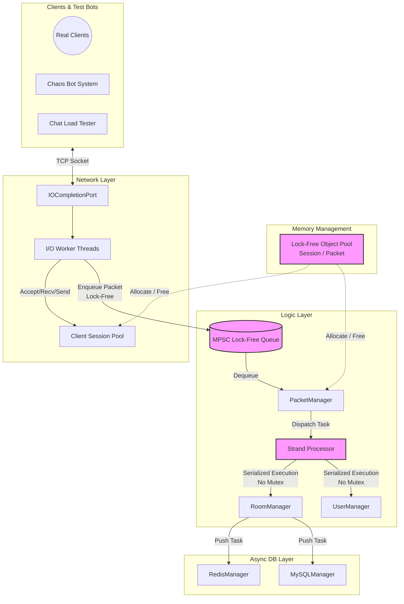

# IOCP 기반 Lock-Free 채팅서버

> C++17 | 10,000명 동시접속 | 최대 884K broadcast ops/s

Windows IOCP 기반 네트워크 엔진과 채팅 서비스를 **직접 설계·구현**한 프로젝트입니다.
Lock-Free 자료구조(MPSC Queue), Strand 패턴, Object Pool을 라이브러리 없이 직접 구현하여 엔진 레이어를 구성하고, Contents 레이어(채팅방, 인증, DB 연동)를 분리 설계하여 다른 실시간 서비스(게임, 알림 등)에도 적용 가능한 구조입니다.

         

---

## 시연 영상


> 추가 시연: [더미 클라이언트 부하 테스트](https://github.com/user-attachments/assets/9ffc338d-c45d-4952-bdbe-462b06e3f24b)

---

## 주요 성과

| 지표 | 수치 | 조건 |
|------|------|------|
| 권장 처리량 | **288K ops/s** | 200방 × 50명, CPU 50%, Avg 20.7ms |
| 한계 처리량 | **884K ops/s** | 500방 × 20명, CPU 90%, Avg 49.2ms |
| 동시접속 | **10,000명** | 연결실패 < 2건, 메모리 394MB 고정 |
| p99 지연시간 개선 | **500ms → 15.5ms** | 97% 개선 (Lock-Free 전환 후) |
| 메모리 누수 | **0 bytes** | VS 힙 스냅샷 +0 Bytes 교차 검증 |
| Zero-Allocation | **Alloc Fail 0건** | Lock-Free Object Pool, 핫패스 할당 없음 |

> 스레드 프로파일: 4-core에서 `IO4/W2/L4` (p99 17ms), 16-core에서 `IO8/W8/L=방개수`를 단계별 부하 시험으로 도출

---

## 핵심 기술 도전: 측정 기반의 병목 추적과 Lock-Free 전환

```
mutex 기반 (v2)              →    Lock-Free 아키텍처 (v3)
p99 500ms, 2,000명 동접       →    p99 15.5ms, 10,000명 동접
```

처음부터 Lock-Free를 도입하지 않았습니다. `std::mutex` 기반의 멀티스레딩 모델로 먼저 구현한 뒤, 부하 한계점을 측정하고 프로파일링하여 병목 지점만을 타겟팅해 최적화했습니다.

**[Issue]** 2,000명 동시 접속 부하 테스트 중 p99 지연시간이 **500ms**로 폭등하며, 처리 지연으로 인해 초당 23만 건의 패킷 유실(Drop) 발생

**[Analyze]** VS Profiler 진단 결과, 아키텍처의 양 끝단에서 `std::mutex` 경합 병목을 교차 확인
- **생산자 경합**: I/O 워커들이 패킷을 중앙 큐에 밀어 넣는 과정
- **동기화 병목**: 로직 스레드들이 방(Room) 객체에 접근할 때 발생

**[Action]** 두 가지 병목을 각각 다른 전략으로 락(Lock) 없이 해소
- **수신부**: CAS 연산 기반의 MPSC(Multi-Producer Single-Consumer) Lock-Free Queue를 직접 구현하여 워커 스레드 간의 Lock 경합 제거
- **로직부**: Boost.Asio의 Strand 패턴을 착안·구현하여, 방(Room) 단위의 브로드캐스트 연산을 락 없이 안전하게 직렬화 보장

**[Result]** p99 지연시간 **500ms → 15.5ms (97% 개선)**. 이후 10,000명 동시 접속 환경에서 브로드캐스트 연산량 최대 **884,000 ops/s**를 무응답 및 크래시 없이 안정적으로 소화

> 아키텍처 리팩토링 전 과정(v0 싱글스레드 → v1 더블버퍼링 → v2 Mutex → v3 Lock-Free)의 상세 지표는 [아키텍처 진화 문서](Docs/architecture-evolution.md)에서 확인할 수 있습니다.

---

## 아키텍처



> 패킷 흐름: Client → WSARecv(IOCP) → RingBuffer → PacketJob 생성 + Generation Token → **Lock-Free GlobalQueue** → PacketManager → **Strand**(Room별 직렬화) → Room::BroadcastChat → **Object Pool**에서 SendBuffer 할당 → WSASend → I/O 완료 후 Pool 반환

---

## 핵심 코드

### Lock-Free MPSC Queue — I/O 워커 스레드 간 패킷 큐 경합을 CAS 연산으로 제거

```cpp
// MPSCQueue.h
void Push(T* node)
{
    node->mpscNext.store(nullptr, std::memory_order_relaxed);
    T* prev = m_tail.exchange(node, std::memory_order_acq_rel);  // 원자적 교환: Producer간 경합 없음
    prev->mpscNext.store(node, std::memory_order_release);       // Hole 구간 (Pop에서 3-state로 처리)
}
```
[전체 구현 보기 → `MPSCQueue.h`](IOCPChatServer/IOCPChatServer/MPSCQueue.h) | Pop에서 sentinel/hole/정상 3가지 상태를 처리하는 로직 포함

### Strand 패턴 — 방(Room) 단위 브로드캐스트를 Lock 없이 직렬화

```cpp
// StrandProcessor.cpp — Boost.Asio strand 개념의 직접 구현
auto result = pRoom->EnqueueJob(pJob);
switch (result)
{
case Room::EnqueueResult::SUCCESS_FIRST:
    mGlobalQueue.Push(pRoom);       // 첫 작업만 GlobalQueue에 등록 → Worker가 처리
    break;
case Room::EnqueueResult::SUCCESS_APPENDED:
    break;                          // 이미 처리 중인 Room → 추가만 하고 끝
case Room::EnqueueResult::FAILED_DROPPED:
    mJobPool.Free(pJob);            // Room이 파손 상태 → Job 반납
    break;
}
```
[전체 구현 보기 → `StrandProcessor.cpp`](IOCPChatServer/IOCPChatServer/StrandProcessor.cpp)

---

## 상세 문서

| 문서 | 내용 |
|------|------|
| [아키텍처 진화 과정](Docs/architecture-evolution.md) | Single-Thread → Lock-Free까지 3단계 리팩토링 + 벤치마크 |
| [부하 테스트 리포트](Docs/load-test-results.md) | 10,000명 수용량 테스트, 스레드 최적화, CPU 포화 한계 |
| [카오스 엔지니어링](Docs/chaos-engineering.md) | ABA 방어, Strand Race, 악성 네트워크 공격 테스트 |
| [기술적 도전과 해결](Docs/technical-challenges.md) | TCP 경계 파싱, Graceful Shutdown, Edge Case 방어 |
| [빌드 상세 가이드](Docs/build-guide.md) | 환경 설정, DB 연동, DLL 의존성, 테스터 실행법 |

---

## 빌드 & 실행

### Quick Start (DB 불필요)

```bash
git clone https://github.com/kanghyoungwoo/IOCPChatServer.git
```

1. Visual Studio 2022에서 `IOCP/IOCPChatServer/IOCPChatServer.sln` 열기
2. `Release | x64` 빌드
3. `F5` 실행 — `config.json`의 `TestMode=true`(기본값)로 Redis/MySQL 없이 순수 엔진 모드로 동작

> 필수 환경: Visual Studio 2022 + Windows SDK 10.0+ 만 있으면 됩니다.
> DB 연동/AWS 배포는 [빌드 상세 가이드](Docs/build-guide.md)를 참조하세요.

---

## 향후 개선 방향

**단기 개선 (엔진 레벨)**

- [ ] **Room Sharding (대형 방 분할)** — 500명 방 1개 → 100명 서브그룹 5개로 분할
  ```
  채팅 1건 → 5개 서브그룹에 병렬 브로드캐스트
  각 서브그룹은 별도 스레드에서 독립 WSASend
  ```
  Strand 직렬화 병목을 해소하면서 대형 방 지원이 가능해짐

**장기 개선 (아키텍처 수준)**

- [ ] **수평 확장 (Multi-Process Sharding)** — 방 번호 기반으로 여러 서버 프로세스에 분산
  ```
  Server A: Room 0~9
  Server B: Room 10~19
  Load Balancer: 방 번호 → 서버 라우팅
  ```

## 개발자

- **이름**: 강형우
- **연락처**: [rkdguddn21@gmail.com](mailto:rkdguddn21@gmail.com)
- **GitHub**: [https://github.com/kanghyoungwoo](https://github.com/kanghyoungwoo)
