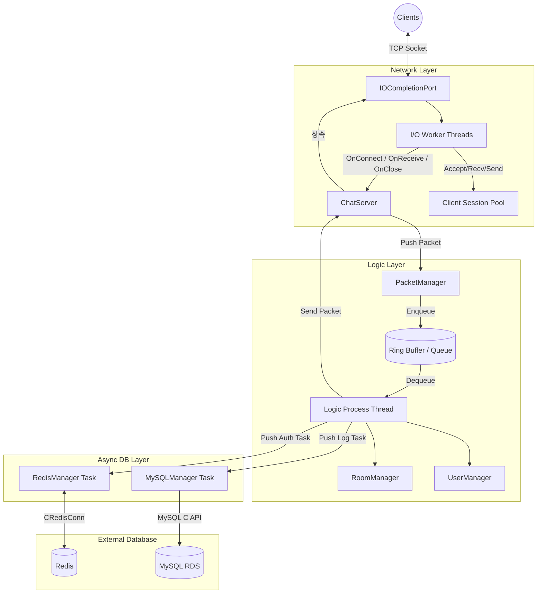
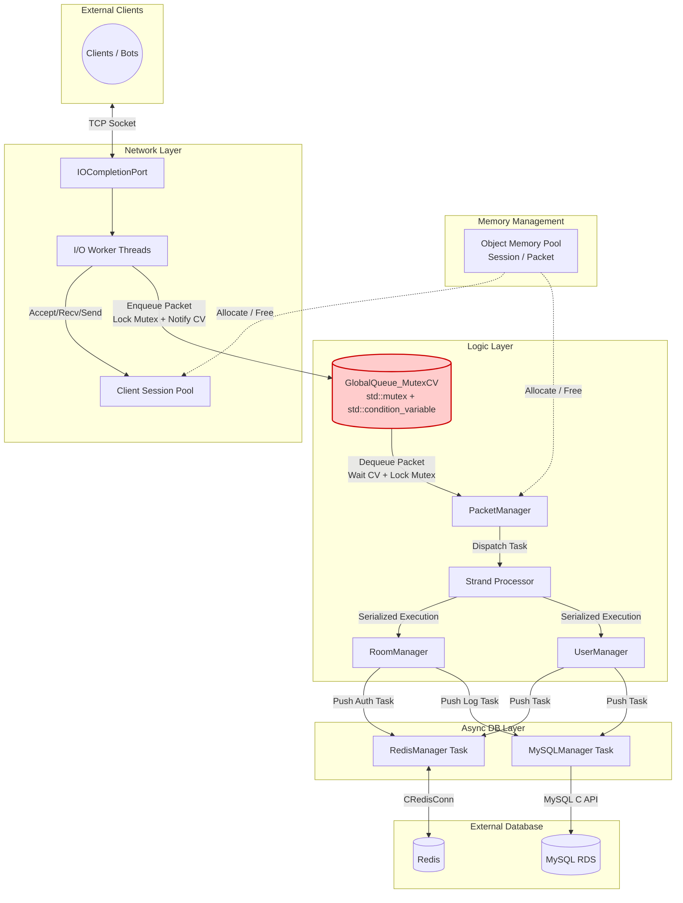
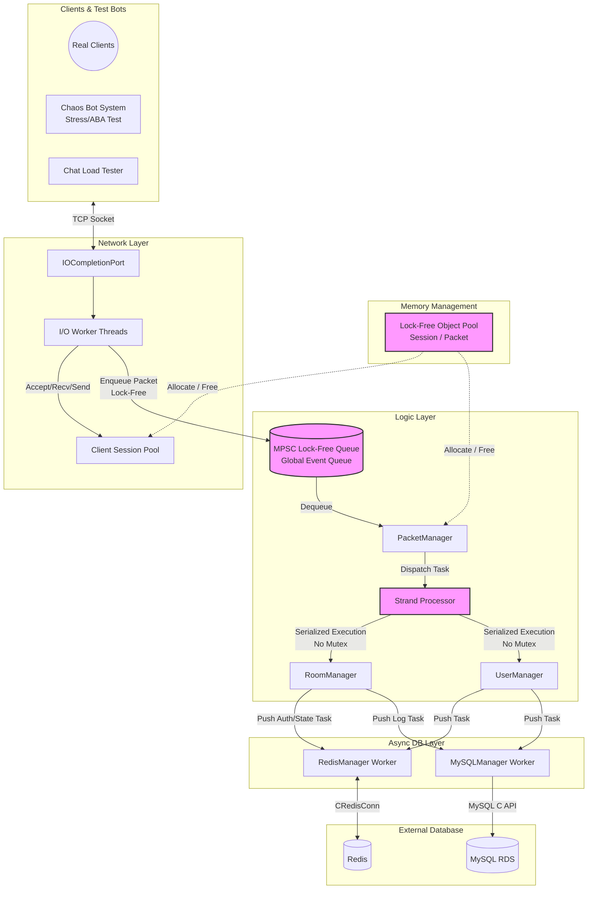

# 🚀 IOCP 기반 고성능 대규모 채팅 서버

## 📋 프로젝트 개요

Windows IOCP(I/O Completion Port)를 활용한 고성능 멀티스레드 채팅 서버입니다.

단순한 기능 구현을 넘어 **아키텍처 진화(Single-Thread ➡️ Lock-Free)와 극한의 부하 테스트**를 통해 병목 현상을 해결하고, 실제 상용 서비스 수준인 **10,000명 동시 접속 환경에서 Hot-path Zero-Allocation을 통한 힙 경합 최소화 및 Object Pool 기반 메모리 누수 0%** 를 달성한 프로젝트입니다.

### 🎯 Key Achievements

- ⚡ **142,400 TPS** — Lock-Free 아키텍처로 초당 14만 건 패킷 처리, Mutex 대비 p99 지연시간 **97% 개선** (≤500ms → ≤16.1ms), 무응답 패킷 0건
- 🔬 **스레드 황금 비율 도출** — AWS EC2 4코어 환경에서 IO·Worker·Logic 스레드 조합 4가지를 실측 비교. `MaxIOWorkerThread=4 / MaxWorkerThread=2 / MaxLogicThread=4` 구성이 CPU 87% 헤드룸 + p99 17ms로 최적 확인
- 📡 **엔진 물리 한계 측정** — 10,000명 브로드캐스트(방당 1,000명) 환경에서 수신 TPS **118,000 pkts/s**가 4코어 IOCP 엔진의 물리적 포화 한계임을 2가지 극한 부하 시나리오 교차 검증으로 확정
- 🛡️ 카오스 엔지니어링을 통한 극한의 안정성 검증
  - 자체 개발한 악성 테스트 봇(ChaosBotSystem)을 통해 Lock-Free 고유 취약점(ABA 오버플로우, 스레드 경합) 및 네트워크 고질 문제(좀비 세션, TCP 단편화, RST 공격) 방어 검증
  - 62만 건 이상의 TCP 패킷 단편화(Fragmentation) 공격 및 무작위 랜선 뽑기(RST) 공격에도 패킷 조립 에러 및 서버 크래시 0건 증명
- 🏋️ **10,000명 동시접속** — AWS EC2 4대에서 실제 유저 시나리오(채팅·입퇴장 반복) 부하 테스트, 연결 유실 0건
- 🧠 **Hot-path Zero-Allocation 설계 + 객체 풀링 기반 메모리 누수 방지**
- - **Zero-Allocation (성능):** 런타임 Hot-path에서 동적 할당(new/delete)을 완전히 배제하여 OS 힙 락(Heap Lock) 경합과 메모리 파편화(Fragmentation) 원천 차단. malloc + Placement new 통짜 할당으로 생성자 오버헤드 제거
- - **Zero-Leak (안정성):** Lock-Free Object Pool로 740만 회 작업 처리 후 반환 누락 0건. VS 프로파일러 힙 스냅샷으로 교차 검증 완료

---

## ✨ 주요 특징

- **네트워크 코어:** IOCP 기반 AcceptEx, WSARecv, WSASend 비동기 I/O 처리
- **Lock-Free 아키텍처:** CAS 연산을 활용한 Lock-Free 큐 및 Object Pool을 통해 스레드 경합(Contention) 최소화
- **DB & Cache:** Redis(인메모리 캐시를 통한 초고속 인증), MySQL/AWS RDS(비동기 Task Queue를 통한 활동 로그 영구 기록)
- **안정성:** AWS CloudWatch를 활용한 메모리 모니터링 및 Generation Token 기반의 좀비 세션 방어

## 📦 기술 스택

**Language & Network** <br>


**Core Architecture** <br>


**Database & Cache** <br>


**Infrastructure & Profiling** <br>


## 📂 프로젝트 구조
```
IOCPChatServer/
├── 📁 Network/ ← IOCP 네트워크 I/O 코어
│ ├── IOCP.h/.cpp          IOCP 엔진 (AcceptEx, WSARecv, WSASend)
│ ├── ClientSession.h/.cpp 클라이언트 세션 관리 및 생명주기
│ ├── ChatServer.h         서버 오케스트레이터 (IOCP 상속)
│ ├── RingBuffer.h         TCP 스트림 패킷 버퍼링
│ └── Packet.h             패킷 헤더/프로토콜 정의
│
├── 📁 Concurrency/ ← Lock-Free 자료구조
│ ├── MPSCQueue.h              CAS 기반 Lock-Free MPSC 큐
│ ├── LockFreeStack.h          Lock-Free 스택
│ ├── ObjectPool.h             Lock-Free Object Pool
│ ├── ObjectMemoryPool.h       범용 메모리 풀
│ ├── StrandProcessor.h/.cpp   Strand 패턴 (Room별 직렬화)
│ ├── StrandCallback.h         Strand 콜백 래퍼
│ ├── GlobalQueue_LockFree.h/.cpp Lock-Free 글로벌 큐 (v3 최종)
│ └── GlobalQueue_MutexCV.h    Mutex+CV 큐 (v2 비교용)
│
├── 📁 Contents/ ← 비즈니스 로직
│ ├── PacketManager.h/.cpp 패킷 라우팅 및 핸들러
│ ├── PacketJob.h          패킷 처리 작업 단위
│ ├── User.h/.cpp / UserManager.h/.cpp 유저 세션 상태 관리
│ └── Room.h/.cpp / RoomManager.h/.cpp 채팅방 관리 및 브로드캐스트
│
├── 📁 Database/ ← 비동기 DB/Cache
│ ├── MysqlManager.h      MySQL 비동기 Task Queue
│ ├── MySQLTaskDefine.h   MySQL 작업 정의
│ ├── RedisManager.h      Redis 인메모리 캐시 (인증)
│ └── RedisTaskDefine.h   Redis 작업 정의
│
├── main.cpp          진입점
├── ConfigManager.h   JSON 기반 서버 설정 로더 (런타임 튜닝)
├── Define.h          공통 매크로 및 구조체
├── ErrorCode.h       에러 코드 정의
└── CrashDump.h       크래시 덤프 수집
```
## 🔀 패킷 처리 흐름
- 클라이언트가 채팅 메시지를 보내고, 같은 방의 모든 유저에게 
브로드캐스트되기까지의 전체 흐름입니다.
```
[Client A] ──WSASend──▶ 서버 수신
│
① WSARecv 완료
(IOCP Worker Thread)
│
② RingBuffer에 적재
(User::SetPacketData)
│
③ PacketJob 생성 + Generation Token 기록
│
④ Lock-Free Global Queue에 Push
(GlobalQueue_LockFree::Push, CAS 연산)
│
⑤ Packet Process Thread가 Dequeue
│
⑥ Generation Token 검증
(유효하지 않으면 폐기)
│
⑦ Room Strand에 콜백 등록
(동일 Room 작업의 직렬화 보장)
│
⑧ Room::BroadcastChat 실행
│
⑨ 같은 방 유저 N명에게 각각:
Object Pool에서 SendBuffer 할당 (Lock-Free, new/delete 없음)
→ WSASend 비동기 전송
│
⑩ I/O 완료 후 SendBuffer를 Object Pool에 반환
│
[Client B,C,D...] ◀── 채팅 메시지 수신 완료
```

## ▶️ 시연 영상


서로다른채팅방

> 💬 추가 시연 영상
> 


일반 채팅


로그인실패 및 중복 로그인 방어

---

## 🏛️ 서버 아키텍처 진화 및 성능 벤치마크

본 프로젝트는 처리량(TPS)을 극대화하기 위해 총 3단계에 걸쳐 아키텍처를 리팩토링 및 최적화했습니다.

### 🖥️ 테스트 환경

| 구분 | 사양 |
| --- | --- |
| **Server** | AWS EC2 c6i.xlarge (4 vCPU, 8GB RAM) × 1대, Windows Server 2022 |
| **Client** | AWS EC2 c6i.xlarge (4 vCPU, 8GB RAM) × 4대, Windows Server 2022 (각 2,500봇) |
| **Network** | 동일 리전, 동일 클러스터 배치 그룹 (Cluster Placement Group) |
| **테스트 모드** | `TestMode=true` — Redis 인증·MySQL 로그 I/O 우회, **순수 네트워크·로직 엔진 처리 성능** 측정 (DB 병목 변수 제거) |

> **아키텍처 진화 요약**

> `v0 → v1` : 단일 큐의 락 경합 → **더블 버퍼링**으로 해결 (TPS 83% 향상)
> 
> `v1 → v2` : 단일 코어 한계 → **멀티스레드** 도입 (Mutex 병목 발견)
> 
> `v2 → v3` : Mutex 병목 → **Lock-Free**로 완전 해결 (142,400 TPS)

### 🔹 v0 → v1: Single-Thread (단일 큐 → 더블 버퍼링)

- **Problem:** IOCP 스레드와 패킷 처리 스레드가 단일 패킷 큐(`mInComingPacketUserIndex`)를 공유하며 `std::mutex`로 보호 → 패킷 삽입/처리마다 락 경합(Lock Contention)이 발생하여 처리 지연 누적, 1,000명 이상에서 처리 스타베이션(Starvation) 발생
- **Solution:** 더블 버퍼링(Double Buffering) 기법 도입. 수신용 큐와 처리용 큐를 분리하고, 로직 스레드가 처리를 시작할 때 두 큐를 O(1) swap하여 락 경합을 원천 차단. IOCP I/O 워커 스레드도 4개 → 8개로 최적화.
- **Result:** 기존 단일 큐 대비 **초당 처리량(TPS) 83% 증가 및 평균 지연시간 76% 단축** 달성. 최대 1,500명 부하까지 안정적 방어.



#### 📊 단일 큐 vs 더블 버퍼링 성능 비교

| 부하 단계 | 핵심 지표 | 단일 큐 (Before) | 더블 버퍼링 (After) | 개선 |
| --- | --- | --- | --- | --- |
| **500명** | Chat RTT 평균 | 22.0 ms | **13.0 ms** | 📉 **41% 단축** |
|  | Chat RTT p50 | 16.8 ms | **11.0 ms** | 📉 **35% 단축** |
|  | Chat RTT p95 | 59.1 ms | **32.3 ms** | 📉 **45% 단축** |
| **1,000명** | Chat RTT 평균 | 349.7 ms | **83.7 ms** | 📉 **76% 단축** |
|  | Chat RTT p95 | 925.6 ms | **221.5 ms** | 📉 **76% 단축** |
|  | 초당 채팅 처리량 | 551 /sec | **1,010 /sec** | 📈 **83% 증가** |
| **1,500명** | Login 성공 | 1,000명 (한계) | **1,500명** | ✅ **Starvation 해결** |
|  | Room Enter 성공 | 1,000명 (한계) | **1,500명** | ✅ **전원 성공** |
|  | Login RTT 평균 | 처리 불가 | **105.2 ms** | ✅ **정상 처리** |
| **2,000명** | 초당 채팅 처리량 | 350.9 /sec | **405.6 /sec** | 📈 **16% 증가** |
|  | 성공한 총 채팅 수 | 123,599건 | **168,851건** | 📈 **37% 증가** |
|  | Chat RTT 평균 | 222.9 ms | **185.6 ms** | 📉 **17% 단축** |

### 🔹 v1 → v2: Multi-Thread (Mutex + CV)

- **한계 극복:** 1,500명 이상에서 발생하는 단일 코어의 한계(CPU 100% 및 처리 스타베이션)를 극복하기 위해 스레드 풀(Thread Pool) 도입.
- **이슈 발생:** 채팅 서버 특성상 브로드캐스트를 위한 공유 자원(Room, Session) 접근이 잦아 Mutex Lock/Unlock 과정에서 심각한 병목 현상 발생. 2,000명 부하 시 p99 지연시간이 500ms까지 튀는 현상 확인.


### 🔹 v2 → v3: Multi-Thread (Lock-Free) ⭐️ 최종 아키텍처

- **구현:** Mutex를 완전히 제거하고 **CAS 연산 기반의 Lock-Free 큐와 Object Pool, Strand 패턴**을 직접 구현하여 적용. 패킷 전송 시마다 발생하던 잦은 동적 할당(new/delete)을 Lock-Free Object Pool로 대체하여 힙 메모리 단편화와 Lock 경합 병목을 동시에 해소.
- **최종 성과:** 2,000명 극한의 스트레스 테스트(Max TPS)에서 **초당 142,400 건의 패킷 처리를 무응답 에러 없이 달성**하며 동급 아키텍처 대비 압도적인 성능 증명.


### 📊 아키텍처별 극한 부하 성능 비교 (2,000명 Stress Test)

초기 단일 스레드(Double Buffering) 아키텍처의 한계를 돌파하기 위해, 멀티 스레드 환경에서 **Mutex 방식과 Lock-Free 방식을 구현하고 극한의 브로드캐스트 부하 상황에서 성능을 교차 검증**했습니다.

> 
> 
> 
> 

> 

**⚔️ 3가지 아키텍처 모델**

1. **v1. Single-Thread (Double Buffering):** 로직 처리를 단일 스레드가 전담하여 락 오버헤드가 없으나, 코어의 물리적 한계가 존재함.
2. **v2. Multi-Thread (Mutex + CV):** 스레드 풀을 도입했으나, 브로드캐스트 시 공유 자원(방, 세션) 접근으로 인한 Lock 경합(Contention) 발생.
3. **v3. Multi-Thread (Lock-Free) ⭐️ 최종:** CAS 연산 기반의 Lock-Free 글로벌 큐와 Strand 패턴을 결합하여 경합을 원천 차단.

**💡 분석**

- **Single-Thread의 붕괴:** 1,500명까지는 락 오버헤드가 없는 싱글 스레드가 훌륭한 효율을 보였으나, 2,000명 부하를 넘어서는 순간 **단일 코어(CPU 100%)의 병목으로 인해 초당 23만 건의 패킷이 Drop(무응답)** 되는 붕괴 현상이 발생했습니다.
- **Mutex의 한계 (Lock Contention):** 멀티 스레드를 도입하여 붕괴는 막았으나, 채팅 서버 특성상 동일한 방(Room)에 접근하기 위해 락을 획득/해제하는 과정에서 병목이 발생하여 **p99 지연시간이 500ms까지 튀는 현상** 을 확인했습니다.
- **Lock-Free의 압승:** 결과적으로 Lock-Free 아키텍처가 **초당 142,400건의 패킷을 15.5ms라는 매우 안정적인 지연 시간, 무응답 0건으로 완벽하게 처리**해 내며 대규모 트래픽에서 가장 우수한 아키텍처임을 증명했습니다.

---

## 🚀 10,000명 수용량 테스트 및 Zero-Leak 검증 (Capacity Test)

*서버의 장기 실행 안정성을 철저히 검증하기 위해, AWS EC2 클라이언트 4대(각 2,500봇)에서 10,000명의 더미 클라이언트가 실제 유저와 동일한 시나리오(로그인 → 방 입장 → 채팅 → 방 퇴장 → 재입장)를 3~10초 간격으로 반복하는 82분(1.38시간) 연속 부하 테스트를 진행했습니다.*

*이후 추가 진행한 극한 부하 시나리오 테스트(Scenario C: CPU 포화 한계 측정)에서 **최대 10,000명 동시 접속**이 확인되었습니다. 자세한 내용은 하단 [극한 부하 시나리오 테스트](#-극한-부하-시나리오-테스트-load-test-scenarios) 섹션을 참조하세요.*

> 
> 
> 
> 


### 📊 1. 클라이언트 부하 테스트 지표 (82분 연속 실행)

| 측정 항목 | 결과 수치 | 상태 요약 |
| --- | --- | --- |
| **최대 동시 접속 (Peak Conn)** | **10,000 명** | 목표 수용량 달성 ✅ |
| **연결 실패 / 끊김 (Fail / Disconn)** | **0 건 / 0 건** | 82분간 단 1건의 유실도 없는 세션 안정성 ✅ |
| **평균 지연 시간 (Avg Latency)** | **15.82 ms** | 지연 없는 실시간 통신 수준 유지 ✅ |
| **p99 지연 시간 (p99 Latency)** | **16.87 ms** (최대 31.49 ms) | 상위 1% 패킷도 30ms 내외로 안정적 처리 ✅ |
| **이상 현상 (Anomalies)** | **없음** | 무중단 서비스 검증 완료 |

### ⚙️ 2. 서버 내부 메모리 풀(Object Pool) 벤치마크 지표

1.38시간 동안 총 **약 740만 번의 작업(Job)이 처리**되었으나, Lock-Free 기반의 메모리 풀이 완벽하게 자원을 재활용하여 동적 할당 병목을 원천 차단했습니다.

| 서버 내부 지표 | 측정 값 | 의미 및 성과 |
| --- | --- | --- |
| **Alloc Total Attempts** | **7,383,090 회** | 1.38시간 동안 약 740만 개의 Job/Packet 처리 완료 |
| **Job Pool Alloc Fail** | **0 회** | Job Pool(10만 개) 고갈 없이 안정적 순환 ✅ |
| **Send Pool Alloc Fail** | **0 회** | Send 버퍼 풀 고갈 없음 ✅ |
| **Pool Free Count** | **100,000** (= Pool Size) | 테스트 종료 후 전량 반환 ➡️ **내부 객체 누수 0건 입증 ✅** |

### 🔍 3. 트러블슈팅: OS 레벨 교차 검증을 통한 Zero-Allocation 증명

위의 서버 내부 지표(`Pool Free Count = 100,000`)로 객체 누수가 없음을 확인했으나, AWS CloudWatch를 통한 OS 레벨 메모리 모니터링을 관찰하고 분석했습니다.

#### Phase 1: 실제 메모리 누수 발견 및 수정
- **현상**: 최초 10,000명 테스트에서 서버 메모리가 **99%(6,680MB)** 를 점유하며 **0.4MB/s** 씩 지속 증가
- **원인 분석**:
    1. **SendBuffer Pool 과잉 할당**: 봇당 400개씩 총 4,000,000개 할당 → 약 4.1GB 낭비
    2. **세션 버퍼 비대화**: `MAX_PACKET_DATA_BUFFER_SIZE`가 65,536으로 과도하게 설정
    3. **세션 종료 시 리소스 미반환**: `Closed()`에서 `Clear()` 미호출로 Send큐 잔존
- **해결**:
    1. Pool 크기를 봇당 **400 → 10**으로 최적화
    2. 버퍼 크기를 **65,536 → 8,192**로 조정
    3. `Closed()` 호출 시 `Clear()`로 세션 리소스 즉시 반환
- **결과**: 시작 메모리 **2,372MB → 372MB**로 **84% 절감**, 0.4MB/s 누수 완전 해소

#### Phase 2: OS 레벨 교차 검증을 통한 Zero-Leak 최종 증명

- **현상**: Phase 1 수정 후 메모리가 371.9MB에서 안정화되었으나, **10,000명 접속 해제 후에도 메모리가 떨어지지 않는 현상** 발견
- **가설 및 프로파일링**: C++ 고질적 문제인 메모리 누수(Memory Leak)를 의심하여 **VS 프로파일러 힙 스냅샷(Heap Snapshot)** 분석 진행. 10,000명 접속 전/후 스냅샷을 비교한 결과, 할당된 메모리의 증가량은 **+0 Bytes**로 확인.
- **결론**: 버그가 아닌 의도된 최적화 — **Lock-Free Object Pool이 해제된 세션/버퍼를 OS에 반납하지 않고 다음 접속을 위해 캐싱(Pre-allocation)**하고 있었음. C++ CRT 힙 할당자의 정상 동작.
- **최종 성과**: 1만 명의 유저가 740만 번의 통신을 주고받는 극한의 환경에서도, 추가적인 동적 할당(new/delete) 오버헤드 없이 371.9MB의 고정된 메모리로 무중단 서비스가 가능함을 입증 Zero-Allocation과 Zero-Leak을 동시에 달성

> 
> 
> 
> 


> 

---

## 📊 극한 부하 시나리오 테스트 (Load Test Scenarios)

AWS EC2 c6i.xlarge (4 vCPU, 8GB RAM) 환경에서 3가지 시나리오로 서버의 한계를 측정했습니다.
클라이언트는 EC2 4대(각 2,500봇, 총 10,000봇)를 자체 개발한 ChatLoadTester로 구동했습니다.

### 🔬 Scenario A: 스레드 황금 비율 탐색

4코어 환경에서 IO Worker / Logic Thread 조합을 바꿔가며 최적 비율을 실측했습니다.

#### 저부하 (방당 8명, 채팅 여유)

| 테스트 | 설정 (IO힌트/Worker/Logic) | 평균 레이턴시 | p99 | CPU |
|--------|--------------------------|-------------|-----|-----|
| A-1 | IO4 / W2 / L2 (총 4개) | 16.10 ms | 32.13 ms | 32.41% |
| A-4 | IO4 / W4 / L2 (총 6개) | 15.69 ms | 32.77 ms | 35.49% |
| A-3 | IO4 / W2 / L4 (총 6개) | 15.89 ms | 23.01 ms | 22.15% |
| **A-2** | **IO4 / W2 / L4 (총 6개)** | **15.89 ms** | **17.21 ms** | **22.22%** |

> Logic Thread 2개(A-1, A-4)는 p99가 32ms로 불안정. **Logic Thread 4개가 핵심.**

#### 고부하 (방당 8명, 채팅 빡빡)

| 테스트 | 설정 (IO힌트/Worker/Logic) | 평균 레이턴시 | 수신 TPS | CPU |
|--------|--------------------------|-------------|---------|-----|
| A-1 | IO4 / W2 / L2 | 251 ms | 146,277 pkts/s | 94.87% |
| **A-2** | **IO4 / W2 / L4** | **261 ms** | **128,528 pkts/s** | **87.38%** |
| A-3 | IO4 / W4 / L2 | 294 ms | 120,565 pkts/s | 100% 🔴 |
| A-4 | IO8 / W4 / L4 | 401 ms 🔴 | 91,093 pkts/s 🔴 | 99.82% 🔴 |

> A-4는 스레드가 가장 많지만 최악. 4코어에 Worker(4)+Logic(4)=8 스레드는 2배 오버서브스크립션 → 컨텍스트 스위칭 폭증.
> **Golden Ratio: IO힌트=4 / Worker=2 / Logic=4** — CPU 87%로 유일하게 헤드룸 확보, 저부하 p99 17ms.

---

### 📡 Scenario B: 브로드캐스트 폭풍 (방당 1,000명)

10개 방 × 1,000명 구성으로 브로드캐스트 증폭이 서버에 미치는 영향을 측정했습니다.

| 지표 | Scenario A (방당 8명) | Scenario B (방당 1,000명) |
|------|----------------------|--------------------------|
| Send:Recv 비율 | 1 : 9 | **1 : 428~520** |
| 최대 서버 송신 TPS | 18,122 pkts/s | **211,892 pkts/s (+12배)** |
| 평균 레이턴시 | 15.89 ms | 502 ms ~ 1,884 ms |
| p99 레이턴시 | 23 ms | **9,346 ms ~ 36,578 ms** 🔴 |
| 최대 동시 접속 | 10,000명 | **10,010명 (전원 입장 성공)** ✅ |

> **접속 안정성은 확보**되었으나 p99 9~36초는 구조적 한계.
> 원인: `SendToAllUser()`가 Strand 내에서 동기 루프로 1,000번 호출 → Strand 블록 → 큐 적체.
> 211,892 pkts/s는 큐가 포화되며 p99 36초를 감수하고 밀어낸 수치로, 안정적 처리량과는 구별해야 합니다.

---

### ⚡ Scenario C: CPU 포화 한계 측정

| 지표 | 결과 | 의미 |
|------|------|------|
| 최대 동시 접속 | **10,000명** | 목표치 초과 달성 ✅ |
| 최고 수신 TPS | **118,042 pkts/s** | 엔진 물리 한계 확정 |
| p99 레이턴시 | 10,269 ms | 큐 포화 시 처리 한계 |
| Send:Recv 비율 | 1 : 501 | 시나리오 B와 동일한 병목 패턴 |

> 시나리오 B 최고치(118,420)와 거의 일치 → c6i.xlarge 4코어 IOCP 엔진의 물리적 수신 한계 = 초당 약 118,000 패킷으로 확정.

---

## 🧪 카오스 엔지니어링기반 극한의 안정성 검증

Lock-Free 아키텍처와 Strand 패턴의 무결성을 입증하기 위해, 악의적인 네트워크 공격과 극단적인 스레드 경합 상황을 모사하는 자체 제작 Chaos Bot System으로 3단계 극한 스트레스 테스트를 진행했습니다. 
단순한 처리량(TPS) 측정을 넘어, Lock-Free의 3대 취약점(ABA, Data Race, 좀비 세션)을 완벽히 방어하며 Zero-Defect(무결점) 서버임을 증명했습니다.

### 🛡️ 3대 시나리오 검증 요약
1. **Scenario A (ABA 오버플로우 방어):** 30분간 570만 개(770MB)의 패킷 I/O 폭격 ➡️ **메모리 오염 및 Crash 0건** (Generation 검증 로직 입증)
2. **Scenario B (Strand Race 방어):** 공유 자원(Room) 동시 접근 버스트 775회 유발 ➡️ **Data Race 0건** (Strand 직렬화 패턴 동작 입증)
3. **Scenario C (좀비 및 단편화 공격):** 패킷 1바이트 조각화 83,000건 및 RST 강제 종료 150건 ➡️ **조립 에러 0건, 좀비 세션 잔류 0건**

### 🛡️ Scenario A: Lock-Free 메모리 무결성 및 ABA 오버플로우 검증
- **Test:** 30분간 950개 이상의 세션이 무차별적으로 접속·해제를 반복하며 **570만 개(770MB)의 패킷 I/O 폭격** 수행.
- **Result:** `ABA Overflow 0건`, `메모리 누수 0건`, `서버 크래시 0건`
- **Insight:** Lock-Free Object Pool의 고질적 문제인 ABA(주소 재사용 오염) 문제를 **Generation(세대) 검증과 RefCount(참조 카운트) 기반의 안전한 메모리 반납 로직**으로 방어해 냈습니다. 

<details>
<summary><b>👉 Scenario A: ABA 오버플로우 검증 테스트 로그 보기</b></summary>
<div markdown="1">

```text
=============================================================
  CHAOS BOT - Statistics (1800.5 sec elapsed)
=============================================================
  [Connection]
    Attempts: 951  Success: 951  Failed: 0
    Disconnects: 951  Hard Close(RST): 0

  [Packet I/O]
    Sent: 5708391 (772.93 MB)  Recv: 5707511 (38.10 MB)
    Send Errors: 0
    Throughput: 3170 pkt/s sent, 3170 pkt/s recv

  *** VULNERABILITY DETECTION ***
    [A] ABA Overflow:     0
    [B] Strand Race:      0
    [C] Zombie Race:      0
    Server Crash:         0
=============================================================
```
</div>
</details>


### ⚔️ Scenario B: Multi-Thread 논리적 경합 (Strand Race) 검증
- **Test:** 200개의 봇이 120초 동안 의도적으로 **패킷 파이프라인 버스트(775회)** 를 일으키며, 동시다발적으로 방 입장/퇴장 및 채팅 도배 요청(Data Race 유발).
- **Result:** `Strand Race 0건`, `비정상 패킷 차단(Fail) 1,175건`
- **Insight:** 수백 개의 스레드가 동일한 Room 자원에 동시 접근하려 했으나, StrandProcessor를 통한 철저한 작업 직렬화(Serialization)가 동작하여 동기화 오류를 원천 차단했습니다. 또한 비정상적인 상태 전이 요청은 입구에서 즉시 차단(Disconnect)하여 서버 로직을 보호했습니다.

<details>
<summary><b>👉 Scenario B: Multi-Thread 논리적 경합 (Strand Race) 검증 결과
<div markdown="1">

</div>
</details>

### 🧟 Scenario C: 악성 네트워크 공격 및 좀비 세션 검증
- **Test:** 83,903개의 모든 통신 패킷을 1바이트 단위로 조각내어 전송(**TCP 단편화**)하고, 정상 통신 중 강제 랜선 뽑기(**RST Hard Close**) 150회 시도.
- **Result:** `Zombie Race 0건`, `패킷 조립 에러 0건`
- **Insight:** TCP 스트림 파싱의 맹점을 노린 극악의 1바이트 쪼개기 공격에서도 **RingBuffer의 패킷 경계 파싱 로직**이 완벽히 동작했습니다. 또한 RST 강제 종료 시 `CancelIoEx`와 내부 Task Queue를 활용한 즉각적인 좀비 세션 암살(Cleanup) 로직이 무결점으로 작동하여, 리소스 낭비 없는 방어력을 입증했습니다.
### 📊 실제 테스트 결과 로그 (Raw Data)
<details>
<summary><b>👉 Scenario C: 악성 네트워크 공격 및 좀비 세션 검증 결과
<div markdown="1">

</div>
</details>

- ---

## 🛠️ Technical Challenges

### Challenge 1: TCP Stream Packet 경계

- **Problem**: TCP는 스트림 기반 프로토콜로 패킷 경계가 없어서, 여러 패킷이 합쳐지거나 하나의 패킷이 분할되어 수신될 수 있음. 이로 인해 패킷 조립 시 데이터 손실이나 잘못된 파싱이 발생할 위험
- **Approach**: 고정 길이 헤더 구조체를 설계하고, 링버퍼를 도입하여 스트림 데이터를 안전하게 버퍼링
- **Solution**: `User::GetPacket()`에서 헤더 peek → 전체 길이 확인 → 정확한 바이트 수만큼 read

### Challenge 2: 다중 쓰레드에서 Ring Buffer 접근

- **Problem**: 네트워크 쓰레드(IOCP Worker)에서 `User::SetPacketData()`로 데이터 쓰기와 패킷 처리 쓰레드에서 `User::GetPacket()`으로 데이터 읽기가 동시에 발생하여 race condition 발생
- **Approach**: Mutex 추가로 쓰레드 안전성 확보
- **Solution**: `User` 클래스에 `mPacketRingBuffMutex` 추가, `SetPacketData()`, `GetPacket()`, `Clear()` 메서드를 동일한 뮤텍스로 보호

### Challenge 3: 비동기 이벤트 처리 중 발생하는 상태 불일치 문제

- **Problem**: I/O 쓰레드가 작업을 생성한 후 큐에 넣기 전 사이에 다른 쓰레드가 사용자의 상태를 변경하면 ProcessPacket 쓰레드엔 무효화된 작업이 들어가게 됨
- **Approach**: Client 객체의 생명 주기를 추적할 수 있도록 Generation Token 도입으로 상태 검증
- **Solution**: User 클래스에 Generation Token을 도입하여 패킷 처리 작업을 생성할 때 당시의 token 값을 함께 기록. 큐에서 꺼내어 작업할 때 token 값을 비교하여 값이 다를 경우 해당 패킷을 무효화 처리

### Challenge 4: Graceful Shutdown 구현

- **Problem**: 서버 강제 종료 시 진행 중인 I/O와 DB 작업이 유실되고, 리소스가 정리되지 않아 데이터 손실과 메모리 누수가 발생
- **Approach**: 5단계 순차 종료(Accept 차단 → 클라이언트 킥 + CancelIoEx → I/O Draining → PQCS 워커 종료 → 리소스 정리)하고, DB/Redis 쓰레드는 queue draining 후 종료
- **Solution**: `DestroyThread()`를 5단계로 구성, MySQL/Redis의 `TaskProcessThread()`를 빈 큐 확인 패턴으로 변경하여 잔여 작업을 모두 처리한 뒤 종료하도록 구현. 추가로 `SetConsoleCtrlHandler`로 Ctrl+C 및 콘솔 종료도 Graceful Shutdown으로 구현

### Challenge 5: AcceptEx 빈 세션 탐색 방식의 비효율

- **Problem**: AccepterThread가 빈 세션을 찾기 위해 매번 전체 10,000개를 O(N) 선형 탐색하며, 이미 AcceptEx가 걸린 세션에 중복 호출하여 소켓 누수 발생 가능성 존재
- **Approach**: FreeList를 도입하여 O(1) Pop/Push로 빈 세션을 관리하고, 서버 시작 시 100개만 미리 AcceptEx를 걸어둔 뒤 워커 스레드가 완료 시 1개씩 보충하는 방식으로 변경
- **Solution**: AccepterThread를 제거하고 `PopFreeSessionIndex()`/`PushFreeSessionIndex()`로 세션을 관리하며 ACCEPT 완료 시 워커 스레드가 자동으로 AcceptEx를 보충하도록 구현. 커널에는 항상 ~100개의 대기 소켓만 유지

---

## 🛡️ Edge Case 방어 로직
부하 테스트 이후, 악의적인 클라이언트가 서버를 공격할 수 있는 시나리오를 분석하고 사전 방어 로직을 설계했습니다.

###  Case 1: 비정상 패킷 크기 검증 (Oversized / Malformed Packet)
- **Attack**: 공격자가 패킷 헤더의 PacketLength를 65,535(UINT16 최대값)로 조작하여 전송. 링버퍼(8KB)는 해당 크기를 절대 모을 수 없어 세션이 영구 좀비 상태에 빠짐 — 패킷 처리 불가, 그러나 연결은 유지되어 세션 자원 점유.
- **Defense**: GetPacket()에서 헤더를 peek한 직후, PacketLength의 상한(MAX_PACKET_DATA_BUFFER_SIZE)과 하한(PACKET_HEADER_LENGTH) 범위를 검증. 범위 밖이면 오염된 링버퍼를 즉시 Clear()하고 해당 패킷을 폐기.
###  Case 2: 링버퍼 오버플로우 시 연결 해제 (Buffer Overflow Protection)
- **Attack**: 공격자가 서버의 처리 속도를 초과하는 대량의 데이터를 연속 전송하여 링버퍼(8KB)를 고의로 가득 채움. 오버플로우 이후의 데이터는 유실되어 패킷 경계가 영구적으로 깨지며, 해당 세션의 모든 후속 패킷 파싱이 불가능해짐.
- **Defense**: SetPacketData()의 반환값을 bool로 변경하여 오버플로우를 호출자에게 전파. 오버플로우 감지 시 기존 DisconnectAsync() 경로(shutdown(SD_BOTH) → WorkerThread가 0바이트 감지 → CloseSocket)를 재활용하여 안전하게 세션을 정리.
###  Case 3: Slowloris 변형 공격 방어 (Incomplete Packet Timeout)
> **1바이트씩 천천히 보내 타임아웃을 피해가는 악의적 세션 공격 방어**
- **Attack**: 공격자가 1바이트씩 59초 간격으로 전송. 기존에는 WSARecv 완료 시마다 UpdateActivity()가 갱신되어, 1바이트만 보내도 60초 타임아웃이 매번 리셋됨 — 세션 하나를 영구 점유 가능.
- **Defense**: UpdateActivity()의 호출 시점을 WSARecv 완료(바이트 수신) → 완전한 패킷 조립 성공 시로 이동. 콜백 패턴(SendPacketFunc과 동일 방식)으로 PacketManager에서 유효한 패킷 처리 완료 시에만 활동 시간을 갱신. 불완전한 바이트 스트림으로는 타임아웃을 리셋할 수 없어 60초 후 자동 연결 해제.

---

## ⚙️ 빌드 및 모드 전환 방법

본 프로젝트는 `#define` 매크로를 통해 내부 아키텍처를 쉽게 전환하며 테스트할 수 있습니다.

```cpp
// Config.h (또는 해당 헤더)
#define USE_LOCK_FREE_ARCH  // Lock-Free 모드 (기본값, 최고 성능)
// #define USE_MUTEX_ARCH   // Mutex 모드 (성능 비교용)

#define USE_AMAZON_AWS_DB    // AWS 환경 DB 연결 모드 (비활성화 시 로컬 MySQL 사용)
```

## 🔮 향후 개선 방향

- [x]  ~~std::function 기반 패킷 핸들러로 리팩토링~~
- [x]  ~~MySQL 연동하여 사용자 활동 로그 기록~~
- [x]  ~~더미 클라이언트 테스트~~
- [x]  ~~디버깅을 위한 Dump추가~~
- [x]  ~~좀비 세션 감지 로직 추가~~
- [x]  ~~Lock-Free 구현하고 적용하기~~
- [x]  ~~Process 처리 쓰레드를 단일 -> 멀티 쓰레드로 확장~~
- [x]  ~~10,000명 동시접속 수용량 테스트 및 Zero-Leak 검증~~
- [x]  ~~극한 부하 시나리오 테스트 (스레드 황금 비율 / 브로드캐스트 폭풍 / CPU 포화 한계)~~
- [ ]  브로드캐스트 구조 개선 (SendToAllUser Strand 외부 비동기화)
- [ ]  멀티서버 구조 확장

## 👨‍💻 개발자

- **이름**: 강형우
- **연락처**: [rkdguddn21@gmail.com](mailto:rkdguddn21@gmail.com)
- **GitHub**: [https://github.com/kanghyoungwoo](https://github.com/kanghyoungwoo)
